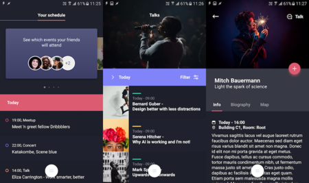

# Alive UX Kit

Alive is a suite of included UX components that demonstrate advanced UX capabilities.



## Getting started

To include Alive in our project, we need to add a package reference to `Fuse.UXKits.Alive` and `Fuse.Charting` in our `.unoproj`.
It should look something like the following.

```json
{
	"Packages": [
		"Fuse",
		"FuseJS",
		"Fuse.Charting",
		"Fuse.UXKits.Alive"
	],
	"Includes": [
		"*"
	]
}
```

Now, there is a small bit of setup that is required for themes to work properly.
Alive provides both a [LightTheme](api:alive/lighttheme) and a [DarkTheme](api:alive/darktheme).

We'll add a [Alive.FallbackTheme](api:alive/fallbacktheme) inside a panel at the root of our App.
This sets up default theme colors and makes sure we always have one of the themes enabled at any point in the UX tree.

```xml
<App>
	<Panel>
		<Alive.FallbackTheme />

		<Panel>
			<!-- app content -->
		</Panel>
	</Panel>
</App>
```

**Note:** Alive.FallbackTheme is explicitly a [LightTheme](api:alive/lighttheme).
To make the entire app be [DarkTheme](api:alive/darktheme), enclose it within a @Panel together with the rest of the app's content.

```xml
	<App>
		<Panel>
			<Alive.FallbackTheme />

			<Panel>
				<Alive.DarkTheme />

				<!-- app content -->
			</Panel>
		</Panel>
	</App>
```

See [themes](themes.md) for more info on how to work with themes.

Also see [text styles](textstyles.md) for a list of included text styles.

## What now?

Take a look at the accompanying [example app](https://github.com/fusetools/fuse-alive-ux-kit-example) to see how you can use Alive your apps.

Also, see the [Alive namespace reference](api:alive) for a list of all the components included with Alive.