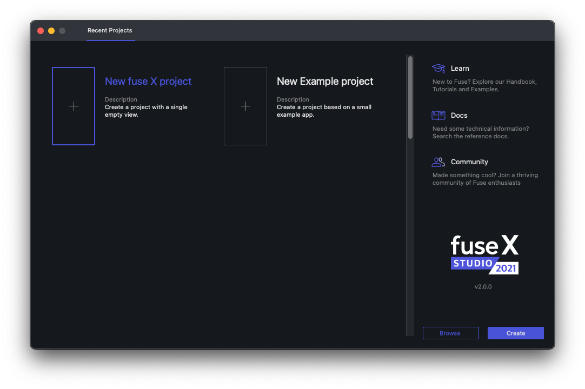
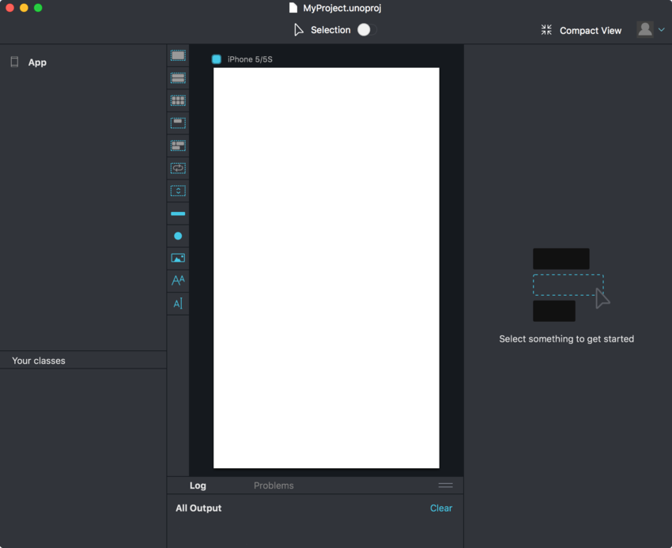

# Installation and Quickstart

This is a step-by-step tutorial that takes you through setting up Fuse and creating your first project. Should you happen to run into problems during installation, please [let us know](https://forums.fusetools.com/c/bug-reports)!

## Installation

The latest version of Fuse can always be downloaded from the <a target="_blank" href="https://fuseopen.com/downloads">downloads page</a>. Download the installer for your operating system and open it to start the installation procedure.

<blockquote class="callout-info">

Both the Windows and macOS installers require an internet connection in order to complete.

</blockquote>

<blockquote class="callout-info">

__Windows:__ You may have to log out and in again (or simply reboot) to make sure the path for fuse is properly updated.

</blockquote>

<blockquote class="callout-info">

__macOS:__ If for any reason you need to remove all of the Fuse components, you can use [this uninstall script](https://gist.github.com/Tapped/daa78c08882f33b0c7c3).

</blockquote>

### macOS Requirements

- A modern Mac running macOS Yosemite or later

### Windows Requirements

- Window 7 or newer
- OpenGL 2.1-capable GPU (Very basic on-board/shared resource GPUs such as the Intel GMA-series are not sufficient!!).

## Finding a text editor

Fuse requires an external text editor in order to make changes to the UX markup in our app. To streamline your experience with Fuse, we provide plugins for some of the more popular text editors which provide code completion, error lists, output logs and the ability to launch Fuse apps from within the text editor.

We currently provide plugins for the following text editors:

<table class="table">
  <thead>
    <tr>
      <th>Editor</th>
      <th>Installation</th>
      <th>Plugin homepage</th>
    </tr>
  </thead>
  <tbody>
    <tr>
      <td><a href="https://code.visualstudio.com/">Visual Studio Code</a></td>
      <td><a href="articles:basics/installation/visual-studio-code-plugin.md">link</a></td>
      <td><a href="https://marketplace.visualstudio.com/items?itemName=fuseopen.fuse-vscode">link</a></td>
    </tr>
    <tr>
      <td><a href="https://atom.io/">Atom</a></td>
      <td><a href="articles:basics/installation/atom-plugin.md">link</a></td>
      <td><a href="https://atom.io/packages/fuse">link</a></td>
    </tr>
    <tr>
      <td><a href="https://www.sublimetext.com/3">Sublime Text 3</a></td>
      <td><a href="articles:basics/installation/sublime-plugin.md">link</a></td>
      <td><a href="https://packagecontrol.io/packages/Fuse">link</a></td>
    </tr>
  </tbody>
</table>

## Starting a new project

To open Fuse, double click the the Fuse icon. On macOS it is located in the "Applications" folder. If you are on Windows, it can be located in the start menu.

<blockquote class="callout-info">

You can also start Fuse by running `fuse` from terminal on macOS or command prompt on Windows.

</blockquote>

When opening Fuse, the first thing you'll see is the dashboard:



To start a new project, we first have to pick a template. Fuse comes with a few templates which provide a good starting point when starting from scratch. For the purpose of this guide, we want to choose the "New Fuse project" template. This template gives a project with one file in which we can easily start building our app. Choose this template by clicking the box with its name, and then click the "create" button. You will then have to pick a name and a directory for your project.


After clicking the "create" button, Fuse starts a local preview viewport. You'll notice that this process take some time, as Fuse has to download the packages containing the [framework code](http://github.com/fuse-open/fuselibs) used to create apps with Fuse. This only happens the first time Fuse is run after installation. You can see the download progress in the "Log" panel at the bottom of the window.



After Fuse is done downloading all the required packages, the preview viewport is started, and you'll notice that all we have to start with is a white background.

### Making some changes

To open the project in your text editor, either click the "Project" tab and select `MainView.ux` or open the project folder directly from your text editor.

To get started, paste the following code directly into `MainView.ux`, replacing the existing code:

```xml
<App Background="#2196F3">
  <ClientPanel>
      <StackPanel ItemSpacing="10">
          <Text FontSize="30">Hello, world!</Text>
          <Slider />
          <Button Text="Button" />
          <Switch Alignment="Left" />
      </StackPanel>
  </ClientPanel>
</App>
```

As soon as you save the document, you should notice the preview viewport update to display some `Text`, a `Slider`, a `Button` and a `Switch` control, stacked on top of each other vertically. Fuse picks up any change you make to your documents, and updates automatically and immediately to reflect those changes. This even works on your devices which you can read about in the next section.

## Running preview on device

Fuse can do live preview on both Android and iOS devices, even at the same time!

The simplest way to get started is with the [Fuse Preview app](./preview-and-export.md#fuse-preview-app) so you should definitely try that one out first.

If you ever need to include non-standard packages or Uno code in your project then you can instead build your own [custom preview](./preview-and-export.md#custom-preview), but you can make that switch whenever you want to so there's no harm in starting out with the Fuse Preview app.

## What next?

Now that you're all set up, it's time to get started learning the fundamentals of Fuse. A good next step is to take a look at the [Introduction to Fuse](articles:basics/introduction-to-fuse) module, which will take you through the fundamentals of Fuse. If you prefer learning by example, the [hikr tutorial](articles:tutorial/tutorial) will lead you through the creation of a simple hiking app, while explaining each step along the way. If you simply want to start digging into example code and play around on your own, there is a ton of content to look at on our [examples page](https://fuseopen.com/examples) as well as in the [fuse-samples github repo](https://github.com/fuse-open/fuse-samples/).
