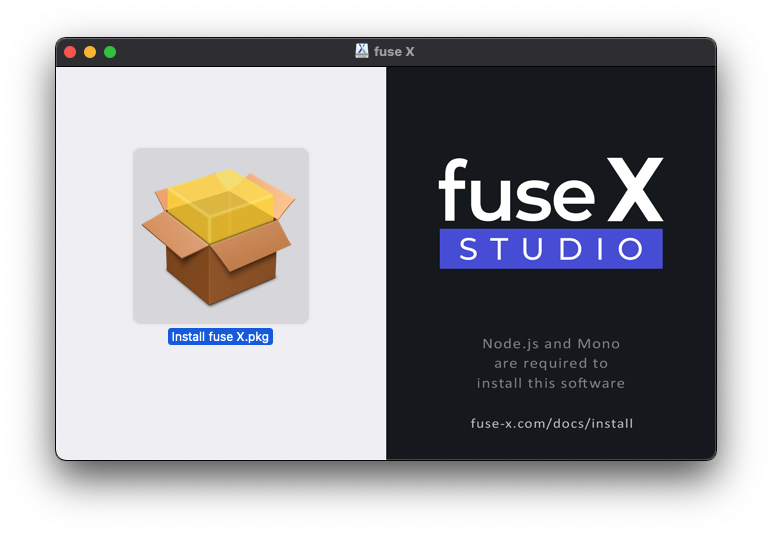
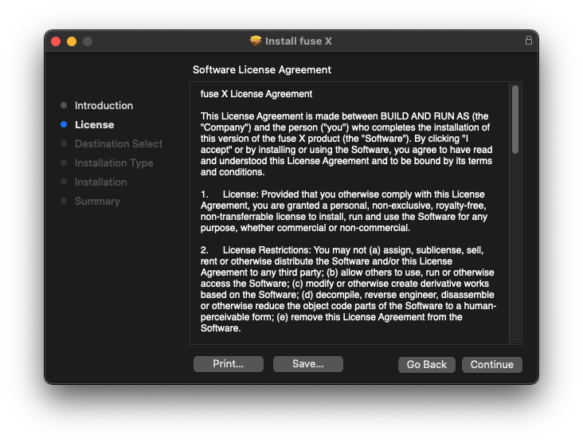
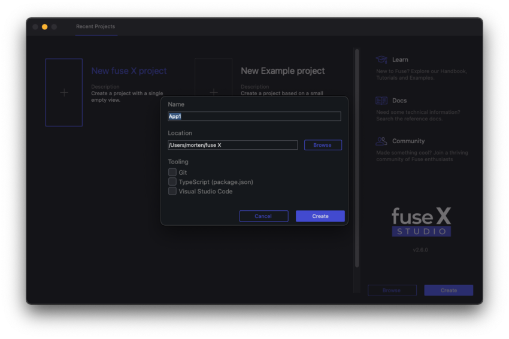

# macOS Installation

This is a step-by-step tutorial that takes you through setting up Fuse X and creating your first project. Should you happen to run into problems during installation, please [let us know](https://fuse-x.com/issues)!

<blockquote class="callout-info">

<a href="https://www.mono-project.com/download/stable/" target="_blank">Mono</a> and <a href="https://nodejs.org/en/download/" target="_blank">Node.js</a> are required to install this software.

</blockquote>

<blockquote class="callout-info">

A working internet connection is required to install this software.

</blockquote>

## Requirements

- OS X 10.10 Yosemite or newer
- macOS 11.2 Big Sur (or latest) is recommended
- Intel processor (M1 support is planned)
- <a href="https://www.mono-project.com/download/stable/" target="_blank">Mono</a> 6.10 or newer
- <a href="https://nodejs.org/en/download/" target="_blank">Node.js</a> 12 or newer

## Running the installer

The latest version of Fuse X can always be downloaded from the <a href="https://fuse-x.com/download">download page</a>. Download the **macOS installer (.dmg)**.

You should have downloaded a file called `fuse-x-2.0.0-mac.dmg` or similar. Open it and follow the installation procedure.

This chapter will guide you through it.

<blockquote class="callout-info">

You can [skip this chapter](#starting-fuse-x) if you already know how to do this.

</blockquote>

### Prerequisites

Make sure you have up-to-date <a href="https://www.mono-project.com/download/stable/" target="_blank">Mono</a> and <a href="https://nodejs.org/en/download/" target="_blank">Node.js</a> installations on your system.

This can be verified by running the following commands.

```s
$ mono --version

Mono JIT compiler version 6.10.0.0 (or newer)
...
```

```s
$ node --version

v12.0.0 (or newer)
```

### Opening the installer



> This is how the DMG looks when it is opened.

Run **Install fuse X.pkg** to continue.

### Installation process


> Hi, and welcome to our cool installer!

Click **Continue** to continue.



> Please read the License Agreement carefully.

Click **Continue** to continue.


> Confirm that you have read the License Agreement.

Click **Agree** to continue.


> *Optional:* Sometimes this screen is shown. **Install for all users of this computer** should be selected.

Click **Continue** to continue.


> The installation will actually take a bit more space due to dependencies being downloading while installing.

Click **Install** to continue.


> The installer needs to run as Administrator in order to complete.

Enter your password and click **Install Software** to continue.


> Time for a quick coffee ☕

Please wait a few minutes...


> Done and done. Good job!

Click **Close** to exit.

## Starting Fuse X

Fuse X can be started in four different ways.

> **1.** From *Installer*: **fuse X** was started when finishing the installer.

> **2.** From *Finder*: Go to **Applications** and start the **fuse X** app.

> **3.** From *Spotlight*: Search for `fuse X` and hit <kbd>Enter</kbd>.

> **4.** From *Terminal*: Type `fuse` and hit <kbd>Enter</kbd>.

## Finding a text editor

Fuse X requires an external text editor in order to make changes to the UX markup in our app. To streamline your experience with Fuse X, we provide plugins for some of the more popular text editors which provide code completion, error lists, output logs and the ability to launch Fuse apps from within the text editor.

We currently provide plugins for the following text editors:

<table class="table">
  <thead>
    <tr>
      <th>Editor</th>
      <th>Installation</th>
      <th>Plugin homepage</th>
    </tr>
  </thead>
  <tbody>
    <tr>
      <td><a href="https://code.visualstudio.com/">Visual Studio Code</a></td>
      <td><a href="articles:basics/installation/vscode-extension.md">link</a></td>
      <td><a href="https://marketplace.visualstudio.com/items?itemName=fuseopen.fuse-vscode">link</a></td>
    </tr>
    <tr>
      <td><a href="https://atom.io/">Atom</a></td>
      <td><a href="articles:basics/installation/atom-plugin.md">link</a></td>
      <td><a href="https://atom.io/packages/fuse">link</a></td>
    </tr>
    <tr>
      <td><a href="https://www.sublimetext.com/3">Sublime Text 3</a></td>
      <td><a href="articles:basics/installation/sublime-plugin.md">link</a></td>
      <td><a href="https://packagecontrol.io/packages/Fuse">link</a></td>
    </tr>
  </tbody>
</table>

## Starting a new project

When opening Fuse X, the first thing you'll see is the dashboard:


To start a new project, we first have to pick a template. Fuse X comes with a few templates which provide a good starting point when starting from scratch. For the purpose of this guide, we want to choose the "New fuse X project" template. This template gives a project with one file in which we can easily start building our app. Choose this template by clicking the box with its name, and then click the "create" button. You will then have to pick a name and a directory for your project.



After clicking the "create" button, Fuse X starts a local preview viewport. You'll notice that this process take some time, as Fuse X has to download the packages containing the [framework code](http://github.com/fuse-open/fuselibs) used to create apps with Fuse X. This only happens the first time Fuse X is run after installation. You can see the download progress in the "Log" panel at the bottom of the window.


After Fuse X is done downloading all the required packages, the preview viewport is started, and you'll notice that all we have to start with is a white background.

### Making some changes

To open the project in your text editor, either click the "Project" tab and select `MainView.ux` or open the project folder directly from your text editor.

To get started, paste the following code directly into `MainView.ux`, replacing the existing code:

```xml
<App Background="#2196F3">
  <ClientPanel>
      <StackPanel ItemSpacing="10">
          <Text FontSize="30">Hello, world!</Text>
          <Slider />
          <Button Text="Button" />
          <Switch Alignment="Left" />
      </StackPanel>
  </ClientPanel>
</App>
```

As soon as you save the document, you should notice the preview viewport update to display some `Text`, a `Slider`, a `Button` and a `Switch` control, stacked on top of each other vertically. Fuse X picks up any change you make to your documents, and updates automatically and immediately to reflect those changes. This even works on your devices which you can read about in the next section.

## Running preview on device

Fuse X can do live preview on both Android and iOS devices, even at the same time!

The simplest way to get started is with the [Fuse X Preview app](../preview-and-export.md#fuse-x-preview-app) so you should definitely try that one out first.

If you ever need to include non-standard packages or Uno code in your project then you can instead build your own [custom preview](../preview-and-export.md#custom-preview), but you can make that switch whenever you want to so there's no harm in starting out with the Fuse X Preview app.

## Uninstall

If for any reason we need to remove all of the Fuse X components, we can use [this uninstall script](https://github.com/fuse-x/studio/blob/master/uninstall.sh).

## Xcode

In order to do iOS *app exports* and custom previews you will need the latest version of Xcode. Follow [these instructions](https://developer.apple.com/xcode/downloads/), or search for it in the Mac App Store.

## What next?

Now that you're all set up, it's time to get started learning the fundamentals of Fuse. A good next step is to take a look at the [Introduction to Fuse](articles:basics/introduction-to-fuse) module, which will take you through the fundamentals of Fuse. If you prefer learning by example, the [hikr tutorial](articles:tutorial-models/tutorial) will lead you through the creation of a simple hiking app, while explaining each step along the way. If you simply want to start digging into example code and play around on your own, there is a ton of content to look at on our [examples page](https://fuseopen.com/examples) as well as in the [fuse-samples github repo](https://github.com/fuse-open/fuse-samples/).
