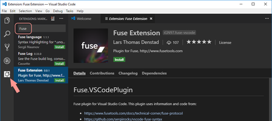

# Visual Studio Code plugin installation

[callout info]
We also provide a [plugin for Atom](atom-plugin.md) and [Sublime Text 3](sublime-plugin.md).
[/callout]

The Visual Studio Code plugin can be installed directly from the extensions tab:

