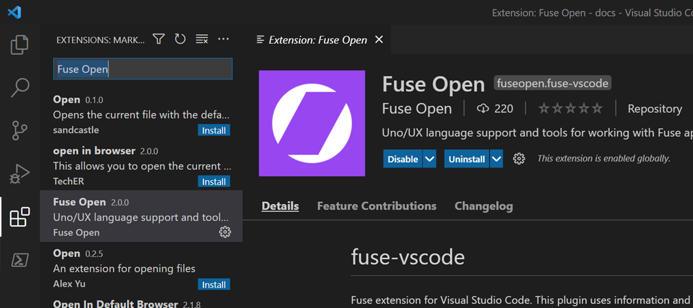

# Visual Studio Code extension installation

<blockquote class="callout-info">

We also provide plugins for [Atom](atom-plugin.md) and [Sublime Text 3](sublime-plugin.md).

</blockquote>

<blockquote class="callout-info">

The source code for this extension can be found on [GitHub](https://github.com/fuse-open/vscode-extension).

</blockquote>

<blockquote class="callout-info">

Please report any [issues](https://github.com/fuse-open/vscode-extension/issues) 🙂

</blockquote>

## From Visual Studio Code

The **Fuse Open** extension can be installed from the **Extensions** tab:



## From the command line

Run the following command:

```s
fuse install vscode-extension
```

That's it! You're now ready to start using Visual Studio Code with Fuse.
