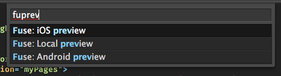
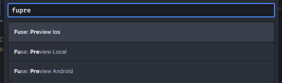

# Preview and Export

Fuse X offers two ways of running your app:

- **Preview** - A fully working build of your app, which also updates in real-time as you make changes to your UX markup or JavaScript.
- **Export** - The final version of your app, which can be shipped to app stores or used for private testing.

When developing your app, you typically work in preview all the time, to be able to iterate quickly. Then you export when you want to deploy it. Note that in some scenarios, preview performance can be a bit slower than in export.

## Fuse X Preview app

This stand-alone app is by far the simplest way of previewing your projects and *does not require the installation of Xcode or Android SDK*. It also lets you preview on iOS devices while developing on a Windows computer.

You can use the preview app as long as your project only contains UX markup, JavaScript, TypeScript and [standard Fuse packages](https://github.com/fuse-open/fuselibs), but excluding `Fuse.PushNotifications`.

If your project contains `.uno` files or custom / 3rd party packages then you must instead build your own [custom preview](./preview-and-export.md#export-and-custom-preview).

### Preview App Setup
You can download the app [for Android from Google Play](https://play.google.com/store/apps/details?id=com.fuse.preview) and [for iOS from the Apple App Store](https://apps.apple.com/no/app/fuse-x-preview/id1549637259).

To run a preview *first make sure your test device and development computer are on the same WiFi*.
Then open your project in Fuse and click the *"Devices"* button in the upper right corner. This will open a window containing the necessary information for connecting the preview. Follow the instructions inside the app to _either_ scan the QR code _or_ manually enter the IP and code.

Check out this video to see how it's done! [Fuse X Preview app](https://www.youtube.com/watch?v=KJYHUHpMmto)

## Export and custom preview

### Android setup

To be able to preview or export to Android, you need to install the required SDK components.
Pull up your terminal and run the following:

```sh
fuse install android
```

> You should *not* use `sudo` here.

<blockquote class="callout-info">

This dependency can also be installed using [NPM](https://www.npmjs.com/package/android-build-tools).

</blockquote>

This will attempt to locate existing Android SDK components, and install them if necessary.

If you are running Windows you also need to install the right USB driver for your device. A list of drivers for common vendors, as well as instructions to install them [can be found here](https://developer.android.com/studio/run/oem-usb.html#Drivers).

Also on your android device itself you will need to enable 'developer options' & 'USB debugging'. For info on how to do this please see [the official docs here](https://developer.android.com/studio/run/device.html).

### iOS setup

You will need macOS and [Xcode](https://developer.apple.com/xcode/) to preview and export your app to iOS.

You also need to create a free Apple Developer account and register it under Xcode's settings as shown below.


<blockquote class="callout-info">

It can also be useful to install the following dependencies if you want to launch apps straight from Terminal.

</blockquote>

```sh
npm install ios-deploy -g
npm install ios-sim -g
```

## Custom Preview

We can easily preview apps both locally and on Android/iOS devices while getting immediate feedback on changes to the UX markup and JavaScript.
These are the instructions for building your own custom preview. If your app project does not contain `.uno` files or custom packages you can use the [Fuse X Preview app](./preview-and-export.md#fuse-x-preview-app) instead (without having to install Xcode or Android SDK).

> When running preview for iOS, Fuse X doesn't run your app directly, but will open the project in Xcode.
> From there, press the "play" button to run the preview session.

When we open a project in Fuse X, it starts in preview mode inside the tool, along with visual tools to inspect and modify the app. To start preview on a device, use the "Preview" menu.


You can start preview on as many devices as you like. A USB connection is only required when starting preview, after that all changes are streamed over WiFi.

### Preview from editor plugins

Preview can also be launched from one of our editor plugins. Select preview target `android` / `ios` to launch on a device, or `local` / `dotnet` to open it in Fuse X.

#### Preview from Sublime Text

To preview from sublime text, right-click any `ux` or `unoproj` file in the sidebar and select your target platform under the `Fuse: Preview` menu.


We can also start preview from the command palette. Press `Cmd+Shift+P` (macOS) or `Ctrl+Shift+P` (Windows) to bring up the palette, and type `Fuse Preview` to see a list of preview targets.



#### Preview from Atom

Press `Cmd+Shift+P` (macOS) or `Ctrl+Shift+P` (Windows) to bring up the command palette, and type `Fuse Preview` to see a list of preview targets.



### Preview from command line

In your terminal, `cd` to the your project's directory, and run the command that corresponds to your build target.

```sh
fuse preview android
fuse preview android-emu
fuse preview ios
fuse preview ios-sim
fuse preview            # Start local preview
```

We can get further documentation on `fuse preview` by running `fuse help preview`.

## Export

When exporting your app, your UX markup is compiled to native C++ code, meaning that you lose the ability to preview your app in real time. However your app will function on its own, without a network connection back to your computer. Performance is also better in many cases. This is what you want when distributing your app.

The simplest way to export is to use the "Export" menu in Fuse. However, the command line provides more options.

### Android

In the project root, run the following command in your shell:

```sh
uno build android --run
```

This will deploy and start the project on your connected Android device.

To run in **Emulator (x86_64)** instead, run:

```s
uno build android-emu --run
```

Please make sure the emulator is started first. It doesn't start automatically.

To make a **release build**, run:

```sh
uno build android --configuration=Release
```

> To export your app to the Google Play Store, you need to [sign it first](../preview-and-export/signing.md).

### iOS

In the project root, run the following command in your shell:

```sh
uno build ios --debug
```

This will generate an Xcode project and open it in **Xcode** (required for provisioning profiles). You can start your app from Xcode.

To run your app directly in **iOS Simulator**, without going via Xcode first, run:

```sh
uno build ios-sim --run
```

> To export your app to the App Store, you need to [sign it first](../preview-and-export/signing.md). You can also do this from Xcode.

## Signing

See [the signing article](../preview-and-export/signing.md) for a guide on signing your app for release.
