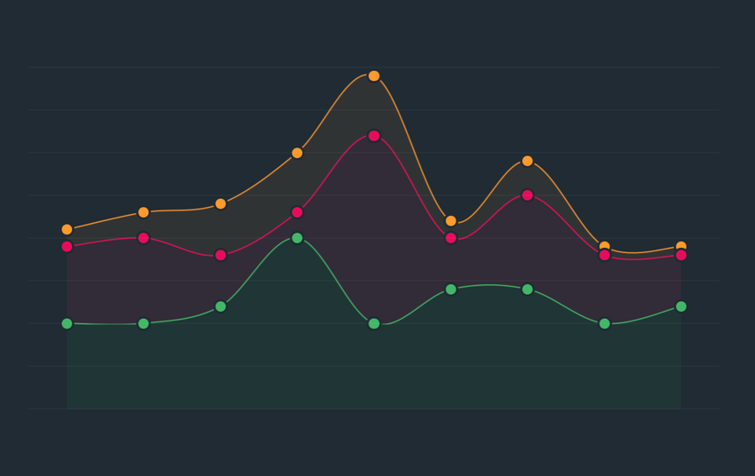
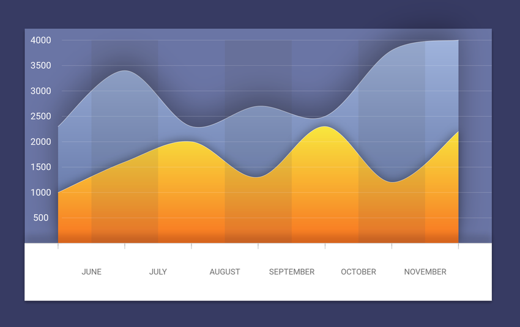

# Charting


## Setting it up

To include Fuse.Charting in our project, we need to add a package reference to `Fuse.Charting` in our `.unoproj`.
It should look something like the following.

```json
	{
		"Packages": [
			"Fuse",
			"FuseJS",
			"Fuse.Charting"
		],
		"Includes": [
			"*"
		]
	}
```

To use charting in your UX you'll need to import the namespace.
You can do this at the top of each UX file as part of your `App` tag or `ux:Class` declaration.

```xml
	<Panel ux:Class="MyChart" xmlns:c="Fuse.Charting">
```

The `xmlns:c="Fuse.Charting"` declares `c` to refer to the charting API, allowing for example `c:Plot` and `c:PlotBar`.
Note, this namespace is valid only for this one file. You'll need to add the same declaration to each file you wish to use the charting API.
The examples here will assume the use of `c` as a prefix.

## The basics

@Plot creates visual charts from a data source.
The API is a series of components that are used to build the chart.

A `Plot` requires these two key components to produce a minimal chart:

- `DataSeries` to define the data
- `PlotData` to enumerate the data points

Following is a minimal example of a bar chart.

```xml
<App xmlns:c="Fuse.Charting">
	<JavaScript>
		var Observable = require("FuseJS/Observable");
		exports.data = Observable({ y: 4 }, { y: 1 }, { y: 2 });
	</JavaScript>
	<c:Plot>
		<c:DataSeries Data="{data}" />
		<c:PlotData>
			<c:PlotBar Color="#000" />
		</c:PlotData>
	</c:Plot>
</App>
```

## DataSeries

@DataSeries define the data for a @Plot. At least one @DataSeries is required for every @Plot.

```XML
<c:Plot>
	<c:DataSeries Data="{data}">
```

Where `data` is an @Observable containing the data expressed as a list of objects. For data with multiple dimensions the `x`, `y`, `z`, and `w` properties can be used. For the simplest data sets only the `value` property is needed. 

> `value` maps to the `y` property, if defined, and vice versa. Setting both `y` and `value` to different values may produce unexpected results. For instance, `{x:0, y:1}` is the same as `{x:0, value:1}`.

A `label` property can also be added to the items. This is primarily for 1-dimensional data sets using `value`. This label can then be used by `PlotAxis` when creating the axis markings.

### Multiple DataSeries



You can use multiple `DataSeries` in one `Plot`. It's helpful to give them names for later reference:

```XML
	<c:DataSeries Data="{dataA}" ux:Name="seriesA"/>
	<c:DataSeries Data="{dataB}" ux:Name="seriesB"/>
	<c:DataSeries Data="{dataC}" ux:Name="seriesC"/>
```

The `Plot` will calculate its ranges based on the values in all of its `DataSeries`. Each series still has its own data, but the calculated values are relative to the combination of all the sets.

## PlotData

@PlotData is how the plot data is enumerated for displaying in the chart. This is used in combination with a layout helper to plot the actual data.

```XML
<Curve StrokeWidth="5" StrokeColor="#008">
	<c:PlotData>
		<c:PlotCurvePoint/>
	</c:PlotData>
</Curve>
```

The above use of `PlotData` creates the points for a `Curve`.

```XML
<Panel>
	<c:PlotData>
		<c:PlotBar>
			<Rectangle Color="#0808" Height="80%" Alignment="VerticalCenter"/>
		</c:PlotBar>
	</c:PlotData>
</Panel>
```

Here we create rectangles for each data entry.

The layout helpers are:

- `PlotBar` Is a panel that covers the entire area where the bar should be drawn.
- `PlotPoint` Is a zero-sized panel that is anchored at a single data point
- `PlotCurvePoint` Creates a `CurvePoint` matching the data point

### {Plot data.*}

Within a @PlotData the `{Plot data.*}` expression can be used to access several variables about each data point:

- `rel` (per-axis) are values relative to the range (Minimum(0) - Maximum(1))
- `screenRel` (per-axis) values relative to the rendering on the screen (Y adjusted and Orientation adjusted)
- `x`,`y`,`z`,`w` are Size values, with Unit.Percent. Based on `screenRel`
- `source` (per-axis) the data point values from the source (not range adjusted)
- `weight` (per-axis) the value of this point divided by the sum of all values
- `cumulative` (per-axis) sum of value up to and including this data point
- `accumulated` (per-axis) sum of value up to but not including this data point
- `accumulatedWeight` (per-axis) sum of weight up to but not including this data point
- `cumulativeWeight` (per-axis) sum of weight up to and including this data point
- `object` the input object associated with this data point
- `label` the label (if any) of this data point

The "per-axis" values can be accessed as `.x`, `.y`, `.z`, or `.w`. For example `rel.x` or `source.y`

### The Metrics

Each axis is calculated according to an `AxisMetric` specified on the `Plot`.

The default `XAxisMetric` is `OffsetCount`. This means that the `X` value of the first data item will be `0.5`, the second `1.5`, and so on. `OffsetCount` and `Count` axes use integer steps along the axis for ticks and labels -- by default 1 tick per data point. This axis is also suitable for dynamically stepping to show just a part of the data at one time.

The default for the other axes, including `YAxisMetric`, is `Range`. This means the value for `Y` is taken directly from the input data (the `y` or `value` properties). On a `Range` axis the stepping values for ticks and labels are spread over the range from the minimum to maximum value. 0 is always considered in the range to avoid producing clipped ranges.

The default values are suitable for creating bar charts and line graphs. 

### Scatter Plot

For a scatter plot you would set `XAxisMetric="Range"`, as you'd like the value to come from the input. 

The input should have both `x` and `y` values specified.

### Stacked or Ranged plots

The `y` and `z` values can be used as a range when plotting bars. The `y` value is the normal value, and `z` is considered the previous value. You need to set `ZMetric="MergeRange"` on the `Plot` in order for this to work. This tells the `Plot` that these two values are part of the same range. Normalization will happen after considering both the `y` and `z` value.

You can then use `Style="Range"` on a `PlotBar` to draw a bar that maps to this range.

`DataSeries` also supports the ability to create automatic ranges. Add a `Metric="Add"` property to the second, and further, `DataSeries`. This will then add the `y` value to the cumulative total, and set `z` to the previous total. This creates a range of values suitable for creating a stacked bar chart.


## GridLayout

A @Plot doesn't have any default layout. A common approach is to use a `GridLayout` to add the labels, ticks, and plot data.

```XML
<GridLayout Columns="50,10,1*" Rows="1*,10,20"/>
```

This is a basic layout that allocates 50 points for the Y-axis labels, 20 points for the X-axis labels, 10 points for both X/Y tick marks, and the rest for the plot.

> Be aware that you can't have `auto` in both the `Columns` and `Rows` property. This is a sizing mode that `GridLayout` does not support. You'll need to use a fixed size for one of the axes, typically the X-labels, as their height is not typically variable.


## PlotAxis



@PlotAxis create labels on an axis. You must specify the `Axis` source for the data and provide a `Label` template that is used for each label.

```XML
<c:PlotAxis>
	<Text ux:Template="Label" Value="{Plot axis.label}"/>
</c:PlotAxis>
```

> `PlotAxis` has numerous options for controlling which labels get shown and how they are grouped. Review the API reference for more details.

### PlotAxisData

`PlotAxisData` enumerates the axis information. This is useful for scenarios where neither `PlotAxis` nor `PlotTicks` achieve what you want.

This example positions angled labels along the X axis in a GridLayout. (NOTE: This simple example could actually be done using `PlotAxis`, but it nonetheless demonstrates the concept.)

```XML
<Panel Row="2" Column="2" HitTestMode="None">
	<c:PlotAxisData Axis="X">
		<Panel>
			<Text X="{Plot axis.position} * 100%" Y="0" FontSize="18" Color="#000" 
				Value="{Plot axis.label}" Anchor="105%,45%" TransformOrigin="Anchor" ux:Name="t">
				<Rotation Degrees="-60"/>
			</Text>
		</Panel>
	</c:PlotAxisData>
</Panel>
```

As shown you'll need to position the items yourself when using `PlotAxisData`, it contains no inherent layout like `PlotAxis`.

### {Plot axis.*}

The `{Plot axis.*}` data contains variables used to construct an axis:

- `label` The label provided by the source data
- `value` The range value
- `position` The relative position of this data point along the axis.
- `index` Index of this data in the source data. This may actually be out-of-range of the source data if using multiple data sets, or options like `Plot.DataExtend`
- `screenIndex` Index of the data relative to the window of data shown on the screen (the first data point being 0)


## PlotTicks

@PlotTicks create tick marks, usually for an axis. This is a @Shape, allowing `Stroke...` properties to be used for drawing the ticks.  The ticks that are drawn will line up with the labels of @PlotAxis provided they are the same element size (either `Width` or `Height` depending on the axis).

```XML
<c:PlotTicks Axis="X" AxisLine="0" StrokeWidth="1" StrokeColor="#000"/>
```

`AxisLine` indicates a line across the entire access should be drawn at this offset. In this example it's the top of the ticks, making this suitable for the bottom of a chart.

## {Plot *}

Within a @Plot the `{Plot variable}` expression can be used to access several useful values from the Plot. These are:

- `baseline` (per-axis) the relative position of the baseline (usually the zero point)
- `hasNext` whether `Offset`,`Limit` could be increased to reveal more data
- `hasPrev` whether `Offset` could be decreased to reveal more data
- `count` the number of data points shown on the plot
- `dataMaxline`, `dataMinline`  (per-axis) the relative position of the max/min value in the full data set


## Radial Charts


The charting API can be used to create pie graphs, spider graphs, and other radial charts. Many of the layout helpers include options to use a radial layout. `{Plot*}` exposes variables useful in positioning.

For basic charts the input data is the same. The difference is that you work with weights and accumulated values.  

The `PlotWedge` is a convenience element provided to draw elements of a simple pie chart. 

```XML
<VectorLayer HitTestMode="None">
	<c:PlotData>
		<c:PlotWedge Color="{Plot data.object}.color" StrokeColor="#488" StrokeWidth="1"/>
	</c:PlotData>
</VectorLayer>
```

In this example we've added a `color` property to our input data to color each pie wedge differently.

> We're using `VectorLayer` here as an optimization for drawing pie wedges. Unlike Rectangles these are a bit slower to draw, as they use the native vector API of the target platform.  This `VectorLayer` will group several vector items together, significantly improving performance.

You can add labels to this chart using `c:PlotPoint`.

```XML
<c:PlotData>
	<c:PlotPoint Style="Radial" PointOffset="0.05" Attractor="pieAttract">
		<Text Value="{Plot data.label}"/>
	</c:PlotPoint>
</c:PlotData>
```

If you don't wish to use `PlotWedge` you can calculate the ranges for a plot yourself. This example creates arcs instead of wedges.

```XML
<c:PlotData>
	<Arc
		StartAngleDegrees="{Plot data.accumulatedWeight.y}*360" 
		EndAngleDegrees="{Plot data.cumulativeWeight.y}*360" 
		StrokeColor="#488" StrokeWidth="2"/>
</c:PlotData>
```
