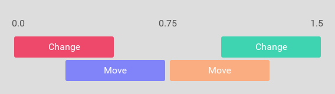
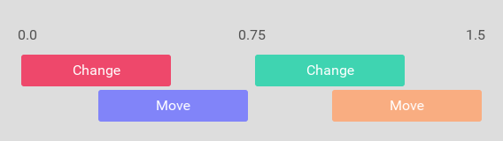

# Declarative animation

Fuse has a powerful animation system that allows you to write your animations in purely declarative UX markup.

The way we describe animations in Fuse is as deviations from what we call the "rest state". The rest state is the layout as it normally looks, when there has been no external inputs or events.
We then apply animations to this rest state in response to input, for example to scale down a button while it is being pressed:

```xml
<Button Text="Hello world!">
	<WhilePressed>
		<Scale Factor="0.8" Duration="0.2" />
	</WhilePressed>
</Button>
```

The code above shows one of the simplest animations you can make in Fuse. It consists of one "trigger" (the `WhilePressed` object) and one "animator" (the `Scale` object). You also see a `Button` object containing the trigger, and which is therefore the object that will get affected by the `Scale` animator.
There are many different triggers available that allow us to react to a variety of different user inputs and app events. There are also quite a few different animators that allow us to make changes to virtually anything within our app as a response to triggers being activated.

The triggers/animator system is designed so that it reads almost like an English sentence. The example above for instance can be read as follows: "While the button is being pressed, scale it by a factor of 0.8 over a duration of 0.2 seconds.".

- Animations are a deviation (or change) from this rest state
- This leads to some interesting design choices (such as AddingAnimation playing backwards)

## Animators

As mentioned, we use animators to make changes and animate our UI. There is a bunch of [different animators](https://fuse-open.github.io/docs/fuse/animations/animator) to pick from, but you will find that most of your needs are covered by the three transform-animators, `Move`, `Scale` and `Rotate`, and the generic animator `Change`, which allows us to animate almost any property on any element (like `Color`, `Width`/`Height`, and `Opacity`). 

A really neat thing about Fuse' declarative animation, is that it automatically knows how to undo its own effects. Say we for example change the color of a `Rectangle` to red using a change animator:

```xml
<Rectangle ux:Name="myRectangle" Color="#00f">
	<WhilePressed>
		<Change myRectangle.Color="#f00" Duration="0.5" />
	</WhilePressed>
</Rectangle>
```

As soon as the `WhilePressed` trigger is deactivated, the `Change` animator knows how to animate back to the original color, even if that color changes from some other source in the meantime. This means that all animation using these animators is only a temporary change, meaning it is in affect only as long as its containing trigger is active.

### Common animator properties

There is a set of common properties that you can expect to find on all animators: 

- `Duration` - Over how much time the animation should apply its effect
- `Delay` - How long the animator should wait before it starts applying its change
- `Easing` - A function that determines how the animators value should change over time
  - Take a look here for a neat illustration of [how easing curves work](http://easings.net/)


Animators play relative to the moment the trigger they are in is activated. This means that all animators inside a trigger are played simultaneously.
In the following example, we have a rectangle that, while pressed, rotates 180 degrees over 0.5 seconds, then fades to blue over a duration half a second.

```xml
<Rectangle ux:Name="myRectangle" Color="#f00">
	<WhilePressed>
		<Rotate Degrees="180" Duration="0.5" />
		<Change myRectangle.Color="#00f" Duration="0.5" Delay="0.5" />
	</WhilePressed>
</Rectangle>
```

### Easing

Animations are linear by default. This means that while they interpolate between the original value and the target value, the value change happens at a constant rate. This can often lead to unrealistic and stiff animations.
The solution to this problem is to change the easing curve using the `Easing` and `EasingBack` properties. For the cases when we need a truly custom easing curve, you can use the `CubicBezierEasing` class. You can find its reference documentation [here](https://fuse-open.github.io/docs/fuse/animations/cubicbeziereasing).

To get started, the `CubicInOut` easing tends to give a nice result for general use-cases.

```xml
<WhilePressed>
	<Rotate Easing="CubicInOut" Degrees="180" Duration="0.5" />
	<Change Easing="CubicInOut" myRectangle.Color="#00f" Duration="0.5" Delay="0.5" />
</WhilePressed>
```

### Backwards animation

As we briefly discussed earlier, animators in Fuse know how to reverse themselves so that when their containing triggers gets deactivated, they can return the UI to its rest state automatically.
It achieves this by creating a reversed version of its animation under the hood, and playing it back.

Say we have an animation that looks something like this:

```xml
<Change Duration="0.5" />
<Move Duration="0.5" Delay="0.25" />
```


The full forward and backward animation can be visualized as follows (where the part after the middle line animates back to the original values).



Here we can see that the backwards animation is a mirror image of the original animation, but there are several ways to control how this backwards animation behaves.
The common animator properties each have a corresponding `Back` variant (`DurationBack`, `DelayBack`, and `EasingBack`). This lets us change the timeline so that it acts differently when the trigger is being deactivated from when its being activated.

Here is an example of the above timeline after we've altered the `DelayBack` property of both animators as follows:

```xml
<Change Duration="0.5" DelayBack="0" />
<Move Duration="0.5" Delay="0.25" DelayBack="0.25" />
```



For the rare case when we want a completely different set of animators for when a trigger deactivates, we can use the `TriggerAnimation` class, and bind it to the triggers `BackwardAnimation` property. Here is an example of what that looks like:

```xml
<WhileTrue>
	<Move X="100" Duration="0.5" />
	
	<TriggerAnimation ux:Binding="BackwardAnimation">
		<Rotate Degrees="90" Duration="0.25" />
	</TriggerAnimation>
</WhileTrue>
```

Of course in this case, that means the object will just "jump" straight back to its original position and then rotate as per the `Rotate` animator in the `TriggerAnimation`.

## Trigger types

The various triggers in Fuse can be roughly grouped in to three categories: while-triggers, pulse-triggers and animation-triggers. We will discuss their differences in the following sections.

### "While" triggers

"While" triggers have in common that they represent a certain state, which is either active or inactive. Some common example are `WhilePressed`, `WhileActive`, `WhileDragging` and `WhileTrue`. There are a bunch more, and they are all listed [here](https://fuse-open.github.io/docs/fuse/triggers/trigger).

### Pulse triggers (one-off events)

Pulse triggers represent one-off events, that can occur due to certain input or events, or changes in app state. They are recognizable by their past tense verb names like `Clicked`, `Activated` and `Scrolled`. Since pulse triggers don't represent persistent state, they are deactivated as soon as their animators have completed. This also means that the triggers don't have any inherent duration themselves. If we therefore put animators without any duration on them inside pulse triggers, the animation will happen "instantly" and won't be visible.

```xml
<Panel Width="150" Height="50" Color="Blue">
	<Clicked>
		<Rotate Degrees="180" Duration="0.5" />
	</Clicked>
</Panel>
```

### `...Animation`

Some triggers do not play back their animations based on a timer, but instead in response to for example a user gesture. These triggers can be identified by their names, which almost always end with `Animation`. Some commonly used examples are the `AddingAnimation`, `RemovingAnimation`, `ScrollingAnimation` and `SwipingAnimation`. Several of these triggers actually do have their own implicit durations, which are bound by the gestures they respond to (and which are defined by the triggers themselves). `SwipingAnimation` for example activates over the defined range of the `SwipeGesture` it is connected to. This means that if we don't put any duration on the animators in this trigger, they will extend to the whole range of the trigger, which means that the animators will animate over the whole swipe gesture.

## Custom `Navigator` page transitions

Using the `Transition` trigger, we can completely customize how pages enter and exit the screen when being navigated to and from using the `Navigator` class. You can read more about how it is used in the [transition reference docs](https://fuse-open.github.io/docs/fuse/triggers/transition).

## Custom `PageControl` page transitions

The easiest way to customize the animation of pages entering and exiting a `PageControl`, is to use the `EnteringAnimation` and `ExitingAnimation`. Those can be put directly on the page, so give it a completely custom animation:

```xml
<Page ux:Class="MyPage" Transition="None">
	<EnteringAnimation>
		<Move X="-1" RelativeTo="ParentSize" />
	</EnteringAnimation>
	<ExitingAnimation>
		<Move X="1" RelativeTo="ParentSize" />
	</ExitingAnimation>
</Page>
```

<blockquote class="callout-info">

Since the `PageControl` already defines how to animate pages as the user swipes, we need to disable this if we want to add our own. We do this by setting the `Transition` property of the `Page` to `None`.

</blockquote>

The `EnteringAnimation` and `ExitingAnimation` can be a source of confusion for people who first encounter them, but we'll try to explain them here:

The "current" page in a `PageControl` is the one the user is currently looking at. Swiping to the left causes the current page to "enter" with the animations defined by the `EnteringAnimation`, and causes the next page to "exit backwards" with the animations defined by the `ExitingAnimation`, played backwards. Why is `ExitingAnimation` played backwards you might wonder? Well, this is because the rest states of our page is defined as the way it looks while being the current page. Its animation then defines the offset from that rest state and how it is moved out of the way before it enters.

You might wonder what happens when the user swipes to the right? This actually causes the previous page to "enter backwards (causing it to re-enter the screen)" and the "current" page to "exit forwards (causing it to exit the screen)" This means that in this case, the `EnteringAnimation` is played backwards while the `ExitingAnimation` is played forwards.


Summarized: 

- `EnteringAnimation` describes what happens to the "current" page as we move to the "next" page.
- `ExitingAnimation` describes what happens to the "current" page as we move to the "previous" page

- When moving to the _next_ page, we play
	- The _current_ page's `EnteringAnimation` forwards
	- The _next_ page's `ExitingAnimation` in reverse
- When moving to the _previous_ page, we play
	- The _current_ page's `ExitingAnimation`
	- The _previous_ page's `EnteringAnimation` in reverse

#### ProgressAnimation

Some controls, like `Slider` and `Video` have an inherent _progress_ property, which we can animate in response to using the `ProgressAnimation` trigger. What _progress_ means in either context depends on the control itself. For a `Slider` for example, _progress_ represents an arbitrary value, while for `Video`, _progress_ represents how far into playback we have come. In either case however, _progress_ is reported as a value between `0` and `1`. WebView uses _progress_ to report how far it's come in loading a page, which we can for example use to implement a custom loading bar.

Here is an example of how `ProgressAnimation` can be used with a `Slider` to scale and rotate a `Rectangle` in response to the slider being slid by the user.

```xml
<Panel>
	<Slider>
		<ProgressAnimation>
			<Scale Target="myRect" Factor="0.5" />
			<Rotate Target="myRect" Degrees="180" />
		</ProgressAnimation>
	</Slider>

	<Rectangle ux:Name="myRect" Width="250" Height="250" Color="Red" />
</Panel>
```

## Elements inside triggers

A very useful feature of triggers is that they can also contain arbitrary elements. When the trigger is activated, the elements become rooted to the visual tree, meaning it becomes visible. This is in general a nice way to show and hide elements. Another neat thing about showing elements this way is that this causes them to be _added_ and _removed_, meaning we can utilize `AddingAnimation` and `RemovingAnimation` to animate the elements as they are shown and hidden.

The following example shows how we can display a `Rectangle` with a nice fading animation using a `WhileTrue` trigger. Note that the `AddingAnimation` trigger does not animate back when the element is removed, and thus we also need a `RemovingAnimation` to make the `Rectangle` fade back out. Another thing to note here is that the `AddingAnimation` animated backwards when the element is added to the visual tree. This is, like with `EnteringAnimation` and `ExitingAnimation` because we want to describe the animation as a deviation from the rest state, which in this case is how the `Rectangle` looks when it is visible.

```xml
<WhileTrue>
	<Rectangle ux:Name="rect" Color="Red" Width="100" Height="100">
		<AddingAnimation>
			<Change rect.Opacity="0" Duration="0.2" />
		</AddingAnimation>
		<RemovingAnimation>
			<Change rect.Opacity="0" Duration="0.2" />
		</RemovingAnimation>
	</Rectangle>
</WhileTrue>
```
