# Fuse for designers

## Learn to build your own apps.

You don’t have to read everything here; the best way to learn Fuse is to play with it. Feel free to skim and re-visit these sections as you get stuck.

# What’s in the box?

When you download and install Fuse you get a few things:

* ### The Dashboard: ###
> When you launch Fuse this is what you will see. From here you can manage and create projects.

* ### Live app preview: ###
> When you run a Fuse project, you’ll get a live preview of your app in the Fuse application. The live preview allows you to interact with the app or visually select objects. You can switch between your selection in preview and your text editor with a simple `⌥ ⌘ L`/`alt ctrl L`.

* ### On device preview: ###
> This requires an extra few steps to get running. Because Fuse is running a genuine native app on your device you’ll need to download and install the relevant Android and iOS SDKs. There is some info [here](https://fuseopen.com/docs/basics/preview-and-export) on how to do this.

### What’s not in the box:

* ### A text editor: ###
> A text editor is an application that allows you to write and edit code. There are many great ones out there. Currently Fuse has plugins for Atom, Sublime and Visual Studio Code. We recommend downloading Visual Studio Code, it’s completely free and has JS debugging built right in. But you can use whichever one suits you.

# What is a Fuse project?

#### A Fuse project is really just a folder that contains two files: MainView.ux and AppName.unoproj

If you open up Fuse and select `New Fuse project` in the Dashboard, it will generate a folder like this:


* The `AppName.unoproj` is used for some more advanced stuff, but it also lets Fuse know where your project is and what it’s called. When you add new files and folders to your project, it’s always going to be relative to this file.

* The `MainView.ux` contains all the visual stuff that appears in your app. If you open it up in a text editor you will see these app tags, `<App><App/>`. Whatever you put between those tags will constitute the UI of your app. That sounds like it might be quite large by the time you build an entire App, right? Well, Fuse is designed to be as modular as possible so that this doesn’t happen. If you are interested in that, check out the Classes section.

* There will be a `build` folder here after you have run the app in Fuse. It contains a bunch of stuff Fuse uses to make the preview of your app. You can completely ignore this for the most part. If you need to send your app to someone else, just delete this to save space.

Aside from that, there is no witchcraft happening here. This is just a normal folder. You can add sub-folders. You can use Git to track the versioning. You can zip it to friend and they’ll be able to run it.

# Workflow

#### What’s the best way to work with Fuse? The answer, is of course: it depends.

If you are super comfortable with coding in UX and have a clear idea of what you want to build then jumping right into Fuse is probably the best way to do it.
It’s more likely that you don’t quite know exactly what you need to build just yet. Using a design tool, like Sketch, Figma or Photoshop, is a great way to quickly and roughly explore your idea. Don’t waste time polishing in these programs though. Once you know how your app should look and behave, you can start putting the building blocks together in Fuse and do the polishing there.

So, what’s the best way to use Fuse once you get to this stage?
As you flesh out your idea, you might feel like you are not doing things right. Maybe some of your UX code is redundant, or maybe there are better ways to do things but they seem a bit complicated to you right now.

That’s FINE.

It’s perfectly okay to splat your ideas on the page and then remove and refactor your UX later. This flexibility is what makes Fuse so much fun and so effective in the prototyping phase.
Just don’t get too carried away as you might have a lot to clean up later.

# UX markup

#### The .ux means that a file contains UX markup, the XML language we created to make building UIs better.

If you have some experience with web, you might recognize the structure of an XML language, but if you haven’t you might need an explainer.


It consists of objects, which are declared inside of `< >`. It is tempting to think of them like layers in design programs. But, you should think of them more as boxes of boxes, where relationships are established like a Russian doll. You open the box, put stuff in it, and then you close the box.


The word that appears immediately after the first `<` is the object name and tells Fuse what type of object it is. Most object names start with a capital letter.


These objects have a variety of properties. What properties you can set depend on the type of object.


Setting the values of these properties is how you tell Fuse how objects should look an behave. Some properties will have a finite list of possible values and others will take numbers and text as values.


A `/` signifies the end of an element. The `/` before the last `>` means that the `Rectangle` has been closed.


Objects can be left open and then closed around another object like this:

```xml
<Rectangle Color="Red">
  <Text Value="Hey, I am some text" Color="White" Alignment="Center" />`
</Rectangle>
```

Notice the first `<Rectangle>` has no `/` but the second one starts with a `</`? This makes the enclosed object a _child_ of the outermost object.
This is usually called wrapping. The `Rectangle` is _wrapping_ the `Text` object.

You can continue this nesting of children pretty much indefinitely. These relationships between objects are important because they allow you to tell them how to behave based on their parent. Fuse uses this in its layout system, to align and position things.

### Why is this good?

There are a bunch of advantages to using a language like this to build UIs.

* First of all, it’s easy to read. Your app is essentially a series of objects (rectangles, panels, and text) arranged in a specific structure. The nesting of objects make this structure easy to understand and alter.

* Secondly, you separate your concerns. You can build your UI with `.ux` files and keep it completely separate from any business logic. Sure, you can easily plug the business logic into the UI, but the UI does not depend on it. This makes iterating on the UI super fast and simple.

* Lastly, it’s _declarative_. This means that you tell Fuse what you want, not how to make it. The advantage of a declarative language is that you don’t have to worry about state in your UI. State is a bit more of an advanced programming concept but managing it can be a pain and with UX you don’t have to.

# Basic Panels

#### Most of what you’ll want to do in Fuse can be achieved by combining the following panels, so understanding them is a great way to get started.

* `<Panel/>`
  > The most basic of all the objects. Essentially a blank slate. Pretty similar to a `div` in html.


* `<Page/>`
  > Basically a `Panel` but with a title. Pages play well with navigation.


* `<Rectangle/>`
  > A Rectangle is exactly like a `Panel` but with `Shape` properties, like `Corner Radius`.


* `<Circle/>`
  > Pretty much just a circle, but like `Rectangle` it has `Shape` properties.


* `<StackPanel/>`
  > Arranges its children in a stacked layout. One after the other.


* `<Text/>`
  > Run of the mill text object.


* `<TextInput/>`
  > Creates a user editable text field.


* `<ScrollView/>`
  > Allows the user to scroll through its children.


* `<Each/>`
   > An each will repeat its children by a specified count or based on some data. Super powerful.


# Layout

#### The layout system in Fuse is a relative layout system. If you have some web experience this might be familiar to you, but if you are used to programs like Sketch, you’ll need an introduction.

Most vector based tools use an absolute positioning system. In an absolute system when you draw a rectangle you are specifying the x and y co-ordinates of that rectangle on the artboard. If you resized the artboard, the rectangle would stay on the exact same x and y points.
_Note: Some design programs already have relative layout features. Figma’s containers and Sketch's resizing rules for instance._

In Fuse’s layout system, when you draw a rectangle, you tell it how it should align relative to its parent. So when the parent changes size, the rectangle will change its position relative to its parent. That might seem complicated, so lets look at a practical example:

```xml
<!-- Red Panel -->
<Panel Color="#DB6882" Width="200" Padding="20" Height="300">
  <!-- Yellow Panel -->
  <Panel Color="#F1D751" />
</Panel>
```


If you change the `Width` of the parent `<Panel/>` you can see how the child adjusts its size accordingly. The child wants to take up as much space as the parent will let it.

You also have the ability to let a parent object dictate the way its children are arranged. A `<StackPanel/>` is a good example of this. The children of a `StackPanel` are stacked one after the other, rather than trying to occupy the same space. Here’s an example:

```xml
<!-- Red Panel -->
<StackPanel Color="#DB6882" Width="300" Height="300" Padding="20">
  <!-- Yellow Panel -->
  <Panel Color="#F1D751" Height="40" />
  <!-- Light Blue Panel -->
  <Panel Color="#6DBFD2" Height="60" />
  <!-- Purple Panel -->
  <Panel Color="#7A49A7" Height="80" />
</StackPanel>
```

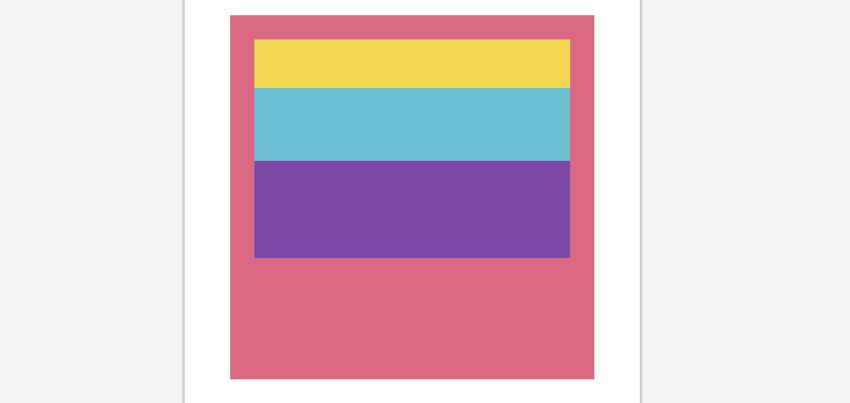

If you used a normal `<Panel/>` instead of a `<StackPanel/>` all of the children would have overlapped, like this:


At first, this way of positioning might seem frustrating but it is incredibly powerful once you get used to it. Your layout will adjust to any screen size meaning you no longer have to worry about slight changes in density and resolution across devices.

### Margin and Padding

You might have noticed in the above code that the parent object has the `Padding` property set on it. `Margin` and `Padding` are the bread and butter of a relative layout system, so lets make sure we understand the difference.

Simply put, `Margin` is the space outside the object and `Padding` is the space inside the object. Setting `Margin` on an object creates space between the object and its parent. Setting `Padding` creates space between the object and any children it contains. Here is a short demo:

```xml
<!-- Red Panel -->
<Panel Color="#DB6882" Width="300" Height="300">
  <!-- Yellow Panel -->
  <Panel Color="#F1D751" Margin="20" Padding="40">
    <!-- Light Blue Panel -->
    <Panel Color="#6DBFD2" />
  </Panel>
</Panel>
```
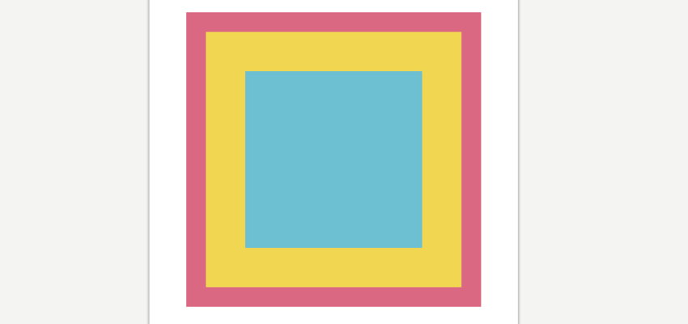

Check out the yellow `Panel`, notice how it’s ‘pushing’ itself away from the edges of the red `Panel`? That’s `Margin` at work. The light blue `Panel` is in turn being pushed away from the edges of the yellow `Panel`. That’s `Padding` doing its job. Here is a diagram that should help:

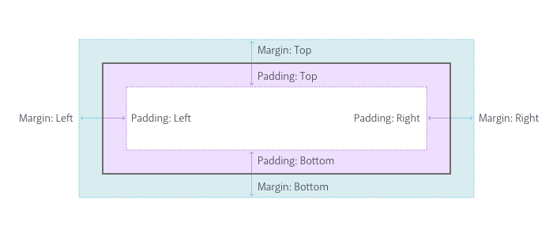

You can also specify different values for each side like so:

```xml
<!-- Red Panel -->
<Panel Color="#DB6882" Width="300" Height="300">
  <!-- Yellow Panel -->
  <Panel Color="#F1D751" Margin="40,30,20,10" />
</Panel>
```

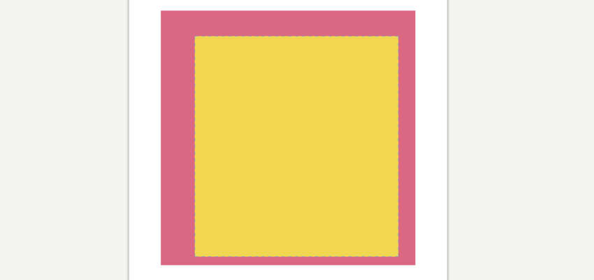

There are 4 values in the `Margin` property this time, each separated by a comma: `Margin="40,30,20,10"`. This is the same as saying:
```js
Margin-Left="40"
Margin-Top="30"
Margin-Right="20"
Margin-Bottom="10"
```
Fuse doesn’t use different types of `Margin` and `Padding`, instead you specify them all in one value. It’s handy to remember that the values start from Left and go clockwise: `Left`,`Top`, `Right`, `Bottom`.

_Note: You can also set Margin and Padding like this: Margin="40,20".
It’s the same as saying:_
```js
Margin-Left-and-Right="40"
Margin-Top-and-Bottom="20"
```

### Alignment

`Alignment` allows you to really fine-tune your layout. As you may have guessed, specifying `Alignment` tells an object where it should align itself relative to its parent. That last bit is important as an object can only align itself in the space it has available. This sounds obvious but it will trip you up when using `Alignment` inside of `StackPanels` and others that constrain available space. First lets see all the options you have:


For the most part, `Alignment` is really straightforward; it does exactly what it says on the tin. But sometimes you won’t get something to align as expected and most of the time that is because of _available space_. Consider this:
```xml
<!-- Red Panel -->
<StackPanel Color="#DB6882" Width="300" Height="300" Padding="20">
  <!-- Yellow Panel -->
  <Panel Color="#F1D751" Height="100" />
  <!-- Purple Panel -->
  <Panel Color="#7A49A7" Height="100" />
</StackPanel>
```

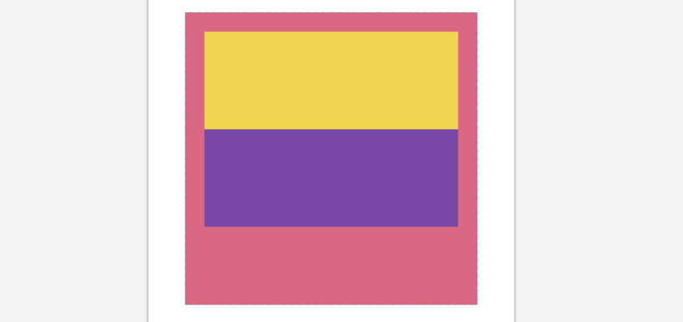

Here you have two `Panels` inside a `StackPanel`. What if you want the purple `Panel` to align to the bottom of the `StackPanel`? You can see that there is plenty of extra space in the `StackPanel`, shouldn’t be an issue.

```xml
<!-- Red Panel -->
<StackPanel Color="#DB6882" Width="300" Height="300" Padding="20">
  <!-- Yellow Panel -->
  <Panel Color="#F1D751" Height="100" />
  <!-- Purple Panel -->
  <Panel Color="#7A49A7" Height="100" Alignment="Bottom" />
</StackPanel>
```
But nothing changes. Why is that?

Most objects want to take up as much space as is available to them but one of the nuances of a `StackPanel` is that it only gives its children as much space as they need. So the purple `Panel` only has available space equivalent to its size. Confused? Check this out:

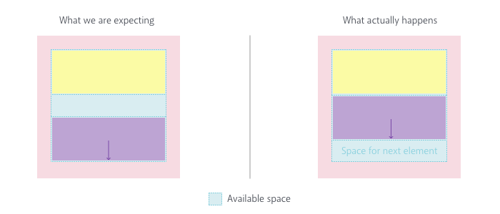

We expect the purple `Panel` to align to the bottom of the space that is provided for all children. Instead the purple `Panel` is aligned to the bottom of the space provided only for itself. Which, visually, doesn’t alter its position at all. In this instance a fix might be to use a different kind of `Panel` that doesn’t divide it’s available space. So, if `Alignment` is tripping you up, remember to think about the way space is being allocated in your app.

Finally, setting `Alignment` on an object has another side-effect on the way that object takes up space. Above we said _"most objects want to take up as much space as is available to them"_ and this is true, until we set `Alignment` on them. Check out this code:

```xml
<!-- Red Panel -->
<Panel Color="#DB6882" Width="300" Height="300" Padding="20">
  <!-- Text with Yellow BG -->
  <Text Value="Hey there" Color="Black" Background="#F1D751" />
</Panel>
```


It is just some `Text` inside a `Panel`. The `Background` of the `Text `is set to yellow so you can easily see how much space the text is taking up. As you can tell, it is filling the entirety of the available space. So let’s add an `Alignment` to the `Text` and see how it changes:
```xml
<!-- Red Panel -->
<Panel Color="#DB6882" Width="300" Height="300" Padding="20">
  <!-- Text with Yellow BG -->
  <Text Value="Hey there" Color="Black" Background="#F1D751"
   Alignment="TopCenter" />
</Panel>
```


So two things happened there. The `Text` moved to the `TopCenter` of the available space and it switched to only occupying as much space as it needs to display its `Value`. Setting `Alignment` is the same as saying to an object _"Go sit in that corner and don’t take up much space."_
This might cause some un-expected results when you initially start playing with layout so it’s worthwhile to spend some time to get your head around it.

### Units

A quick note on units. You will have undoubtedly noticed that you haven’t needed to specify units in the code. This is because Fuse uses `points` by default. `Points` ensure consistency across multiple screen densities but there are a few other options. Properties like `Width`, `Height`, `X` and `Y` etc can all take their values in `percent` and `pixels` too:

* Percent — `Width="50%"` makes the Width of an object 50 percent of its parent width.

* Points (default) — `Width="50"` makes the `Width` of an object 50 points. This means that the width will appear the same on all screen densities.

* Pixels — `Width="50px"` makes the `Width` be exactly 50 pixels. This means that the width will appear smaller on screens with higher pixel densities.

# Styling

#### Styling in Fuse is really simple and intuitive.

In Fuse, styling works in a pretty similar way to a vector based program. Each object has styling properties, like `Color`, that you specify on the object. This is unlike CSS where objects inherit their styling from a rule.
```xml
<Rectangle Color="#46E3D6" Width="200" Height="100" />
```


Shape objects like `Rectangle` and `Circle` have a few more style related properties than a typical Panel. For instance, `Rectangle` can have `Stroke` and `CornerRadius` whereas `Panel` can’t. Shape objects usually have a visual role where a `Panel` will often be used to help construct a layout, where they will be invisible.

What is really interesting is that you can create some styles as their own objects:
```xml
<Rectangle  Width="200" Height="100">
   <SolidColor Color="#46E3D6" />
   <Stroke Color="#6DBFD2" Width="2" />
   <Shadow Color="#0003" Distance="1" />
</Rectangle>
```

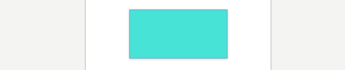


It looks like the `Rectangle` is being styled by its children, but it’s probably easier to say that the Rectangle is defining an area for those children to be displayed.

This might seem strange and cumbersome at first, but when you start doing more advanced animations and transitions, this flexibility shines. It allows you to specifically target the styles as objects and manipulate them independently from their parent.

### Handling Assets

At some point you will probably want to use assets in your app. It’s pretty simple to use assets in Fuse, you just need to make sure you put them all inside the Fuse project so that you can keep track of them easily. For consistency’s sake, we suggest the following folder structure.

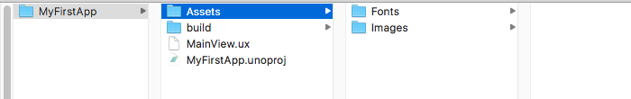

```s
Project Folder> Assets> Asset Type
```
Then when you include the file in MainView.ux, you do so relative to the project root folder like this:
```xml
<Image File="Assets/AssetType/Asset.jpeg" />
```

### Using MultiDensity Images

Of course you want to make sure that the images you include look good on all devices. The best way to do this is to export your images at multiple pixel densities from Sketch, Figma or Photoshop. Luckily, that is the hardest part of the process. Fuse has a really neat way of figuring out which image to use on each screen density. All you need to do is include the images like so:
```xml
<Image StretchMode="PointPrefer">
  <MultiDensityImageSource>
    <FileImageSource File="Icon.png" Density="1" />
    <FileImageSource File="Icon@2x.png" Density="2" />
    <FileImageSource File="Icon@3x.png" Density="3" />
  </MultiDensityImageSource>
</Image>
```
The `Density` property here tells Fuse which asset you want used at each density, then Fuse figures out the density of the current screen and displays the correct one. In the above example the icon will appear the same on both retina and non-retina screens. Simple.

### Making Text Styles

One of the most convenient aspects of design programs is the ability to create re-usable styles for text. It helps ensure consistency across a design with minimal effort.
In Fuse you can do something pretty similar. To get started you need to include a font of your choice by putting it in your `Assets` folder, like so:


Next you need to make that font globally available in your app. Fuse has a `<Font/>` object which allows you to include a font in your project:
```xml
<Font File="Assets/Fonts/Comic Sans MS.ttf" />
```
You’ll need to copy the actual font file into your project folder. Then you make it globally available like so:
```xml
<Font File="Assets/Fonts/Comic Sans MS.ttf" ux:Global="MyDefaultFont" />
```
The `ux:Global` property as you may have guessed, makes the font a globally available resource in your app. Meaning that whenever you make a new `Text` object, you can apply the font like this:
```xml
<Text Font="MyDefaultFont" Value="Oh, hi there" />
```

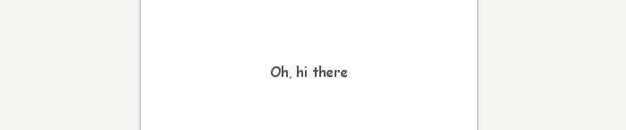

There is one more step here to make a truly re-usable style and it requires using `ux:Class`. We will cover classes a bit further on in this article in more detail, so don’t stress if it’s a new concept to you. For this task all you need to know is that putting `ux:Class` on an object makes it into a new type of object that you can re-use. So, if you do this:
```xml
<Text ux:Class="MyHeadlineText" FontSize="32" Font="MyDefaultFont" />
```
You can then re-use that text style every-time you need a headline, like this:
```xml
<MyHeadlineText Value="Oh, hi there" />
```


Then if you want to change the way headlines look across the app, you tweak the original class:
```xml
<Text ux:Class="MyHeadlineText" Size="32" Font="MyDefaultFont" Color="#DB6882" />
```
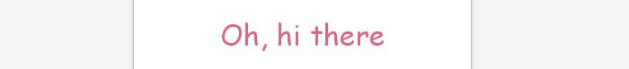


### Making Color Palettes

Another aspect of design programs you can replicate is a color palette. To avoid the tedium of typing in hex codes over and over you can create global colors and apply them by name.
First thing you need to do is declare a color like so:
```xml
<float4 ux:Value="#8A5182" />
```
You may be wondering what a `<float4/>` is. Without getting into too much detail, it’s a value-type Fuse uses for colors. You are saying to Fuse that you want to make a new thing and it will be `<float4/>` type. Then you define the value of that thing as `#8A5182`. If you typed in a value that wasn’t the right type, like `"Hello"` , Fuse would throw an error.

By adding the following, we can make that color globally available.
```xml
<float4 ux:Global="MyFavColor" ux:Value="#8A5182" />
```
Then you can apply it to anything that takes a `Color` property by using the unique `ux:Global` name you made:
```xml
<Text Size="16" Font="MyDefaultFont" Color="MyFavColor" />
```
You can make as many colors as you need to. It’s really great because if you change your mind about the exact kind of color you want, you can tweak the color here and it will update to every object using that color.

# Animation

#### Great UIs are made from more than just colors and fonts. They move and respond dynamically to gestures.


We haven’t touched on what is arguably Fuse’s best feature: its animation system. We are going to go through some of the core concepts of the animation system but we will leave the more advanced transitions for another time. This should be enough to get you going.

If you have done any sort of animation you know that it can get tricky real fast. Fuse is designed so that doesn’t happen. That’s thanks to the core concept of the animation system.

> "Animation is deviation from rest state"

That means when you animate an object you are moving it away from its rest state. When the animation is over, the object returns to rest state. The important part to grasp here is that objects want to go back to their original state. This might seem unintuitive right now, but the advantage is you don’t need to specify where the object is at any given time. UX is declarative remember, so that means you tell Fuse what you want to happen and let it take care of how it gets from a to b.
This allows you to define your design entirely separately from its transitions and animated behaviours, because you always design for the scenario where things have "come to a rest".

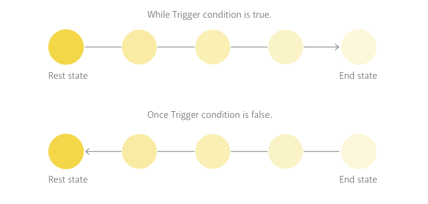

### Triggers

Triggers listen for specific events, gestures or inputs. When that event takes place the trigger activates and performs an animation in response. More specifically the trigger performs whatever animations/actions you place inside of it. Let’s look at a basic example:
```xml
<Circle Height="60" Color="#6DBFD2" >
   <WhilePressed>
     <Scale Factor="0.9" Easing="BounceInOut" Duration="0.2" />
   </WhilePressed>
</Circle>
```


Notice that `<WhilePressed/>`? It tells Fuse "While that object is pressed, do this." Fuse then listens for the condition specified by that trigger, in this case a touch event on the `Cirlce`.

When placing a trigger inside of an object the trigger is scoped to the object you put it in. This means it will ignore touch events everywhere else on the screen, only acting when its parent is pressed.


Triggers that begin with `<While.../>` will continue to remain active the whole time their required conditions are true. In the above example, the `Circle` will remain scaled until the user stops pressing. Then it will return to its rest state by animating itself backwards. Triggers in Fuse are pretty smart, and they always know how to return to their rest state, even if you interrupt their animation mid way:

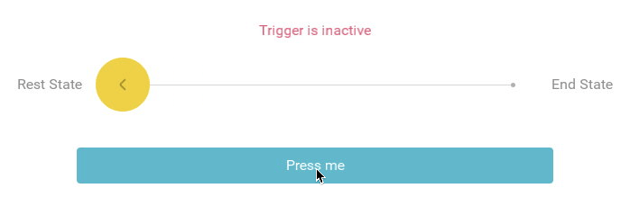

There are other types of triggers that will only execute their action or animation once. You typically use those to fire off events you don’t want to repeat, like function calls in JavaScript. These have passed-tense verbs for names, like `Tapped` or `Clicked`.

### Animators

Animators tell triggers what to do when their conditions are met. The `<Scale/>` we used above is an animator. So is this `<Move/>`:
```xml
<Circle Height="60" Color="#6DBFD2" >
   <WhilePressed>
     <Move Y="-1" RelativeTo="Size" Easing="BounceInOut" Duration="0.2" />
   </WhilePressed>
</Circle>
```


Animators want to know what to animate. In the above example the `<Move/>` animates its parent, but sometimes you want to animate a different object. In this case you need to explicitly tell them through the `Target` property as seen in the `<Move/>` below:
```xml
<StackPanel Orientation="Horizontal" Alignment="Center" ItemSpacing="10">
  <Circle ux:Name="circleName" Height="60" Width="60" Color="#F1D751" />
  <Circle Height="60" Width="60" Color="#6DBFD2" >
    <WhilePressed>
      <Move Target="circleName" Y="-1" RelativeTo="Size" Easing="BounceInOut" Duration="0.2" />
    </WhilePressed>
  </Circle>
</StackPanel>
```


The advantage of the `Target` property is that you can animate things outside of the current scope. You do this by specifying `ux:Name` on the object you want to animate. This gives Fuse a unique identifier for the object so that it can animate the right one.
Animators have a few other important properties: duration, delay and easing.

* `Duration` specifies how long the animation should take from start to finish.

* `Delay` specifies if there should be a delay before starting the animation.

* `Easing` specifies an easing curve for the animation. [Here](https://fuseopen.com/docs/fuse/animations/easing) is a list of all the curves Fuse allows.

By default animations will play themselves in reverse when returning to rest state. But if you want you can change the way this happens you can specify how each of those properties play in reverse:

```xml
<StackPanel Orientation="Horizontal" Alignment="Center" ItemSpacing="10">
  <Circle Height="60" Width="60" Color="#F1D751" ux:Name="circleName" />
  <Circle Height="60" Width="60" Color="#6DBFD2" >
    <WhilePressed>
      <Move Target="circleName" Y="-1" RelativeTo="Size" Delay="0.2" Easing="Linear" Duration="0.2" DurationBack="0.4" EasingBack="ElasticIn" DelayBack="0.4" />
    </WhilePressed>
  </Circle>
</StackPanel>
```


### Change

Although Fuse has a bunch of different animators, there is one that is more versatile than the rest. `Change` allows you to animate any property that the targeted object has. For instance:
```xml
<StackPanel Orientation="Horizontal" Alignment="Center" ItemSpacing="10">
  <Circle Height="60" Width="60" Color="#F1D751" ux:Name="circleName" />
  <Circle Height="60" Width="60" Color="#6DBFD2" >
    <WhilePressed>
     <Change Target="circleName.Color" Value="#6DBFD2" Duration="0.4" />
    </WhilePressed>
  </Circle>
</StackPanel>
```


In this example, the `Change` animator is animating the `Color` property of the other `Circle`. You can use `ObjectName.Property` to target and animate specific properties of other objects. Change can target almost any property in this way which makes it extremely versatile.

_Note: you could use this notation, `circleName.Color="#6DBFD2"`, to achieve the same as `Target="circleName.Color" Value="#6DBFD2"`._

# Navigation

#### Fuse has a flexible and extensive navigation system and, as with most things that are this powerful, there is a learning curve.

To create extensive multi-page navigation requires hooking a few things up behind the scenes. So for this introduction to Fuse, we’ll only talk about a simple navigation type here.
_Note: If you feel comfortable learning about more complex navigation, skip to the end of this section for some links._

### PageControl

A `PageControl` object simply allows navigation between its children in a linear order. Users can swipe through the children from beginning to end:
```xml
<PageControl>
    <Page Background="#6DBFD2" />
    <Page Background="#F1D751" />
    <Page Background="#DB6882" />
</PageControl>
```


A `Page` is basically just a `Panel` with a `Title` property. You could actually use any type of object here but it’s important to distinguish between containers and their contents, at least mentally. Plus, `Page` plays nicely with more complex navigation, so it’s a good idea to use them.

You can specify which `Page` should be the default by using the `Active` property. You can also make a `PageControl` navigate to a specific `Page` for you. These both require giving each `Page` a unique `ux:Name` so that the `PageControl` knows which is which. Then you just add a `NavigateTo` animator to force the navigation. Check it out:

```xml
<PageControl>
  <Page Background="#6DBFD2" ux:Name="bluePage" >
    <Text Value="Click Me!" Alignment="Center" TextColor="White">
      <Clicked>
        <NavigateTo Target="redPage" />
      </Clicked>
    </Text>
 </Page>
 <Page Background="#F1D751" ux:Name="yellowPage" />
 <Page Background="#DB6882" ux:Name="redPage" />
</PageControl>
```


The limitation of PageControl is that its not very smart. It really only works for linear navigation, you can see this above as it navigates through the yellow page to the red page. But to get you started this should be all you need to create some basic prototypes.

_Note: If you feel comfortable learning some more advanced concepts, check out the docs on [Navigation](https://fuseopen.com/docs/navigation/navigation), [Router](https://fuseopen.com/docs/fuse/navigation/router) and [Navigator](https://fuseopen.com/docs/fuse/controls/navigator)._

# Classes

#### You may have heard the phrase Don’t Repeat Yourself. It’s an important concept in programming — you should never do work that the computer could be doing for you.

Classes are very similar to the concept to Symbols in Sketch, Components in Figma and Library Objects in Photoshop.

In basic terms when you make a class you are making a blueprint. When you tell Fuse to build that class, it knows exactly what to do because it has the plans. Lets imagine you have the following code:

```xml
<StackPanel Padding="20" ItemSpacing="40">
  <StackPanel ItemSpacing="20">
    <Text FontSize="24" TextColor="#0006" Value="This is a short
     Headline." />
    <Text FontSize="16" TextColor="#0004" Value="This is a sub-
     heading. It can be much longer and wrap over two lines
     sometimes." TextWrapping="Wrap" />
  </StackPanel>
  <StackPanel ItemSpacing="20">
    <Text FontSize="24" TextColor="#0006" Value="This is a short
     Headline." />
    <Text FontSize="16" TextColor="#0004" Value="This is a sub-
     heading. It can be much longer and wrap over two lines
     sometimes." TextWrapping="Wrap" />
  </StackPanel>
</StackPanel>
```


There’s some clear repetition here so this is a perfect place to use classes. To do this, you set `ux:Class` on the first `StackPanel`, like so:
```xml
<StackPanel ux:Class="MyFirstClass" ItemSpacing="20" >
    <Text FontSize="24" TextColor="#0006" Value="This is a short
     Headline." />
    <Text FontSize="16" TextColor="#0004" Value="This is a sub-
     heading. It can be much longer and wrap over two lines
     sometimes." TextWrapping="Wrap" />
</StackPanel>
```
This makes the `StackPanel` and all of its children into a re-usable class. Brilliant! But, something weird happens now. One of the components is missing:


The reason this happens is that what you just did is declare the class, but there is no instance of that class. To create an instance, we need to do the following:
```xml
<MyFirstClass/>
```
You can see that when you make a class, you really are making a new custom type of object that you can use instead of writing all that code again. Hence, you can now delete the other `StackPanel`, so your code should look like this:
```xml
<StackPanel Padding="20" ItemSpacing="40" >
  <StackPanel ItemSpacing="20" ux:Class="MyFirstClass">
    <Text FontSize="24" TextColor="#0006" Value="This is a short
     Headline." />
    <Text FontSize="16" TextColor="#0004" Value="This is a sub-
     heading. It can be much longer and wrap over two lines
     sometimes." TextWrapping="Wrap" />
  </StackPanel>
  <MyFirstClass/>
  <MyFirstClass/>
</StackPanel>
```
When you put `ux:Class` on an object you are _declaring_ a class. When you write `<MyFirstClass/>` you are creating an _instance_ of that class. The idea is to have one class, and many instances.


The confusing bit is that class declarations are invisible. Fuse knows not to display them. You can think of them like the Symbols Page in Sketch. It’s not part of the visuals, it’s just the place where you go to edit what the symbol looks like.

_Note: in the interest of code cleanliness you should make your class declarations in a new .ux file. You can still instantiate the classes wherever you like, but it helps to keep things organized. There is more information about project organization at the end of this module._

### Making smarter Classes

Obviously, you will need the ability to have class instances that are slightly different from each other. This is where `ux:Property` comes in. It allows you to tell a class which of its properties you want to _expose_.

When you expose properties in a class, it means you can change those properties every time you make an instance. This is sort of like over-rides in Sketch symbols, but way more powerful.
This can get a bit tricky but it really only consists of two steps:

* Making a new property of a particular type. The types tell Fuse what kind of value it should expect.

* Binding that new property to the class so that every time we make an instance, we can edit our custom property.

**Step1: Make a new Property**

Lets re-visit the class from above and inside of it write:
```xml
<string ux:Property="HeadlineText" />
```
So now the code should look like this:
```xml
<StackPanel ItemSpacing="20" ux:Class="MyFirstClass">
  <string ux:Property="HeadlineText" />
  <Text FontSize="24" TextColor="#0006" Value="{Property
   HeadlineText}" />
  <Text FontSize="16" TextColor="#0004" Value="This is a sub-
   heading. It can be much longer and wrap over two lines
   sometimes." TextWrapping="Wrap" />
</StackPanel>
```
What is going on here? Well string means something with a text-value. You are telling Fuse "I am making a new thing that will have a text value. I want this thing to be a property called HeadlineText. So if any `Object` says it has a property called `HeadlineText`, expect it to be text."

That’s a bit confusing, so reading over it a few times might be useful. But now we have this empty property floating around we need to _bind_ it to the place we want to use it.

**Step2: Bind the Property**

In the first text object of your class you should change `Value` to:
```xml
<Text FontSize="24" TextColor="#0006" Value="{Property HeadlineText}" />
```


Lets break down what is happening here step by step:


First we have these curly braces. They tell Fuse "You’re going to get a different value here". These curly brackets are used when the value you provide for a property isn’t explicit, meaning it needs to be worked out first.


So now that Fuse is in the right frame of mind, the `Property` keyword tells it that it needs to look for a property that you have created.


Fuse needs some more info about the property because there could be a few different properties in this class. So the last piece of the puzzle is the unique name of your property.

So now when you create an instance of that class, you have access to that new property:
```xml
<MyFirstClass HeadlineText="Woah, they can be different everytime? " />
<MyFirstClass HeadlineText="Hey, this is neat" />
```


_Note: You can do this for more than just text. In fact you can expose just about any property that the class has. If you want to expose properties that aren’t text, you will need to specify a different value-type. Color uses `<float4/>` type and for a normal number `<int/>` type will do. There is some info on all the different value-types [here](https://fuseopen.com/docs/ux-markup/literals)._

### Inheritance

When you make an instance of your class that instance is a new object. It inherits all of the properties of the original class . But, those can be over-ridden because each instance is an object all on it’s own. So if the class has `Alignment="Center"` on it, we can over-ride that on individual instances:


Inheritance is a one way street. Changing something on an instance does not effect the class. But, changing something on the class effects all instances.

# Data

#### Of course you really don’t want to populate your App by hand. You want the machines to do the tedious stuff for you.

The best way to take care of that problem, is to link your UI to a data source. This may be uncharted territory for you so lets understand some basic concepts about data first.
_Note: This section is more advanced. Depending on your needs, you might not need to know any of this.
Furthermore, we have opted for simplicity for the sake of understanding here, Fuse is more flexible than this brief introduction might suggest._

### A brief intro

Data comes in a bunch of different types, but in most cases it consists of some sort of list. The complexity of the list can vary greatly, sure, but when you use data in Fuse you are basically telling Fuse "Over here, I want you to go check that list I mentioned earlier and whatever value you find throw it in here."

The nice thing about this approach is that if you want to change some items in the list, you don’t have to worry about updating the UI. The UI is always pointed towards the data and the data is the source of truth.

### Data in JavaScript

Data comes in a bunch of different types and formats. For the sake of simplicity here we are going to take a look at how data works in JavaScript. Mainly because this is the easiest way to get data into our apps.

As mentioned above, data is usually just some sort of list. This is just a list of Fruit types:
```js
Fruits:
  - type:
    - Apple
    - Orange
    - Pear
    - Banana
    - Plum
```
In JavaScript, we would represent the same data like this:
```js
Fruits: [
      { type: "Apple" },
      { type: "Orange" },
      { type: "Pear" },
      { type: "Banana" },
      { type: "Plum"}
    ]
```
It's a little bit hard to see with all the syntax so lets dig into what all of that means:

* `Fruits` is what we call an `Array`, that’s what those `[ ]` brackets after it indicate. An `Array` is just an ordered list.

* Each object in the list is separated by a comma `,` and wrapped in `{ }` .

* The `type : "Apple"` relationship inside each object is known as a key-value pair.

You can also have lists inside of lists (list-ception?), basically until infinity. This means you can create more complicated data structures like so:

```js
Fruits: [
  {
    type: "Apple",
    subtypes: [
      "GrannySmith",
      "Crab",
      "Red",
      "Toffee"
     ]
  },
  {
    type: "Orange",
    subtypes: [
      "Blood",
      "Satsuma"
     ]
   }
 ]
```
This is sort of like saying:
```js
Fruits:
  - type:
    - Apple
      - sub-types:
        - GrannySmith
        - Crab
        - Red
        - Toffee
    - Orange
      -sub-types:
        - Blood
        - Satsuma
```
So why should you care about this? Well, it’s not likely that you will ever need to make your own data structures but it does help you understand how how it is structured. When we need to access the `sub-types` of `Apples` it would be helpful to know how to tell Fuse "Hey go check that Fruits list and when you get to the Apple list inside of it, give me all of those."

### Creating mock data:

If you need to some local data for a prototype or to test something, you can do that pretty easily in your UX file. Calling it ‘mock’ data merely implies that it’s not a genuine live data source.

_Note: This is not the way we recommend working with data on larger or more serious projects. It’s better to work with data in separate JSON files and then include those in JS. That method means you can easily plug in a live data source at a later date._

First you need to use a `<JavaScript/>` object at the top of your `MainView.ux`. Anything written inside a `<JavaScript/>` object is well… JavaScript. It’s important that it is at the top of your ux file, so that Fuse reads this before executing the rest of the code. Copy the following at the top of your `MainView.ux`:
```xml
<JavaScript>
    module.exports = {
    };
 </JavaScript>
```
So what is going on there? Well in between those `<JavaScript/>` tags you have `module.exports`. This allows you to export from JS and make things available in your _data-context_. Data-context is just a term used to describe the data that we have access to in the application.

To recreate that list from the last section you write the following:
```xml
<JavaScript >
module.exports = {
    Fruits: [
      { type: "Apple" },
      { type: "Orange" },
      { type: "Pear" },
      { type: "Banana" },
      { type: "Plum"}
    ]
 }
</JavaScript>
```
This adds the list `Fruits` as an `Object` in the `module exports`. This is a quick and easy way of making that data available in the data context.

To get it into UX:
```xml
<Grid Alignment="Center" CellSpacing="10">
  <Each Items="{Fruits}">
    <Text Value="{type}" />
  </Each>
</Grid>
```


To get data into UX you need to use `{}` inside property values. We call this step data-binding and those curly brackets tell Fuse two things:

* "There is no explicit value here. You’re going to have to work it out"

* "You should go check the data context for this. Whatever value you find there that matches this word, bring it back here"

### Each

Now that we know a bit more about using data in your UI we can talk about those `Each` objects we used above. `Each` can be a bit daunting at first as it combines a lot of the concepts at once.
Lets break it down. What does `Each` really do? Well simply `Each` repeats whatever children it has. You can specify how many times the children repeat like so:
```xml
<Grid Alignment="Center" CellSpacing="10" >
  <Each Count="5">
    <Text Value="This is a Fruit list" />
  </Each>
</Grid>
```
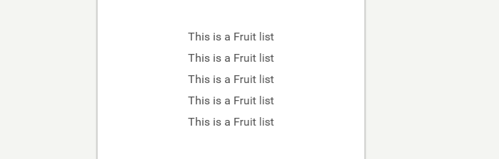

That’s great, but what is actually happening when you tell `Each` to do this?
Think about it like this:

* Step1: `Each` takes its children and makes them into one re-usable component.

* Step2: It then makes copies of that component based on the number in `Count=""` property.

* Step3: It places those as children of the `Each’s` parent.

So that’s all fairly understandable. Where it gets a bit tricky is when you use `Items` instead of `Count`. Items allows you to tell an `Each` to make new instances based off the number of items in a list. That means each list item gets its own instance. Wait, what? Lets break it down again:

* Step1: The same as before. It makes a component out of its children.

* Step2: It reads the data object specified in Items. It then makes a new copy for every item it finds in that list.

* Step3: Also the same as before. It places those instances as children of its parent.

Back to the example from the last section:
*Data:*
```xml
<JavaScript >
module.exports = {
    Fruits: [
      { type: "Apple" },
      { type: "Orange" },
      { type: "Pear" },
      { type: "Banana" },
      { type: "Plum"}
    ]
 }
</JavaScript>
```
*UX:*
```xml
<Grid Alignment="Center" CellSpacing="10" >
  <Each Items="{Fruits}">
    <Text Value="{type}" />
  </Each>
</Grid>
```


Here, the `Each` is told to look for the data object `Fruits` and the `Text` inside it is told to populate with the contents of the `Fruits` list.

Letting `Each` do all the work is pretty great because you don’t actually have to know in advance how many items you have. You can add or remove things from the data without worrying about explicitly updating the UI.

It gets better though. You can easily have more complicated components inside of the `Each` that draw from the same data. Here is an example:
```js
Fruits: [
    {
        type: "Apple",
        subtypes: [
            "GrannySmith",
            "Crab",
            "Red",
            "Toffee"
        ]
    },
    {
        type: "Orange",
        subtypes: [
            "Blood",
            "Satsuma"
        ]
    }
]
```

```xml
<Grid Alignment="Center" CellSpacing="10" >
  <Each Items="{Fruits}">
    <Text Value="{type}" />
    <Each Items="{subtypes}">
      <Text Value="{}" Margin="20,0,0,0" />
    </Each>
  </Each>
</Grid>
```


Here there is an `Each` for the `type` of `Fruit` and inside of that is another `Each` for every `subtype` of `Fruit`. Creating a list within a list.

If you haven’t quite grasped `Each`, you should read through a few more times. It’s really worth it.

_Note: `Each` limits the data context for its children, meaning that `Text` can’t see anything outside of the `Fruits` list. In fact it can’t even see that the list is called `Fruits`. So using the empty brackets here `Value="{}"` tells the `Text` object that it should just display the value of the list that the `Each` gives it. This is a bit complicated but is helpful to know._

### Observables

This is a more advanced concept, that we will only go through briefly here. If you want to learn more about them there is a great explainer in the docs.

Let’s take a look at this example:
```xml
<Text Value="{Fruits}" />
```
The way this is set up means that Fuse gets to the property `Value` in UX and encounters the curly braces. It looks through the data context for the value, finds it (or doesn’t), updates the value and moves on. It doesn’t think about that value until the whole process runs again. So if that value were to change dynamically in the background, the UI wouldn’t necessarily know about that change.

However, if you make `Fruits` an `Observable`, Fuse will watch for _dynamic_ changes of that value and update the UI in real time. What is actually happening is that you create a _subscription_ to that value at that point in the UI. This is really helpful. It means you can dynamically change the data and not worry about having to manually tell the UI that there have been changes. It’s sort of magic.

Here’s what you have to do make that happen. First you have to make sure you import the `Observables` module in JavaScript with this line of code:
```js
var Observable = require("FuseJS/Observable");
```
Then, you have to explicitly state that the data object is an `Observable`:
```js
var Fruits = Observable([
      { "type": "Apple" },
      { "type": "Orange" },
      { "type": "Pear" },
      { "type": "Banana" },
      { "type": "Plum"}
    ]);
```
Lastly, we need to make sure we export Fruits
```js
module.exports = {
    Fruits : Fruits
    };
```
By creating a `DataBinding` in UX you automatically create a subscription to that value.
```xml
<Text Value="{Fruits}" />
```
There is no obvious visual change with anything we just did, but it does allow you to create more dynamic applications. For instance you could create an app where the user modifies the `Fruits` data and the UI reflects those changes instantly.

_Note: if you don’t create a subscription anywhere in UX or JS the value of the `Observable` never populates. `Observables` need subscribers to work. You can read more about that [here](https://fuseopen.com/docs/fusejs/observable)._

# Project Organisation

#### By now, you have covered enough to re-visit the idea of how you should organize your projects.

Your `MainView.ux` file might be getting a bit unruly at this stage so it’s probably a good idea to take a look at a good way to break things up. Consider the following folder structure:

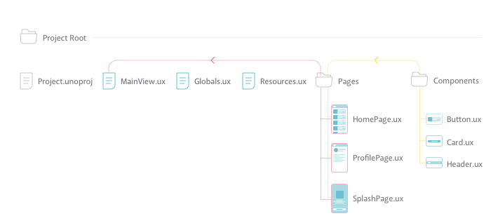

### Pages and Components

You’ll see that you have made folders for `Pages` and `Components`. The idea here is that you separate high level containers/pages from the low-level components. A helpful analogy here might be Sketch: You can think about Artboards as Pages, and Symbols as Components.
It’s likely that the Pages will contain multiple Components but instead of writing out the code for that component every time, you create classes out of them. You then create instances of the Components inside those Pages.
It’s a good idea to keep them in separate folders, especially when you start to have multiple pages.

### MainView.ux

This contains your entire app and is pretty important. In an ideal world, this file will actually be quite short. Instead of exhaustively writing all the UX for your pages here, you want to write them as classes in separate .ux files and store them in the Pages folder. Then you create instances of your Pages inside of some sort of navigation like a `PageControl` or `Navigator` in `MainView.ux`. This file then becomes the place where you figure out which pages to navigate to.
To keep things simple it’s smart to keep it in the same folder as the .unoproj file.

### Resources.ux

So what is in here? Well throughout the app you might have a lot of places where you include images and other assets. All of these will use file paths to determine where the asset is located like so:
`File="Assets/AssetType/Asset.jpeg"`

The problem is, keeping track of these paths can get tricky and if you need to re-arrange something your file paths will break. So instead, you create all your assets as classes in this file. Check out this example:
Instead of:
```xml
<Grid>
  <Image StretchMode="UniformToFill" File="Assets/icon.png" />
  <Image StretchMode="UniformToFill" File="Assets/icon.png" />
  <Image StretchMode="UniformToFill" File="Assets/icon.png" />
</Grid>
```
You create the class in `resources.ux` like so:
```xml
<Image ux:Class="Icon" StretchMode="UniformToFill" File="Assets/icon.png" />
```
And reference it in the original position:
```xml
<Grid>
  <Icon/>
  <Icon/>
  <Icon/>
</Grid>
```
Why? If all your file paths are relative to the same document, it’s much easier to keep track of and you are less likely to break any links.

### Globals.ux

Much like `Resource.ux` you want to separate out all the global resources you have made available. So inside this file will be your color palette, fonts and any other globals you might have defined. You could include this in your `Resources.ux` file, but for the sake of keeping things tidy it’s a good idea to separate the two concepts. Once again, you want to keep this file in the root to make file paths easier to maintain.
To make it even neater, you might want to wrap all your separate globals up in a `Panel` like this:
```xml
<!-- ColorPalette -->
<Panel>
    <float4 ux:Global="SecondarySolid" ux:Value="#8A5182" />
    <float4 ux:Global="DarkGrey" ux:Value="#636363" />
    <float4 ux:Global="MidGrey" ux:Value="#979797" />
    <float4 ux:Global="LightGrey" ux:Value="#D8D8D8" />
    <float4 ux:Global="PrimaryText" ux:Value="#282D67" />
    <float4 ux:Global="PrimarySolid" ux:Value="#426E89" />
    <float4 ux:Global="TextGrey" ux:Value="#3A4454" />
</Panel>
```

### You’re done. Congrats.
