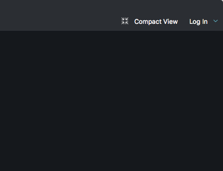
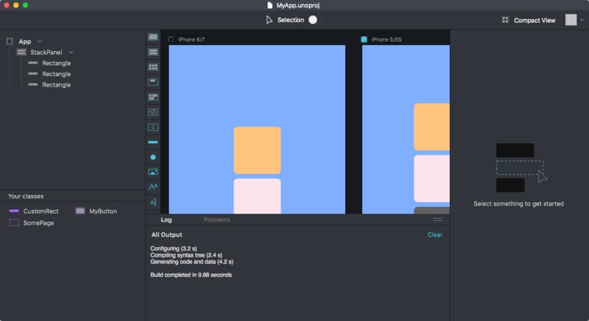
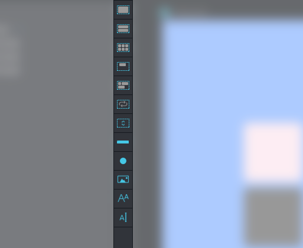
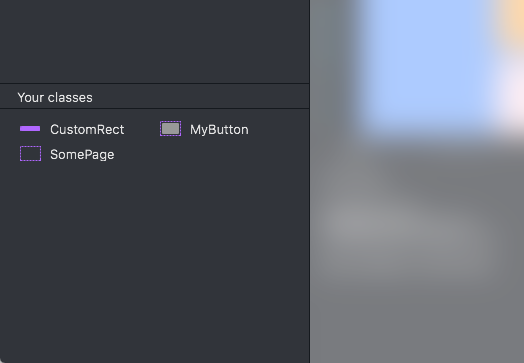
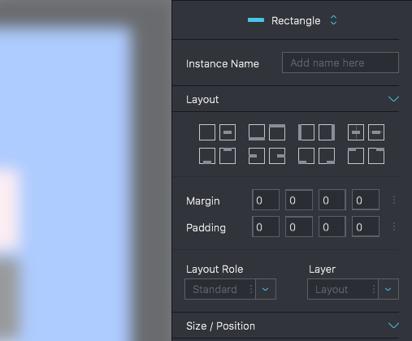

# Fuse Studio

Take UX authoring to the next level with Fuse Studio.
- A hierarchical overview of your app that makes layout and project structuring even more intuitive.
- Easily add and tweak elements in your app using visual tools.
- Preview different states & pages in at the same time to see how your changes affect the whole app.

## Logging in

Logging in can be done from the dashboard or the workspace, and is, in conjunction with a pro subscription, required in order to access many of the features described below.

From the Dashboard, this can be achieved by clicking the "Log in" button at the top of the window. From the workspace, this can be achieved by clicking the "Log in" button in the top right of the window.

## Panes

A quick introduction to the various panes and views you'll interact with in Fuse Studio.

### Dashboard

When starting Fuse the first thing we are presented with is the dashboard. From there we can create new projects, open recent projects, or jump straight to tutorials and documentation. 

### Workspace

The area which contains our preview viewports is called the workspace. Here we can also find the log window. In the workspace we can spawn as many preview viewports as we need, and configure them in different sizes and aspects (requires a pro license).

### Hierarchy view

The hierarchy view shows us the structure of our app. Each item in the hierarchy view corresponds to an element in UX markup.
When selecting an element in the hierarchy view its attributes can be edited in the inspector panel. The selected element is also highlighted by a blue rectangle in the preview viewport.
We can reorder elements by dragging them around in the hierarchy view, and remove them by right clicking and selecting the "Remove element" option.

#### Locate in editor

Right clicking an element and clicking "Locate in editor" will navigate to the correct file and line inside your text editor.
- _Note:_ 
  - Locate in editor works with the atom and sublime plugins.
  - The editor needs to be open.

#### Edit <elementtype>

Right clicking an element lets us edit its class definition as long as it is defined in the current project. The hierarchy view will then change context to show the structure of the class we're editing.
To go back to the `App` context, click the `Return to "App"` button above the hierarchy view.

### Toolbox

The toolbox lists basic Fuse components. This includes all the most important `Panel` types, like `StackPanel` and `Grid`, as well as some basic shapes, `Text`, `Image` and input controls. These can be dragged and dropped into the hierarchy view. While dragging elements inside the hierarchy view, a blue line appears to indicate where in the hierarchical structure the element will be placed.

### Your classes

The "Your classes" pane lists all custom components we have defined in our project using the `ux:Class` attribute. We can drag these into our hierarchy view, just like with the basic Fuse components from the toolbox.

### Inspector

The inspector displays information about elements in our app. Selecting an element, either in the viewport, the hierarchy view or by selecting it in the text editor (Atom or Sublime Text 3 with the Fuse plugin installed), will populate the inspector with controls allowing us to tweak its various properties.
A blue dot next to a tab header indicates that it contains properties that have been changed to non default values.
The inspector has several expandable tabs, containing controls that allow us to tweak various aspects of an element. (This is also a good way of exploring exactly what properties the different elements have.)

### Compact mode

Activating compact mode, shrinks the entire window to fit the primary preview viewport. This allows us to more easily fit a preview viewport next to our text editor. This is very handy if one prefers to work with UX markup directly.

### Selection mode

You can enter selection mode by clicking the "Selection" toggle button, in the top middle part of the window. This lets you select element by clicking on them directly in the preview viewport.

