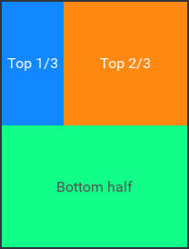
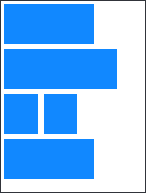
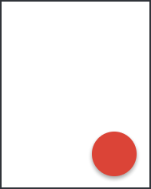
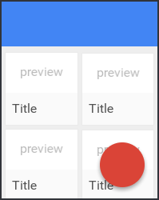

## Responsive layout

When making apps for a wide range of mobile devices, we're facing a huge number of different screen sizes, pixel densities and aspect ratios. How do you make a fully responsive app that adapts to these constraints? Fuse solves the challenge by using a basic set of layout rules and triggers, which you should know and understand in order to be effective in Fuse.

### Units of measurement

There are several units of measurement you can use to describe element dimensions. The default unit is points (`pt`). The advantage of using points is that an element with explicit dimensions appears the same size on screens of different pixel densities. There is also a percentage unit (`%`), which can be used to define the size of an element to be a percentage of its available size. For the odd case where you need to specify the exact amount of pixels you want an element to occupy, we have the pixel (`px`) unit. Note however that when using this unit of measurement, elements will have different sizes on different screen densities.

You can specify the unit of a number by appending either pt, px or % (note that we don't need to specify `pt` as that becomes the unit if we only specify the number):

```xml
<Panel Width="50%" Heigh="100px" />
```

### Using images in responsive layout

When using images in Fuse apps, you should try to make them match the intended target size on screen. Scaling the image up or down significantly will likely result in visible aliasing artefacts. You should use `MultiDensityImageSource` to supply several versions of the same image for use on screens of different pixel densities. This lets us avoid up-/downscaling in the cases where the image would otherwise not match its intended size on screen as a result of changes in pixel density between screens.

### Basic building blocks

Fuse comes with an extremly powerful layout system that lets you create UIs that fit on many different screen sizes and aspect ratios. UIs in Fuse are created by a hierarchy of various `Panel` types, as well as other primitives like `Rectangle`, `Circle` and `Image`. The various `Panel` types, like `StackPanel`, `Grid` and `DockPanel`, are used to position and size multiple elements relative to each other as well as relative to the available space.

### Available space concept

Let's start with the concept of **available space**. As you might expect, when you have an empty application, the available space is the whole screen of the mobile device, including the area behind status and action bars:

```xml
<App>
</App>
```

Now, most of the visual elements placed inside of the app tag will by default try to be as big as possible and fill up all available space (there are exceptions, such as `StackPanel`):
```xml
<App>
    <Panel>
    </Panel>
</App>
```

However, sometimes we don't want our elements to occupy all available space, but instead subdivide that space and distribute it amongst several elements:

```xml
<App>
    <DockPanel>
        <Panel Dock="Top" Height="56" Color="Blue" />
        <Panel Dock="Bottom" Height="56" Color="Green" />
        <Panel Color="Yellow">
        </Panel>
    </DockPanel>
</App>
```

In this example, the `DockPanel` fills up all available space, then inside it is a 56pt tall blue `Panel` that is docked to the top edge. The green `Panel` is also 56pt high, but it is docked to the bottom edge. Since there are no horizontal constraints on the two panels (like the `Width` property for example), they stretch to fill the full width of the available space, which in this case is the full width of the screen.

The yellow `Panel` automatically takes up the **remaining available space**, which is now the whole area between the blue and green panels.

Assigning a `Dock` property to an element within a `DockPanel` ensures it takes up as little space as possible either vertically (when docked to the top or bottom) or horizontally (when docked to the left of right).

### Alignment affects layout

With the **available space** concept settled firmly, let's move on and throw `Alignment` into the mix!

```xml
<App>
    <DockPanel>
        <Panel Dock="Top" Height="56" Color="Blue" />
        <Panel Dock="Bottom" Height="56" Color="Green" />
        <Panel Color="Yellow">
        	<Panel Color="Red" Alignment="Top" Height="16" />
        </Panel>
    </DockPanel>
</App>
```


In this case, the nested red `Panel` with `Alignment="Top"` set will take up only 16pt vertically, and be aligned to the top of the yellow `Panel`. When we assign an `Alignment` to an element, it tries to stick to the particular side of its parent and take up as little space in the respective direction as possible. The red `Panel` still stretches to fill the full width of the available space since there are no horizontal constraints set on it.

[callout info]
At this point you might wonder what the difference between "docking" something in a `DockPanel` and aligning something is. Although the two have similar effects, __the most important difference is that aligning something does not subdivide its parents available space.__ What we mean by this is that the red `Panel` in the previous example does not "spend" its parent available space (as was done by the blue and green panels), it is instead just a way of declaring where panel should appear in the case where it is smaller (or bigger) than its parent in one or more dimensions.
[/callout]

If we remove the explicit `Height` on the red `Panel` and add some child elements with non-zero dimensions inside of it, the children will push the parent dimensions to accommodate the tallest child, the 200pt high maroon `Panel` in this case:

```xml
<App>
    <DockPanel>
        <Panel Dock="Top" Height="56" Color="Blue" />
        <Panel Dock="Bottom" Height="56" Color="Green" />
        <Panel Color="Yellow">
        	<Panel Color="Red" Alignment="Top">
        		<Panel Color="Teal" Height="20" />
        		<Panel Color="Maroon" Height="200" />
        	</Panel>
        </Panel>
    </DockPanel>
</App>
```


---

Other `Panel` types behave slightly differently. For example, let's take a look at `StackPanel`:

```xml
<App>
    <DockPanel>
        <Panel Dock="Top" Height="56" Color="Blue" />
        <Panel Dock="Bottom" Height="56" Color="Green" />
        <Panel Color="Yellow">
        	<StackPanel Color="Red" Alignment="Top">
        		<Panel Color="Teal" Height="20" />
        		<Panel Color="Maroon" Height="200" />
        	</StackPanel>
        </Panel>
    </DockPanel>
</App>
```


A vertical `StackPanel` stacks its children one after the other, and stretches to accommodate the combined height of all children. The red `StackPanel` in the example above is now 220 points high and aligned to the top of the yellow `Panel`. You can find more details on `StackPanel` behaviour in [StackPanel docs](https://fuse-open.github.io/docs/fuse/controls/stackpanel).

It's worth noting that aside from `Alignment`, other visual properties have an effect on the layout calculation too. These include `Width`, `Height`, `MinWidth`, `MinHeight`, `MaxWidth`, `MaxHeight`, `X`, `Y`, `Margin`, `Padding` and a few more. When setting such properties, be sure to always test how your layout looks on different target devices.

### List of commonly used layout controls

#### DockPanel

`DockPanel` is one of the most frequently used layout containers. It lets us dock elements to its sides, consuming that space in the process so that the next item being docked only considers the remaining space. See the [DockPanel docs](https://fuse-open.github.io/docs/fuse/controls/dockpanel) for more details.


```xml
<DockPanel>
	<Rect Dock="Left" Color="Red" Width="50" />
	<Rect Dock="Top" Color="Blue" Height="100" />
	<Rect Dock="Right" Color="Green" Width="100" />
	<Rect Color="Yellow"/>
</DockPanel>
```

#### StackPanel

As the name suggests, you want to use a `StackPanel` for stacking items. This is very useful when creating lists of items, but it's applicable in any situation when you need to stack elements either vertically or horizontally. We often use `StackPanel` when we don't know exactly how many items we need to display. The `StackPanel` can just grow to fit as many children as it is given (unlike the `DockPanel` for example). Because of this, a `StackPanel` can grow to become larger than its parent, overflowing its available size. See the [StackPanel docs](https://fuse-open.github.io/docs/fuse/controls/stackpanel) for more details.

```xml
<StackPanel Alignment="Top" Margin="8" ItemSpacing="4">
	<Each Count="4">
		<Panel Height="56">
			<Text Value="The title of an item" Alignment="Center" Color="#fff" />
			<Rectangle Layer="Background" Color="#18f" CornerRadius="2" />
		</Panel>
	</Each>
</StackPanel>
```


#### Grid

`Grid` comes in handy when you need to build a responsive layout with flexible row or column sizes. By default, elements in a `Grid` are placed in the order they appear in UX, from left to right, top to bottom. However, you have full control over how a `Grid` behaves by using its properties `RowCount` and `ColumnCount`, or `Rows` and `Columns`. You can also explicitly tell each child to which row and column it should attach itself by using the `Row`, `Column`, `RowSpan` and `ColumnSpan` properties. See the [Grid docs](https://fuse-open.github.io/docs/fuse/controls/grid) for more details.

```xml
<Grid RowCount="2" Columns="1*,2*">
	<Panel Color="#18f">
		<Text Value="Top 1/3" Alignment="Center" Color="#fff" />
	</Panel>
	<Panel Color="#f81">
		<Text Value="Top 2/3" Alignment="Center" Color="#fff" />
    </Panel>
	<Panel ColumnSpan="2" Color="#1f8">
		<Text Value="Bottom half" Alignment="Center" />
	</Panel>
</Grid>
```



#### WrapPanel

The `WrapPanel` is used when you need to lay out children one after another in a given orientation, and wrap around whenever you reach the end of the available space in a particular direction. By default it lays its children out horizontally, and wraps around vertically. See the [WrapPanel docs](https://fuse-open.github.io/docs/fuse/controls/wrappanel) for more details.

```xml
<App>
	<WrapPanel>
		<Panel Width="128" Height="56" Margin="4" Color="#18f" />
		<Panel Width="160" Height="56" Margin="4" Color="#18f" />
		<Panel Width="48" Height="56" Margin="4" Color="#18f" />
		<Panel Width="48" Height="56" Margin="4" Color="#18f" />
		<Panel Width="128" Height="56" Margin="4" Color="#18f" />
	</WrapPanel>
</App>
```



#### Panel

A `Panel` is arguably the simplest container in Fuse. You want to use `Panel` when you want to position its children in the same area of available space without subdividing it like for example `DockPanel` does. Details can be found [here](https://fuse-open.github.io/docs/fuse/controls/panel).

```xml
<Panel Height="56" Margin="24,0">
	<TextInput Value="Some text" TextColor="#fff" Margin="10"/>
	<Rectangle Color="#18f" CornerRadius="2" />
</Panel>
```


#### ScrollView

A `ScrollView` is generally used to display content that is bigger than the screen of the device. A prominent example are lists of items. Note that a `ScrollView` can only have a single visual child. Since `ScrollView` by default occupies the whole available space, we usually place a `StackPanel` inside it in order to make a scrollable list.

```xml
<ScrollView>
	<StackPanel Margin="8" ItemSpacing="4">
		<Each Count="24">
			<Panel Height="56">
				<Text Value="The title of an item" Alignment="Center" Color="#fff" />
				<Rectangle Color="#18f" CornerRadius="2" />
			</Panel>
		</Each>
	</StackPanel>
</ScrollView>
```


### Adapting to different screen sizes and orientations

When we're making cross-platform applications that target a broad range of device models, it makes sense to use the additional screen real estate you get when running on larger devices, such as tablets. It is also wise to adapt certain views to whether it is displayed in the portrait or landscape device orientation. Fuse has a set of triggers to handle this: `WhileWindowPortrait`, `WhileWindowLandscape` and `WhileWindowSize`. These can be combined to describe very detailed use cases. We will show you how in the next section!

### Hands-on

It's time we use what we've learnt so far and replicate a real-world app design in Fuse. As a popular example, let's take a look at how the Google Docs application behaves on different screens. There are of course many subtle details that change, but here we will replicate the basic structure of the app layout.

On iPhone 6, it has two items in a row while in portrait, and changes that to 3 items when rotated to landscape.


On iPad, it has three items in a row while in portrait, and changes that to 5 items when rotated to landscape.


Let's start with the basic app structure. The first things we take care of are the status and bottom bars - we do not want our app content to be drawn behind them, so we put a `DockPanel` in the app and dock a `StatusBarBackground` and `BottomBarBackground` to its top and bottom. Further more, we set the background color of the status bar to the blue tone that's going to be used for the whole top section of the app.

```xml
<App Background="#eee">

	<!-- iOS specific status bar styling -->
	<iOS.StatusBarConfig Style="Light" />
	
	<DockPanel>
		<StatusBarBackground Dock="Top" Background="#4285f4" />
		<BottomBarBackground Dock="Bottom" />
	</DockPanel>
</App>
```

Next we add the blue top bar itself that holds our action buttons. Since we already have our parent `DockPanel`, we only need to specify `Dock="Top"` on the element and give it a height, and it gets aligned to the very top of the available space, right below `StatusBarBackground`. We won't add any icons for now, but note that we conveniently made the element a `DockPanel` so you can easily dock things inside of it later.

Then we add another empty `Panel` which automatically fills the remaining available space, and is the container that we will put the rest of our content in.

```xml
<App Background="#eee">

	<!-- iOS specific status bar styling -->
	<iOS.StatusBarConfig Style="Light" />
	
	<DockPanel>
		<StatusBarBackground Dock="Top" Background="#4285f4" />
		<BottomBarBackground Dock="Bottom" />

		<DockPanel Dock="Top" Height="56" Color="#4285f4">
			<!-- this is the blue top bar that will hold the icons -->
		</DockPanel>

		<Panel>
			<!-- this fills the remaining available space -->
		</Panel>

	</DockPanel>
</App>
```


Looking back at the app screenshots, we see that the content area is scrollable, which means that we will have to use a `ScrollView`. However, there is this red "plus" button that should stay on top of the `ScrollView`, and __not__ move with it as it scrolls. Because of that, we use a `Panel` as the parent of the content area, because it allows us to put its children on top of each other:

```xml
<Panel>
	<Circle Width="56" Height="56" Margin="16" Color="#db4437" Alignment="BottomRight">
		<Shadow />
	</Circle>
	<ScrollView>
	</ScrollView>
</Panel>
```



The scrollable content in the screenshots appears to be arranged in a grid formation with equally sized columns. It makes sense to use a `Grid` here, since that allows us to change the number of columns our content is going to be put into, and the `Grid` will adjust as necessary. As we outlined at the top, the number of columns will depend on the screen size of the device the app runs on.

First we need to reserve some space on top of the `Grid` for a title and an ordering toggle that you can add later. To do that, we first put a `StackPanel` inside of the `ScrollView`. In the `StackPanel`, we put a 56 points tall `Panel` and the `Grid` that will hold the items. We specify our `Grid` to have 2 equally sized columns by default (using the `ColumnCount` property), and give it a `ux:Name` so we can refer to it later.

```xml
<Panel>

	<Circle Width="56" Height="56" Margin="16" Color="#db4437" Alignment="BottomRight">
		<Shadow />
	</Circle>

	<ScrollView>
		<StackPanel>
			<Panel Height="56" />
			<Grid ux:Name="itemGrid" ColumnCount="2" Margin="4" CellSpacing="4">
			</Grid>
		</StackPanel>
	</ScrollView>
	
</Panel>
```

The next thing we want to do is to add some placeholder content for the items so that we can style them. To achieve that, we use the `Each` class. `Each` is most frequently used for data-binding to arrays of data, but in our case we'll use it as a tool to repeat the same UX multiple times using its `Count` property.

Inside the `Each`, we want to define how a single "box", that represents an item, looks like. The `Each` object will take care of creating 20 instances of it for us. What's tricky about the list items is that their size should adapt to the varying number of columns in the parent `Grid` as the screen size or orientation changes. This means that we can't set explicit `Width` or `Height` on them. Luckily, there's one thing that is certain: we know they need to stay square. We can achieve this by setting `BoxSizing="FillAspect"` and `Aspect="1"` on the item. This will stretch the item to fill the available space within the `Grid` cell that it gets assigned to.

```xml
<Grid ux:Name="itemGrid" ColumnCount="2" Margin="4" CellSpacing="4">
	<Each Count="20">
		<DockPanel BoxSizing="FillAspect" Aspect="1">
		</DockPanel>
	</Each>
</Grid>
```


Finally we add some content to the grid items. Note how we set `Layer="Background"` on the `Rectangle` that serves as the white background of the item - this ensures that it is sent to the background and does not participate in the layout calculation done by its parent `DockPanel`.

```xml
<Grid ux:Name="itemGrid" ColumnCount="2" Margin="4" CellSpacing="4">
	<Each Count="20">
		<DockPanel BoxSizing="FillAspect" Aspect="1">
			<Panel Dock="Bottom" Height="40" Color="#fafafa" Margin="1">
				<Text Value="Title" Alignment="CenterLeft" Margin="8,0" />
			</Panel>
			<Text Value="preview" Alignment="Center" TextColor="#bbb" />
			<Rectangle Color="#fff" Layer="Background">
				<Stroke Width="1" Color="#eaeaea" />
			</Rectangle>
		</DockPanel>
	</Each>
</Grid>
```


To make the basic app structure complete, we need to make the `Grid` adapt to various screen sizes and device orientations. Here we want to use the general approach of describing varying states as deviations from the rest state. Our rest state in this case is a phone in portrait orientation that has two items on each row in the `Grid`.

The deviations we need to describe then are "phone in landscape", "tablet in portrait" and "tablet in landscape". We start by creating a new `WhileTablet` trigger that is going to evaluate to true when the screen size in any direction is larger than or equal to 600 points. We chose the number so that it matches [Material design guidelines](https://material.io/guidelines/layout/responsive-ui.html#responsive-ui-breakpoints).

Then we couple the new `WhileTablet` trigger with `WhileWindowPortait` and `WhileWindowLandscape` to describe the "how many items per row" rules we set out at the top of the Hands-on section.

```xml
<WhileWindowSize ux:Class="WhileTablet" GreaterThan="599,1" />

<WhileWindowPortrait>
	<WhileTablet>
		<Change itemGrid.ColumnCount="3" />
	</WhileTablet>
</WhileWindowPortrait>

<WhileWindowLandscape>
	<WhileTablet>
		<Change itemGrid.ColumnCount="5" />
	</WhileTablet>
	<WhileTablet Invert="true">
		<Change itemGrid.ColumnCount="3" />
	</WhileTablet>
</WhileWindowLandscape>
```

With that, our Google Docs app mockup is done. Take a look at the full code below, give it a go and see how it works on different devices!



```xml
<App Background="#eee">
	<iOS.StatusBarConfig Style="Light" />

	<DockPanel>

		<StatusBarBackground Dock="Top" Background="#4285f4" />
		<BottomBarBackground Dock="Bottom" />

		<DockPanel Dock="Top" Height="56" Color="#4285f4">
			<!-- this is the blue top bar that will hold the icons -->
		</DockPanel>

		<Panel>

			<Circle Width="56" Height="56" Margin="16" Color="#db4437" Alignment="BottomRight">
				<Shadow />
			</Circle>

			<ScrollView>
				<StackPanel>
					<Panel Height="56" />
					<Grid ux:Name="itemGrid" ColumnCount="2" Margin="4" CellSpacing="4">
						<Each Count="20">
							<DockPanel BoxSizing="FillAspect" Aspect="1">
								<Panel Dock="Bottom" Height="40" Color="#fafafa" Margin="1">
									<Text Value="Title" Alignment="CenterLeft" Margin="8,0" />
								</Panel>
								<Text Value="preview" Alignment="Center" TextColor="#bbb" />
								<Rectangle Color="#fff" Layer="Background">
									<Stroke Width="1" Color="#eaeaea" />
								</Rectangle>
							</DockPanel>
						</Each>
					</Grid>
				</StackPanel>
			</ScrollView>
			
		</Panel>

		<WhileWindowSize ux:Class="WhileTablet" GreaterThan="599,1" />

		<WhileWindowPortrait>
			<WhileTablet>
				<Change itemGrid.ColumnCount="3" />
			</WhileTablet>
		</WhileWindowPortrait>

		<WhileWindowLandscape>
			<WhileTablet>
				<Change itemGrid.ColumnCount="5" />
			</WhileTablet>
			<WhileTablet Invert="true">
				<Change itemGrid.ColumnCount="3" />
			</WhileTablet>
		</WhileWindowLandscape>

	</DockPanel>
</App>
```
