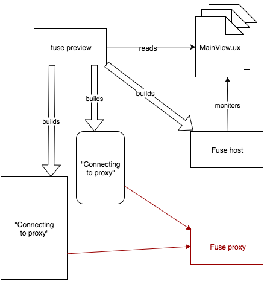
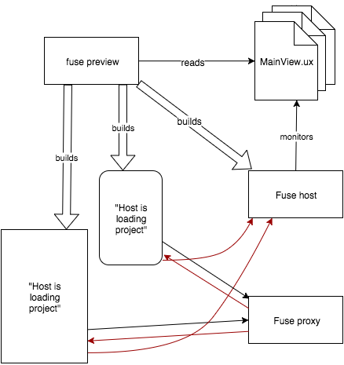

# How Fuse Preview works

This article is the first in a series on how `fuse preview` works, and how it differs from `fuse build`. As a start, let's assume you're working on an app consisting of a few UX files:

When you're exporting your app, for instance with `fuse build`, those files are compiled to native code for the given platform. The result is a normal app that runs on your device, can be uploaded to the App/Play store etc. The topic of this article is however how `fuse preview` differs from that, so let's dive in!

When you start preview of your app, for instance with `fuse preview`, some extra code is injected into your app for it to be able to pick up and display your changes while you're making them. We can of course preview your app on multiple devices at once; in this example we start two previews, one on an Android device and one locally on a Mac. We use the `fuse preview` command to start preview here, but the same thing happens when you start preview from the dashboard, or one of our editor plugins.

In addition to building the actual preview app for the device, a Fuse host is also started, which is responsible for picking up live changes to your app. After running `fuse preview` and `fuse preview --target=android`, the situation looks like this:

<!-- TODO: The two boxes in the lower left should probably look like a real OS X window and a real Android device. -->

As we can see, a preview-capable app has now been started on both the local computer and the Android device. The Fuse host has also been started on the local computer, and it is monitoring the files which are part of the app.

The preview apps now need to connect to the host, to get live updates. To get the connection details of the Fuse host, they ask the Fuse proxy. This is the reason for that mysterious "Connecting to proxy..." message that you see when preview starts. Note that all of this is happening on your local computer. The app does not connect to the internet, and the proxy should not be confused with for instance an http proxy.

The preview apps connects to the Fuse proxy and asks for the connection details of the host:

The proxy responds with the connection details, and the preview apps connect to the host:

Now that everything is booted, the preview apps are connected directly to the Fuse host, and any changes you make to the files in your app are reflected instantly on all devices.

<!-- TODO: Replace "Hello, World" with something that looks like an app? -->
