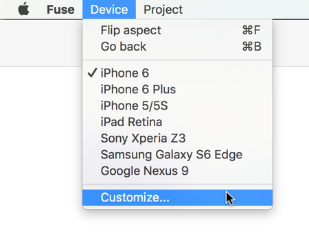
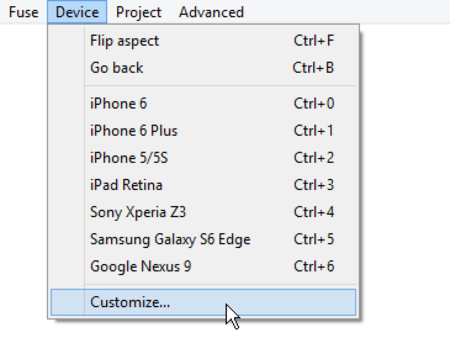

# The preview simulator

The preview simulator lets you preview your Fuse apps on your computer while you're working on them.
One advantage is that we can design for a large number of form factors and resolutions without needing actual devices for each configuration.

For instructions on how to start the preview simulator, see [Fuse Preview](../basics/preview-and-export.md).

## Preview display configuration
The preview window can be switched to different screen densities and resolutions using the dropdown menu or keyboard shortcuts. We can also add your own custom display configurations by editing the `devices.json` file inside the project directory. If this file doesn't exist, we can generate the default one by selecting the `Customize` option from the `Device` menu found at the top of the preview window.

<table>
<tbody>
<tr>
<td>

</td>
<td>

</td>
</tr>
</tbody>
</table>

### Uno code and Live preview

We can also add Uno code files to your projects. Uno code compiles to native code through C++, which is great for performance-critical code, and code that needs to interop with native APIs directly.

Uno code generates new native code, thus changes cannot be reflected while the app is running.

Preview will not be automatically updated when you modify Uno code. If you modify Uno code and want those changes reflected, you will need to restart the preview (close the window and open a new one) or do a full build of the app.

#### Uno codebehinds
If any of the UX files in the project have a codebehind (i.e. partial class named the same as the class generated by the UX file) these will not have any effect when running in preview mode. For this reason it is preferred to use data binding instead of codebehinds to hook up logic for the views.
