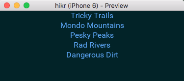
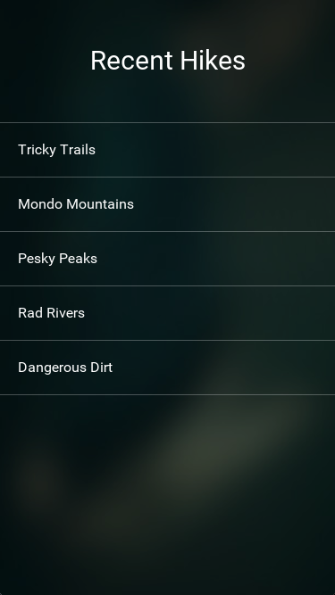
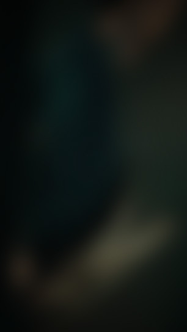

## Introduction

In the [last chapter](mock-backend.md), we implemented a mock backend and tied our views together, finishing the flow of the main portion of our app. While we still haven't done a splash screen for our app, there's enough in place now to tackle the next part of our project - the _look and feel_. The look and feel of our app refers to how our app looks and behaves. It covers the general style/coloring of the app, as well as how it animates based on user interaction.

In this chapter, we'll iteratively tweak the look and feel of our app to match our original design. To accomplish this, we'll take full advantage of Fuse's live reload functionality to make fast iterations, as well as create reusable components that describe how the more common of our app will look and behave. After this chapter, we'll be just one chapter away from completing the app, so let's get started!

The final code for this chapter is available [here](https://github.com/fusetools/hikr/tree/models-chapter-6).

## Background color

A great way to start tweaking the look/feel of an app is to simply set a background color that fits with the general look we'll want to achieve. This is very quick and easy and will make a lot of the other tweaks we'll want to make very apparent, so we'll start with that.

If we take a quick look at the design for one of the screens for our app (the edit hike page in this case):


Here we can see that generally, the app has a dark green-ish blue tint throughout its design. So, we'll use that as a guide to pick our background color and start there. To change the background color of our app, all we have to do is set the [Background](api:fuse/appbase/background) property of our app's [App](api:fuse/app) class. In our case, we'll do that inside `MainView.ux`. Let's set this color to hex `#022328`:

```
<App Model="Models/App" Background="#022328">
```

Our app now looks something like this:



And with that, we're off to a great start! However, quite a lot of our UI components now look pretty out-of-place. So, let's just go through our screens and fix them up piece by piece.

## Tweaking `HomePage`

We'll start with our `HomePage`, which we'll want to look something like this eventually:



One of the most obvious differences between our current implementation and the design we're after is the look and feel of the selectors. Currently, our selectors are implemented using a simple [Button](api:fuse/controls/button); however, we'll want to build something custom instead to match our design.

The first thing we'll do is replace our `Button` with the simplest custom UX possible. Looking at our `Pages/HomePage.ux` file, our `Button` currently looks like this:

```
			<Each Items="{hikes}">
				<Button Text="{name}" Clicked="{goToHike}" />
			</Each>
```

Instead of a `Button`, we'll simply use a [Panel](api:fuse/controls/panel) with a [Text](api:fuse/controls/text) element inside it. We'll start with just that:

```
			<Each Items="{hikes}">
				<Panel>
					<Text Value="{name}" />
				</Panel>
			</Each>
```

We'll want this custom `Panel` to be clickable just like our `Button` was. As it turns out, the `Clicked` attribute is not exclusive to the `Button` class at all; all visual and layout elements, like `Panel` can have the `Clicked` attribute. So, we'll add that to our `Panel`:

```
				<Panel Clicked="{goToHike}">
					<Text Value="{name}" />
				</Panel>
```

If we save this and let our preview update, we can see that these new selectors _mostly_ work, as long as you click on the `Text` element. This is because by default, when Fuse is performing hit testing on elements for user interactions such as `Clicked`, it will try to respect the transparency of the element. Since our `Panel` is mostly transparent, this means that most of the element will not be clickable. To fix this, we can simple override the [HitTestMode](api:fuse/elements/element/hittestmode) of the panel, like so:

```
				<Panel HitTestMode="LocalBoundsAndChildren" Clicked="{goToHike}">
					<Text Value="{name}" />
				</Panel>
```

This way, if the pointer is pressed anywhere within the local bound of the `Panel` or on any of the `Panel`s children (such as the `Text` element), it will count as a "hit", and our element will be clickable as expected.

The next thing we'll do is change the text color. Since we have a pretty dark background, simple white should do the trick:

```
				<Panel HitTestMode="LocalBoundsAndChildren" Clicked="{goToHike}">
					<Text Color="White" Value="{name}" />
				</Panel>
```

We'll also add some [Margin](api:fuse/elements/element/margin) around the `Text`:

```
				<Panel HitTestMode="LocalBoundsAndChildren" Clicked="{goToHike}">
					<Text Color="White" Value="{name}" Margin="20" />
				</Panel>
```

Now things are starting to look pretty good! However, it's a bit hard to see where one selector stops and another one starts, so we'll add some separators in between them. For this, we'll first place a small, white [Rectangle](api:fuse/controls/rectangle) with some transparency above all of our elements, like so:

```
			<Each Items="{hikes}">
				<Rectangle Height="1" Fill="#fff4" />

				<Panel HitTestMode="LocalBoundsAndChildren" Clicked="{goToHike}">
					<Text Color="White" Value="{name}" Margin="20" />
				</Panel>
			</Each>
```

This looks pretty good, and works well as a border _above_ all of our selectors, but it doesn't cover the last one, which has no border below it. We _could_ also add a `Rectangle` beneath all of our selectors, but then our borders would appear to have different thicknesses depending on if the border touches another element or not. Instead, we can just add a `Rectangle` beneath _all_ of our selectors, like this:

```
		<StackPanel>
			<Each Items="{hikes}">
				<Rectangle Height="1" Fill="#fff4" />

				<Panel HitTestMode="LocalBoundsAndChildren" Clicked="{goToHike}">
					<Text Color="White" Value="{name}" Margin="20" />
				</Panel>
			</Each>

			<Rectangle Height="1" Fill="#fff4" />
		</StackPanel>
```

There, that looks great! At this point, our selectors should look like they do in the design. However, we've duplicated some code for our separators, which we'll want to fix. Instead of creating two identical `Rectangle`s, we can make a reusable component called `Separator` and instantiate that twice. In our [StackPanel](api:fuse/controls/stackpanel), let's create the `Separator` component like this:

```
		<StackPanel>
			<Rectangle ux:Class="Separator" Height="1" Fill="#fff4" />

			<Each Items="{hikes}">
				<Rectangle Height="1" Fill="#fff4" />

				<Panel HitTestMode="LocalBoundsAndChildren" Clicked="{goToHike}">
					<Text Color="White" Value="{name}" Margin="20" />
				</Panel>
			</Each>

			<Rectangle Height="1" Fill="#fff4" />
		</StackPanel>
```

Then, we can replace our `Rectangle` instances with `Separator` instances:

```
		<StackPanel>
			<Rectangle ux:Class="Separator" Height="1" Fill="#fff4" />

			<Each Items="{hikes}">
				<Separator />

				<Panel HitTestMode="LocalBoundsAndChildren" Clicked="{goToHike}">
					<Text Color="White" Value="{name}" Margin="20" />
				</Panel>
			</Each>

			<Separator />
		</StackPanel>
```

Perfect!

> Note: Often times, when we create reusable components with ux:Class, we'll place them inside their own files to keep things organized. However, it's perfectly ok to create small components inside other files where reuse is desired, and where moving them out of the file would make it harder to see how the pieces fit together. In the case of our `Separator` class, it makes the most sense to simply declare and use the component right where we need it.

Now that our selectors _look_ like they do in the design, we'll add a basic animation to them so that they _feel_ like they're being pressed down when we press them as well.

If we were to precisely describe the animation we wanted to see in English, we would say something like this: "For our item, while it's pressed, scale the item smoothly by small amount over a short period of time." Lucky for us, Fuse provides a powerful, succinct way to describe animations and interactions that looks quite a lot like that English sentence through _triggers and animators_. In short, _triggers_ are used to _detect_ events, gestures, or other user input or state changes in a Fuse app. Triggers use _animators_ to _respond_ to these inputs, and can make state changes, perform animations, etc. Triggers and animators are designed from the ground up to be highly composable and very easy to use.

For example, let's express the animation we described above in UX. For starters, we wanted to animate our selector items "while they're pressed". So, we'll start by adding a trigger to our `Panel` called [WhilePressed](api:fuse/gestures/whilepressed):

```
				<Panel HitTestMode="LocalBoundsAndChildren" Clicked="{goToHike}">
					<Text Color="White" Value="{name}" Margin="20" />

					<WhilePressed>
					</WhilePressed>
				</Panel>
```

Next, we want to "scale the item". For that, we add a [Scale](api:fuse/animations/scale) animator inside the `WhilePressed` trigger:

```
					<WhilePressed>
						<Scale />
					</WhilePressed>
```

See how that reads just like the English sentence above? Next, we'll describe _how much_ the item should scale while it's being pressed. For `Scale`, to describe the scaling amount, we specify a `Factor` that's relative to 1. If the `Factor` is 1, the element will not change size. If it's 2, the element will scale to twice its size, .5 and it will scale to half its size, etc. In our case, we'll want the element to become slightly smaller than its original size, so we'll use a factor of .95:

```
					<WhilePressed>
						<Scale Factor=".95" />
					</WhilePressed>
```

If we save this, we can see that indeed, while we press our selectors, they get smaller. But this scaling happens instantly; we wanted it to happen "over a short period of time." To describe this, we'll add a `Duration` to the animator, which will describe _how long_ it will take for our element to scale from its normal size to the size specified by the `Factor` attribute, in seconds. Since we want our pressing animation to be fairly quick, let's specify a `Duration` of .08 seconds:

```
					<WhilePressed>
						<Scale Factor=".95" Duration=".08" />
					</WhilePressed>
```

If we save again and try this out, we can see that now the change happens over a short period of time, and feels a lot better. However, the animation doesn't quite feel smooth enough. This is because by default, an animation like this will be _linear_, meaning that the animation will happen at a constant rate from start to finish. This is very predictable, but not ideal in our case. Since we're making a pressing animation, we'd prefer if our animation started out more or less linear, but finished smoothly. For this, many animators support specifying an _easing_ that will describe how the animation starts and stops. Easings are quite common in describing animations, and there are [many standard curves](http://easings.net/) that many tools (including Fuse) support (although the naming conventions used may differ slightly).

For our pressing animation, we can specify the `QuadraticOut` easing, which is similar to a `Linear` easing (the default) when the animation starts, but the curve becomes smoother towards the end of the animation:

```
					<WhilePressed>
						<Scale Factor=".95" Duration=".08" Easing="QuadraticOut" />
					</WhilePressed>
```

Now when we try this, our selectors scale very naturally when pressed, just like we wanted. Awesome!

> Note: For more information about triggers and animators, check out our [triggers and animation](https://fuse-open.github.io/docs/fuse/triggers/trigger) article and [video](https://www.youtube.com/watch?v=bT1npBvXEzw)!

Now that we've gotten our items up-to-spec, we've got one more thing to add to this page before it's complete, and that's the "Recent Hikes" title text. This should be pretty easy; we basically want some white text that's docked to the top of the screen with some margin etc. First, let's solve the docking part. We'll move the UX code for our items into a [DockPanel](api:fuse/controls/dockpanel):

```
	<DockPanel>
		<ScrollView>
			<StackPanel>
				<Rectangle ux:Class="Separator" Height="1" Fill="#fff4" />

				<Each Items="{hikes}">
					<Separator />

					<Panel HitTestMode="LocalBoundsAndChildren" Clicked="{goToHike}">
						<Text Color="White" Value="{name}" Margin="20" />

						<WhilePressed>
							<Scale Factor=".95" Duration=".08" Easing="QuadraticOut" />
						</WhilePressed>
					</Panel>
				</Each>

				<Separator />
			</StackPanel>
		</ScrollView>
	</DockPanel>
```

Then, we'll add a `Text` element for our "Recent Hikes" text that we'll dock to the top of the `DockPanel`:

```
	<DockPanel>
		<Text Color="White" FontSize="30" TextAlignment="Center" Dock="Top" Margin="0,50">Recent Hikes</Text>

		<ScrollView>
```

Great! That was easy. Looking at the code, however, we've got two different `Text` elements already in this file where we're specifying `Color="White"`. Since our app has a dark background, this is probably something we're going to want to use quite a bit, and not just for this one page. So, let's make a reusable component for this!

Since we'll want our reusable component to be used throughout the app, we probably don't want to specify it in this file. Instead, we'll want to place it in its own file. In the root of our project dir, let's create a folder called `Components`:

```
.
|- MainView.ux
|- Components
|- Services
|- Pages
```

This `Components` directory will be a perfect place to put our various reusable components. Since we'll want our white text component to be used throughout the app, we'll call it `hikr.Text`, to signify that this component is a `Text` element that's specific to our `hikr` app. We usually do not include the app name prefix (`hikr` in this case) in the file name though; only in the class name. To create the component, we'll create a file called `Text.ux` inside our `Components` directory that contains the following text:

```
<Text ux:Class="hikr.Text" Color="White" />
```

We'll go ahead and save that, and the component will be available for use in our project. Going back to our `HomePage`, let's use `hikr.Text` instead of `Text Color="White"` where applicable. Don't forget to also update the closing tag for our "Recent Hikes" text!

```
	<DockPanel>
		<hikr.Text FontSize="30" TextAlignment="Center" Dock="Top" Margin="0,50">Recent Hikes</hikr.Text>

		<ScrollView>
			<StackPanel>
				<Rectangle ux:Class="Separator" Height="1" Fill="#fff4" />

				<Each Items="{hikes}">
					<Separator />

					<Panel HitTestMode="LocalBoundsAndChildren" Clicked="{goToHike}">
						<hikr.Text Value="{name}" Margin="20" />

						<WhilePressed>
							<Scale Factor=".95" Duration=".08" Easing="QuadraticOut" />
						</WhilePressed>
					</Panel>
				</Each>

				<Separator />
			</StackPanel>
		</ScrollView>
	</DockPanel>
```

And with that, apart from the background (which we'll get to later in this chapter), we've fully completed the contents of our `HomePage`, and even got a nice, reusable text component out of it as well. Cool!

> Note: As we'll see throughout this chapter, it's common practice to add styling/functionality to existing elements in Fuse, and then extract reusable components from them when reuse is desired. This provides a consistent and fast workflow and is a great way to develop good habits for tweaking things in Fuse. For the rest of the chapter, we'll continue to follow this pattern as we work to make sure we get it "in the fingers."

## Tweaking `EditHikePage`

Now it's time to take a look at our `EditHikePage`. Our design looks like this:


We've got a bit more work to do with this page than the last one, but since we're already getting the hang of tweaking the look and feel for our app, this should be no problem!

For our `EditHikePage`, we can basically split up what we need to do into two parts - the `Cancel`/`Save` buttons, and the editors. We'll start with the buttons.

### Tweaking the `Cancel` and `Save` buttons

Just like with the `HomePage`, our `Cancel` and `Save` buttons are currently just simple [Button](api:fuse/controls/button)s. But since we'll want to make our own custom look for these, we'll create our own component instead. Let's start by customizing the `Save` button, and then we'll extract a reusable component from that.

We'll start the same way we did with the hike selectors in the `HomePage` by replacing our `Save` `Button` with a [Panel](api:fuse/controls/panel) containing a [Text](api:fuse/controls/text) element in `Pages/EditHikePage.ux`, only this time, we'll use our custom `hikr.Text` that we just created instead of a normal `Text` element:

```
			<Panel Clicked="{save}">
				<hikr.Text Value="Save" />
			</Panel>
			<Button Text="Cancel" Clicked="{cancel}" />
```

Since we want the text to be in the center of the button, we'll add some alignment to the `hikr.Text` element. We'll also specify a default font size:

```
			<Panel Clicked="{save}">
				<hikr.Text Value="Save" FontSize="16" TextAlignment="Center" />
			</Panel>
```

Next, we'll want to change the background of our custom button to match our design. We'll start by adding a [Rectangle](api:fuse/controls/rectangle) to our component, and we'll specify `Layer="Background"` on it to set it as the background of our component. We'll also apply the same color to the `Rectangle` as the buttons in our design:

```
			<Panel Clicked="{save}">
				<Rectangle Layer="Background" Color="#125F63" />

				<hikr.Text Value="Save" FontSize="16" TextAlignment="Center" />
			</Panel>
```

This looks pretty good, but the buttons in our design had rounded corners. So, let's add a small `CornerRadius` to this `Rectangle` as well:

```
			<Panel Clicked="{save}">
				<Rectangle Layer="Background" Color="#125F63" CornerRadius="4" />

				<hikr.Text Value="Save" FontSize="16" TextAlignment="Center" />
			</Panel>
```

The last thing we'll do with our custom button's background is add a slight [DropShadow](api:fuse/effects/dropshadow) that will be directly beneath the button. We'll make it black with some transparency, and specify its `Angle`, `Distance`, `Spread` and `Size` values so that our shadow is subtle and fits our app's theme:

```
			<Panel Clicked="{save}">
				<Rectangle Layer="Background" Color="#125F63" CornerRadius="4">
					<DropShadow Angle="90" Distance="1" Spread="0.2" Size="2" Color="#00000060" />
				</Rectangle>

				<hikr.Text Value="Save" FontSize="16" TextAlignment="Center" />
			</Panel>
```

Great! Now that we've got our button's background and text set up, we'll add some margin around the outermost `Panel`, and some padding inside it as well. This will give it some room to breathe:

```
			<Panel Clicked="{save}" Margin="10" Padding="10">
				<Rectangle Layer="Background" Color="#125F63" CornerRadius="4">
					<DropShadow Angle="90" Distance="1" Spread="0.2" Size="2" Color="#00000060" />
				</Rectangle>

				<hikr.Text Value="Save" FontSize="16" TextAlignment="Center" />
			</Panel>
```

That about covers the look of this custom button. But what about its feel? This button should have a pressing animation just like our selectors did in the `HomePage`. In fact, why don't we use the same one? Let's copy that code and paste it inside our custom button:

```
			<Panel Clicked="{save}" Margin="10" Padding="10">
				<Rectangle Layer="Background" Color="#125F63" CornerRadius="4">
					<DropShadow Angle="90" Distance="1" Spread="0.2" Size="2" Color="#00000060" />
				</Rectangle>

				<hikr.Text Value="Save" FontSize="16" TextAlignment="Center" />

				<WhilePressed>
					<Scale Factor=".95" Duration=".08" Easing="QuadraticOut" />
				</WhilePressed>
			</Panel>
```

If we save everything and give this a try, it feels pretty good. Awesome!

Now that we've got our `Save` button set up nicely, let's extract a reusable `hikr.Button` component out of it, and apply this style to our `Cancel` button as well.

So, let's add a `ux:Class="hikr.Button"` attribute to our `Panel` here, and we'll add a new instance of our `hikr.Button` for our `Save` button, and move the `Clicked` handler from our `Panel` to that:

```
			<Panel ux:Class="hikr.Button" Margin="10" Padding="10">
				<Rectangle Layer="Background" Color="#125F63" CornerRadius="4">
					<DropShadow Angle="90" Distance="1" Spread="0.2" Size="2" Color="#00000060" />
				</Rectangle>

				<hikr.Text Value="Save" FontSize="16" TextAlignment="Center" />

				<WhilePressed>
					<Scale Factor=".95" Duration=".08" Easing="QuadraticOut" />
				</WhilePressed>
			</Panel>

			<hikr.Button Clicked="{save}" />
			<Button Text="Cancel" Clicked="{cancel}" />
```

The next thing we'll want to do is move the hardcoded `"Save"` text out of the component and onto our instance. However, if we simply wrote `Text="Save"` on our `hikr.Button`, this would fail to compile, because our `hikr.Button` class has no such property. This is easy to fix though, as Fuse provides a mechanism called `ux:Property` that allows us to define our own properties for a component using only UX.

To create a `Text` property for our `hikr.Button` component, all we need to do is add a `string` instance (since `Text` will contain a string of text) to our class with a `ux:Property` attribute that defines the name for our property:

```
			<Panel ux:Class="hikr.Button" Margin="10" Padding="10">
				<string ux:Property="Text" />

				<Rectangle Layer="Background" Color="#125F63" CornerRadius="4">
					<DropShadow Angle="90" Distance="1" Spread="0.2" Size="2" Color="#00000060" />
				</Rectangle>

				<hikr.Text Value="Save" FontSize="16" TextAlignment="Center" />
```

And with that, we've got our property. However, the `hikr.Text` instance in the class is still displaying the hardcoded string `"Save"`. We want it to display the value of the `Text` property we just created instead, and we can do this through _property binding_. Property binding is similar to data binding like we've used before to bind values in UX to values from JavaScript, and its syntax is almost the same. To bind our button's text to the `Text` property, we'll change our `hikr.Text` instance's `Value` like so:

```
				<hikr.Text Value="{ReadProperty Text}" FontSize="16" TextAlignment="Center" />
```

Here, we can see binding to a `ux:Property` looks almost identical to binding to JS data, but we've added `ReadProperty` to the front of it. This is how Fuse tells the difference between different binding types.

With our new `Text` property created and bound to inside our component, we can now set it specifically for our `Save` button:

```
			<hikr.Button Text="Save" Clicked="{save}" />
			<Button Text="Cancel" Clicked="{cancel}" />
```

If we save this, we can see our button looks just like it did before, but now we're able to set its `Text` to whatever we'd like outside of the component. This makes our component truly reusable!

> Note: For more information about `ux:Property` and other useful tools Fuse provides for creating components, check out our [Creating Components](articles:componentization) article.

Let's go ahead and move our new component into its own file in our `Components` dir called `Button.ux`:

```
<Panel ux:Class="hikr.Button" Margin="10" Padding="10">
	<string ux:Property="Text" />

	<Rectangle Layer="Background" Color="#125F63" CornerRadius="4">
		<DropShadow Angle="90" Distance="1" Spread="0.2" Size="2" Color="#00000060" />
	</Rectangle>

	<hikr.Text Value="{ReadProperty Text}" FontSize="16" TextAlignment="Center" />

	<WhilePressed>
		<Scale Factor=".95" Duration=".08" Easing="QuadraticOut" />
	</WhilePressed>
</Panel>
```

And finally, we'll style our `Cancel` button as well. In this case, all we have to do is replace `Button` with `hikr.Button`:

```
			<Text>Comments:</Text>
			<TextView Value="{hike.comments}" TextWrapping="Wrap" />

			<hikr.Button Text="Save" Clicked="{save}" />
			<hikr.Button Text="Cancel" Clicked="{cancel}" />
		</StackPanel>
```

And with that, we now have a reusable `hikr.Button` component and two great-looking buttons! Now, it's time to make sure they're placed in the correct area of the screen according to our design. In particular, we'll want to place the two buttons side-by-side at the very bottom of the screen.

To place the buttons side-by-side, we'll place them in a [Grid](api:fuse/controls/grid). A `Grid` is a `Panel` that will divide up its available space based on a specified number of _rows_ and _columns_, and place its children in the resulting _cells_. By default, these rows and columns will have equal sizes. So, if we specify a `Grid` with a single row and two columns, we should get the perfect container for our two buttons:

```
			<Text>Comments:</Text>
			<TextView Value="{comments}" TextWrapping="Wrap" />

			<Grid ColumnCount="2">
				<hikr.Button Text="Save" Clicked="{save}" />
				<hikr.Button Text="Cancel" Clicked="{cancel}" />
			</Grid>
		</StackPanel>
```

Here, we specify a `ColumnCount` of `2`, which tells our `Grid` it will need two columns. We don't need to specify how many rows it will need in this case, since we only need one anyway. This places our buttons side-by-side, but let's swap the order of the buttons to match our design:

```
			<Grid ColumnCount="2">
				<hikr.Button Text="Cancel" Clicked="{cancel}" />
				<hikr.Button Text="Save" Clicked="{save}" />
			</Grid>
```

Perfect! Here we can see that the `Grid` will place its child elements in the order they're specified, starting with the top-left cell in the `Grid`. To change which cells our child elements occupy, all we have to do is specify them in a different order. Nice and easy!

Finally, let's place this `Grid` at the very bottom of the `Page`. For this, we'll place all of the current contents of the `Page` into a [DockPanel](api:fuse/controls/dockpanel), and we'll dock our `Grid` to the bottom of that `DockPanel` using `Dock="Bottom"`. Altogether, our `EditHikePage.ux` file will look like this:

```
<Page ux:Class="EditHikePage">
	<DockPanel>
		<Grid ColumnCount="2" Dock="Bottom">
			<hikr.Button Text="Cancel" Clicked="{cancel}" />
			<hikr.Button Text="Save" Clicked="{save}" />
		</Grid>

		<ScrollView>
			<StackPanel>
				<Text Value="{hike.name}" />

				<Text>Name:</Text>
				<TextBox Value="{hike.name}" />

				<Text>Location:</Text>
				<TextBox Value="{hike.location}" />

				<Text>Distance (km):</Text>
				<TextBox Value="{hike.distance}" InputHint="Decimal" />

				<Text>Rating:</Text>
				<TextBox Value="{hike.rating}" InputHint="Integer" />

				<Text>Comments:</Text>
				<TextView Value="{hike.comments}" TextWrapping="Wrap" />
			</StackPanel>
		</ScrollView>
	</DockPanel>
</Page>
```

And with that, we've finished customizing both the look and feel and placement of our `Cancel` and `Save` buttons!

### Tweaking the editors

Now, let's dig in and tweak the look/feel of the various value editors on the `EditHikePage`. To refresh our memory, let's take another look at the design for this page:


First of all, our current implementation has an extra `Text` element displaying the hike name. Since we already have an editor for this, we can go ahead and just remove that:

```
			<StackPanel>
				<Text>Name:</Text>
				<TextBox Value="{hike.name}" />
```

Next, let's tweak the title text for all of our editors. We'll start by simply replacing the `Name` field's `Text` element with a `hikr.Text` element:

```
				<hikr.Text>Name:</hikr.Text>
				<TextBox Value="{hike.name}" />
```

This looks pretty good, but let's tweak the opacity of this `hikr.Text` element a bit so it's not so white:

```
				<hikr.Text Opacity=".6">Name:</hikr.Text>
				<TextBox Value="{hike.name}" />
```

Then, we'll add some margin between the title text and the editor field:

```
				<hikr.Text Opacity=".6" Margin="0, 0, 0, 5">Name:</hikr.Text>
				<TextBox Value="{hike.name}" />
```

This looks pretty good, so let's extract this styling into its own custom component which we'll call `TitleText`, and we'll update our `Name` title field to use it:

```
				<hikr.Text ux:Class="TitleText" Opacity=".6" Margin="0,0,0,5" />

				<TitleText>Name:</TitleText>
				<TextBox Value="{hike.name}" />
```

Looks cleaner already! Notice how we're even able to subclass one of our subclasses just by using `ux:Class` again. Now, let's update the titles for the other editors as well:

```
			<StackPanel>
				<hikr.Text ux:Class="TitleText" Opacity=".6" Margin="0,0,0,5" />

				<TitleText>Name:</TitleText>
				<TextBox Value="{hike.name}" />

				<TitleText>Location:</TitleText>
				<TextBox Value="{hike.location}" />

				<TitleText>Distance (km):</TitleText>
				<TextBox Value="{hike.distance}" InputHint="Decimal" />

				<TitleText>Rating:</TitleText>
				<TextBox Value="{hike.rating}" InputHint="Integer" />

				<TitleText>Comments:</TitleText>
				<TextView Value="{hike.comments}" TextWrapping="Wrap" />
			</StackPanel>
```

Nice and easy! Next, we'll tweak the spacing around the various editors/titles. The first thing we can do is apply some padding to the [StackPanel](api:fuse/controls/stackpanel) that contains the editors to space them out a bit from the borders of the `StackPanel`:

```
			<StackPanel Padding="10">
				<hikr.Text ux:Class="TitleText" Opacity=".6" Margin="0,0,0,5" />
```

This helps with the spacing between the editors and the borders of the `Page`, but not between the various different elements. Let's add some [ItemSpacing](api:fuse/controls/stackpanel/itemspacing) as well to the `StackPanel`, which (as the name implies) should add some space between the different items in the `StackPanel`:

```
			<StackPanel ItemSpacing="10" Padding="10">
```

Almost; now we've got spacing between our elements, but we also have more spacing than we'd like between our titles and editors as well. To fix this, we'll go ahead and wrap each of our title/editor pairs in their own `StackPanel`. This way, the `ItemSpacing` of the surrounding `StackPanel` will only be applied between title/editor pairs, and the titles and editors will be properly spaced in relation to each other. That will look something like this:

```
			<StackPanel ItemSpacing="10" Padding="10">
				<hikr.Text ux:Class="TitleText" Opacity=".6" Margin="0,0,0,5" />

				<StackPanel>
					<TitleText>Name:</TitleText>
					<TextBox Value="{hike.name}" />
				</StackPanel>

				<StackPanel>
					<TitleText>Location:</TitleText>
					<TextBox Value="{hike.location}" />
				</StackPanel>

				<StackPanel>
					<TitleText>Distance (km):</TitleText>
					<TextBox Value="{hike.distance}" InputHint="Decimal" />
				</StackPanel>

				<StackPanel>
					<TitleText>Rating:</TitleText>
					<TextBox Value="{hike.rating}" InputHint="Integer" />
				</StackPanel>

				<StackPanel>
					<TitleText>Comments:</TitleText>
					<TextView Value="{hike.comments}" TextWrapping="Wrap" />
				</StackPanel>
			</StackPanel>
```

With that, all of our editors are properly spaced, and we were able to fix this just by composing simple properties and `Panel`s. Nice!

Now, let's take care of the editors themselves. Just like before, we'll iteratively fix up the first one, then make a reusable component, then apply it to all the others. The only exception in this case is the `Comments` editor, which is a [TextView](api:fuse/controls/textview) rather than a [TextBox](api:fuse/controls/textbox) like the others. It will need its own styling, so we'll just take care of the `TextBox`es for the other editors first, and come back to it after.

So, let's take a look at the `Name` editor's `TextBox`. First, we'll set its `TextColor` to `White`, just like we did with our `hikr.Text` component. Additionally, we'll also set its `CaretColor` to `White`, which controls the color of the flashing caret indicator when we're interacting with it. And, while we're at it, let's add some `Padding` as well:

```
				<StackPanel>
					<TitleText>Name:</TitleText>
					<TextBox TextColor="White" CaretColor="White" Padding="10,10,0,10" Value="{hike.name}" />
				</StackPanel>
```

Looking good! Now, let's extract it into a reusable component called `hikr.TextBox`, and apply the styling to all the other `TextBox`-based editors by replacing them with `hikr.TextBox` instances (but leaving their bindings and `InputHint`s where applicable):

```
			<StackPanel ItemSpacing="10" Padding="10">
				<hikr.Text ux:Class="TitleText" Opacity=".6" Margin="0,0,0,5" />

				<TextBox ux:Class="hikr.TextBox" TextColor="White" CaretColor="White" Padding="10,10,0,10" />

				<StackPanel>
					<TitleText>Name:</TitleText>
					<hikr.TextBox Value="{hike.name}" />
				</StackPanel>

				<StackPanel>
					<TitleText>Location:</TitleText>
					<hikr.TextBox Value="{hike.location}" />
				</StackPanel>

				<StackPanel>
					<TitleText>Distance (km):</TitleText>
					<hikr.TextBox Value="{hike.distance}" InputHint="Decimal" />
				</StackPanel>

				<StackPanel>
					<TitleText>Rating:</TitleText>
					<hikr.TextBox Value="{hike.rating}" InputHint="Integer" />
				</StackPanel>
```

And finally, we can move this component into our `Components` directory, as we may wish to use it later for other screens in our app. So, we'll move the `ux:Class` to a new `TextBox.ux` file in the `Components` dir:

```
<TextBox ux:Class="hikr.TextBox" TextColor="White" CaretColor="White" Padding="10,10,0,10" />
```

Now, before we wrap this page's content up, it's time to tackle the `Comments` editor. Because this is a `TextView` that can display multiple lines, we'll want to apply some different styling than what we had for the `TextBox`es before. However, we'll start with basically the same process by applying some `TextColor`, `CaretColor`, and `Padding` to the editor:

```
				<StackPanel>
					<TitleText>Comments:</TitleText>
					<TextView TextColor="White" CaretColor="White" Padding="5" Value="{hike.comments}" TextWrapping="Wrap" />
				</StackPanel>
```

Next, we'll want to add a rounded [Rectangle](api:fuse/controls/rectangle) with some opacity for the background of the `TextView` to match our design. Just like we did with our `hikr.Button` component, we'll add a `Rectangle` instance with `Layer="Background"`, and set its `Color` and `CornerRadius`:

```
				<StackPanel>
					<TitleText>Comments:</TitleText>
					<TextView TextColor="White" CaretColor="White" Padding="5" Value="{hike.comments}" TextWrapping="Wrap">
						<Rectangle Layer="Background" Color="#fff2" CornerRadius="4" />
					</TextView>
				</StackPanel>
```

Looking good! At this point, we don't really have to split this styled `TextView` into its own component like we have with the others, as it's only being used for this one instance. However, for good measure, let's go ahead and do so. Just like before, we'll create a file in our `Components` directory called `hikr.TextView.ux`, and place our styled `TextView` code in there, adding a `ux:Class` definition. Then, we'll update our `EditHikePage` to use this `hikr.TextView` for the `Comments` editor. Be sure to leave the `TextWrapping="Wrap"` and `Value` binding on the _instance_ instead of putting them in the component, as these are properties that we would very likely want to set ourselves when using the component:

`TextView.ux`:
```
<TextView ux:Class=”hikr.TextView” TextColor="White" CaretColor="White" Padding="5">
	<Rectangle Layer="Background" Color="#fff2" CornerRadius="4" />
</TextView>
```

`EditHikePage.ux`:
```
				<StackPanel>
					<TitleText>Comments:</TitleText>
					<hikr.TextView Value="{hike.comments}" TextWrapping="Wrap" />
				</StackPanel>
```

And that concludes the content in our `EditHikePage`!

## Adding a background image to our `Page`s

With the content of our [Page](api:fuse/controls/page)s finished, let's focus on finishing the design for these `Page`s. We got pretty far with just a solid background color, but now it's time to add a background image to our `Page`s that matches our design. This image will be a _static asset_ that our app will use, so we'll first create an `Assets` folder in our project's root dir:

```
.
|- MainView.ux
|- Assets
|- Components
|- Services
|- Pages
```

Next, let's download the background image we need. This is the background image we'll be using:



Go ahead and save that image into the `Assets` directory as `background.jpg`.

Now that we've got the image in our project folder, we'll want to use it in our app. Per our design, we'll want to use this image as the background of our `HomePage` and our `EditHikePage`. We _could_ apply it to our entire app, but applying it to each `Page` ensures that transitions that occur on the `Page` will also apply to the background image, which I happen to prefer design-wise. So, let's apply it to each `Page`, starting with our `HomePage`.

In `HomePage.ux`, we'll apply this image as the background of our `Page` similarly to how we added rounded `Rectangle`s to our components before, by adding an [Image](api:fuse/controls/image) element with `Layer="Background"` set:

```
<Page ux:Class="HomePage">
	<Image Layer="Background" File="../Assets/background.jpg" />
```

Note how the value in the `File` property is relative to our `HomePage.ux` file. With this set, we now have the image in the background, but the image content doesn't quite fill the entire space of the `Page` as we might expect. This is because by default, an `Image` element will squeeze or stretch its content to fit into the available space without changing the content's aspect ratio, and since our image file has a slightly different aspect than our `Page`, it will be shrunk slightly. To fix this, we can specify `StretchMode="UniformToFill"` for our `Image` element, which will ensure the content will always fill the whole available space, and still maintain its aspect ratio:

```
	<Image Layer="Background" File="../Assets/background.jpg" StretchMode="Fill" />
```

> Note: To learn more about the various ways an `Image` element can display an image, check out our [Image Basics](https://www.youtube.com/watch?v=d5lA0yyq9g0) video!

Finally, let's make this `Image` element slightly transparent to "tint" the image with the dark teal background color we have:

```
	<Image Layer="Background" File="../Assets/background.jpg" StretchMode="Fill" Opacity=".7" />
```

Great! Now we have our background image properly applied to our `HomePage`, so let's apply it to our `EditHikePage` as well. You can probably guess how we'll do this - we'll first make a reusable `hikr.Page` component that has this background image applied, and then we'll make our `HomePage` and `EditHikePage` components derive from that class instead of `Page` directly.

So, just like before, we'll create a new file in our `Components` directory called `Page.ux`, containing the following:

```
<Page ux:Class="hikr.Page">
	<Image Layer="Background" File="../Assets/background.jpg" StretchMode="Fill" Opacity=".7" />
</Page>
```

Then, we'll update our code in `Pages/HomePage.ux` and `Pages/EditHikePage.ux`. Don't forget to update both the opening and closing tags; these ones are easy to miss:

`HomePage.ux`
```
<hikr.Page ux:Class="HomePage">
	...
</hikr.Page>
```

`EditHikePage.ux`
```
<hikr.Page ux:Class="EditHikePage">
	...
</hikr.Page>
```

Cool, now our `Page`s are completely finished and look great!

## Tweaking the status bars

We're almost done now with the full look and feel of our app! There's just one more thing we need to take a look at, and that's our app's status bars. If we run the app on our devices, we'll be looking pretty good, but our status bars don't really fit the theme. In particular, because of our dark background, the status bar text and icons on iOS will be too dark to read, and the background color of the status bar on Android will simply be the wrong color!

To solve these problems, Fuse provides the [iOS.StatusBarConfig](api:fuse/ios/statusbarconfig) and [Android.StatusBarConfig](api:fuse/android/statusbarconfig) classes, which can be used to customize the status bar for iOS and Android respectively. To use these, all we have to do is add an instance of each one at the top of our `App` tag in `MainView.ux`, and set the appropriate properties for each platform. We'll start with iOS, where we'll specify `Style="Light"` to tell Fuse we want a status bar with light text and icons instead of dark ones:

```
<App Model="Models/App" Background="#022328">
	<iOS.StatusBarConfig Style="Light" />
```

Next, we'll take care of the Android status bar. In this case, we'll specify a background color that matches our app's background color:

```
<App Model="Models/App" Background="#022328">
	<iOS.StatusBarConfig Style="Light" />
	<Android.StatusBarConfig Color="#022328" />
```

And with that, our app looks great on our devices as well!

> Note: It's important to have at most only one of each instance of the `StatusBarConfig` classes for each platform, or else they may not behave properly. For more information on the status bars and similar configuration, check out our [Status Bar Basics](https://www.youtube.com/watch?v=EBopndSkk5c) video.

## Our progress so far

Whew, that was a lot to get through! But now we've got the look and feel of our app solved, and we got lots of practice extracting reusable components in Fuse. Awesome!

Currently, our app looks like this:


## What's next

Now that the main parts of our app are functional and look great, it's time to tie everything together. In the [next chapter](splash-screen.md), we'll finish up our app by building a beautiful splash screen with a video background. Since we already have our app's architecture in place and a bunch of good-looking reusable components, this should be no problem. So let's [dig in](splash-screen.md)!

The final code for this chapter is available [here](https://github.com/fusetools/hikr/tree/models-chapter-6).
