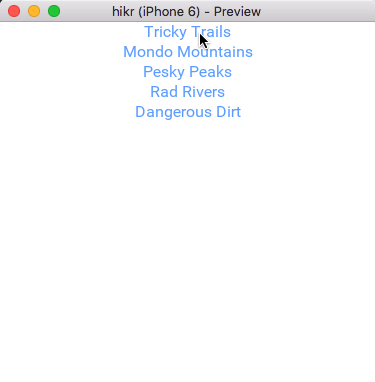

## Introduction

In the [previous chapter](navigation-and-routing.md), we took at look at Fuse's @Navigator class and used it to tie our app's views together. 

Now that we've got much more of our architecture figured out, it's time to start thinking about how we would interact with a backend. We'll do so by implementing a _mock backend_, which is a module that will act like a "real" backend, but will just store some data locally in our running app instead of persisting it on the device's storage or in a database somewhere.

Building a mock backend like this isn't strictly necessary when building an app with Fuse. We could just as well pick an existing backend solution, for example, and build our app against that directly. But because this tutorial is meant to be as general as possible, we want to present these concepts in a general, backend-agnostic way so we can focus on the core concepts rather than the details of a specific backend. This will be a good exercise to do at least once so that we can understand what to expect when hooking our app up to a real backend in the future, regardless of which backend solution is actually used.

But before we start building anything, we need to consider what the _interface_ to a typical backend might look like. So let's dive in and take a look!

The final code for this chapter is available [here](https://github.com/fusetools/hikr/tree/models-chapter-5).

## Typical backend interface

Backends can be quite complex and how they look/behave can vary a lot, but their most basic interfaces tend to be fairly similar across the board, especially if we're only after a few core features. For example, we can ignore things like initialization, signup, authentication, etc., as those parts will be highly backend-specific, and are features we're not concerned with in our basic app. For our simple app case, we really only need some simple data storage/retrieval and a way to update that data. With these features in mind, a simple backend interface might look something like this:

```
class MockBackend {
	// Returns an array of item objects
	getItems() { ... }
	// Updates an item
	updateItem(...) { ... }
}
```

Then, our app would use this interface in a very straightforward way:

```
// Get the item objects from the backend
var someItems = MockBackend.getItems();
// Update one of the items in the backend
MockBackend.updateItem(...);
```

This should be straightforward enough. However, we've ignored a very important detail that most (if not all) backends have to deal with: _distribution_. Our simple interface should work just fine if we already have the data locally, but what if the data is stored on a server somewhere else? We can't have our code just stalling, waiting for the backend server (or disk, etc) to respond with the data we asked for. It could take an indeterminate amount of time for our requests to get to the backend and for the backend to send data back. So, retrieving and updating the data should happen _asynchronously_. And, in JavaScript, when any asynchronous computations are involved, it's very likely you'll find a `Promise` or two nearby.

To paraphrase [MDN's article about `Promise`s](https://developer.mozilla.org/en/docs/Web/JavaScript/Reference/Global_Objects/Promise): "A `Promise` represents a value which may be available now, or in the future, or never." This is a pretty basic explanation of what a `Promise` can do for us, but already from that description, we can see that this fits our use case of asynchronously communicating with our backend. With `Promise`s, our typical backend interface looks more like this:

```
class MockBackend {
	// Returns a Promise that represents an array of item objects
	getItems() { ... }
	// Returns a Promise that will be fulfilled when the item is updated in the backend
	updateItem(...) { ... }
}
```

From this, it doesn't look like our interface has really changed at all! Of course, actually _using_ these functions (and implementing them in the case of our mock backend) is slightly different, but not by much. For example, the code that uses this interface could look something like this:

```
// Get the item objects from the backend asynchronously
var someItems = [];
MockBackend.getItems()
	.then(items => {
		someItems = items;
	})
	.catch(error => {
		console.log("Couldn't get items: " + error);
	});

// Update one of the items in the backend asynchronously
MockBackend.updateItem(...)
	.catch(error => {
		console.log("Couldn't update item: " + error);
	})
```

To properly use a `Promise`, we have to introduce some of our own asynchronous code. The simplest way to interact with a `Promise` is by calling two of the functions it provides: `then` and `catch`.

By calling the `then` function, we can describe what will happen when the `Promise` is fulfilled. We do this by passing in another function that optionally accepts the value the `Promise` is fulfilled with; in this case, the items from the backend. This argument is optional, though. For example, in the case of our `updateItem` function, the `Promise` it returns isn't meant to yield a value when the update is complete. We only care about whether or not the `Promise` was actually completed, so the argument wouldn't be used in this case.

By calling the `catch` function, we can describe what will happen if an error occured while trying to fulfill the `Promise`. In this case, we can pass in a function that accepts a description of what caused the failure. For example, a real backend might report an error if it can't connect to the backend server, or authentication failed. Error detection/handling is a complex topic, however, so for the sake of keeping things simple, we're going to skim over a lot of these details. But we'll still want to attach some simple error handlers to our `Promise`s so we have them if we hook up to a real backend later.

There are many more features `Promise`s provide, and they're very useful. But this short description should clarify all we need to know to build and use our mock backend, as well as mock the interfaces of real backends later on.

> Note: you can learn more about `Promise`s in [this guide over at MDN](https://developer.mozilla.org/en/docs/Web/JavaScript/Reference/Global_Objects/Promise), and the [A+ promise standard](https://promisesaplus.com/) which describes the flavor of `Promise`s that Fuse conforms to specifically.

All in all, using `Promise`s, we've arrived at a fairly good approximation of what a typical JS-based backend interface will look like, so this is what we'll use to model our mock backend.

## Implementing our mock backend

> Note: Keep in mind that we'll be moving things around a bit in our project, so we won't be able to compile and/or preview for a while, but we'll be back up and running by the end of the chapter.

Before we start implementing our mock backend, we'll want to talk about how we'll organize our JavaScript moving forward. Currently, we have all of our JavaScript, besides the page models, in the `App.js` file. As we start adding more functionality of different kinds, it is a good idea to start splitting things up into new classes and to group simlar type of functionality together. In Fuse, as with many other front end systems, we like to separate between models and services. Our models typically model the state of our app, be it which hikes we are displaying or the navigation flow we've defined. The model is however not concerned with talking to backends, interacting with native functionality or other types of services. This is why we usually group these bits of logic in a folder called services, which is functionality that in theory could be useful to any part of our app.

Lets start by creating a folder called `Services`, which is where we will put our mock backend code. We also create a new JS file called `MockBackend.js`.

```
|- MainView.ux
|- App.js
|- Pages
	|- ...
|- Services
	|- MockBackend.js
...
```

While we're at it, lets also create a `Models` folder, and move the `App.js` to it.

```
|- MainView.ux
|- Models
	|- App.js
|- Pages
	|- ...
|- Services
	|- MockBackend.js
```

We also need to make sure we update the path to our model in `MainView.ux`, since it has now changed place:

```
<App Model="Models/App">
```

> [callout_info] After moving the model class like we just did, you might need to __rebuild__ the project in order for Fuse to pick up the change. This can be done from the menu by going to Preview->Rebuild.


Now we're ready to start implementing our mock backend. As it turns out, our `Models/App.js` file already contains all the data we'll need to present. Lets start our mock backend implementation by simply moving the `hikes` array to our newly created `Services/MockBackend.js` file. But instead of assigning it to `this.hikes`, lets make it a constant and a part of the files root scope (notice the `const hikes` part):

```
const hikes = [
	new Hike(
		"Tricky Trails",
		"Lakebed, Utah",
		10.4,
		4,
		"This hike was nice and hike-like. Glad I didn't bring a bike."
	),
	new Hike(
		"Mondo Mountains",
		"Black Hills, South Dakota",
		20.86,
		3,
		"Not the best, but would probably do again. Note to self: don't forget the sandwiches next time."
	),
	new Hike(
		"Pesky Peaks",
		"Bergenhagen, Norway",
		8.2,
		5,
		"Short but SO sweet!!"
	),
	new Hike(
		"Rad Rivers",
		"Moriyama, Japan",
		12.3,
		4,
		"Took my time with this one. Great view!"
	),
	new Hike(
		"Dangerous Dirt",
		"Cactus, Arizona",
		19.34,
		2,
		"Too long, too hot. Also that snakebite wasn't very fun."
	)
];
```

A problem we have now, is that the hikes uses the actual `Hike` model to construct its items. This is a problem, since we don't want our mock backend to know about how we model its data on the client. What we'll do instead is to just use simple JavaScript object literals. We'll also give each item a unique `id` field, so that we can identiy exactly which item we are working with. This is to cover the case where our backend might have two items with exactly the same data, but that actually represet two unique cases:

```
const hikes = [
	{
		id: 0,
		name: "Tricky Trails",
		location: "Lakebed, Utah",
		distance: 10.4,
		rating: 4,
		comments: "This hike was nice and hike-like. Glad I didn't bring a bike."
	},
	{
		id: 1,
		name: "Mondo Mountains",
		location: "Black Hills, South Dakota",
		distance: 20.86,
		rating: 3,
		comments: "Not the best, but would probably do again. Note to self: don't forget the sandwiches next time."
	},
	{
		id: 2,
		name: "Pesky Peaks",
		location: "Bergenhagen, Norway",
		distance: 8.2,
		rating: 5,
		comments: "Short but SO sweet!!"
	},
	{
		id: 3,
		name: "Rad Rivers",
		location: "Moriyama, Japan",
		distance: 12.3,
		rating: 4,
		comments: "Took my time with this one. Great view!"
	},
	{
		id: 4,
		name: "Dangerous Dirt",
		location: "Cactus, Arizona",
		distance: 19.34,
		rating: 2,
		comments: "Too long, too hot. Also that snakebite wasn't very fun."
	}
];
```

Lets also update our `Hike` class in `Models/App.js` to allow us to take care of the new `id` field:

```
class Hike {
	constructor(id, name, location, distance, rating, comments) {
		this.id = id;
		this.name = name;
		this.location = location;
		this.distance = distance;
		this.rating = rating;
		this.comments = comments;
	}
}
```

If you hit save at this point, you might notice the "Problems" tab light up, complaining that it cant resolve the binding to {hikes}. We'll fix this during this chapter.

Our `Services/MockBackend.js` does not yet export any functionality that would allow our app to access the hikes, so lets get started creating that. We are aiming for the interface we discussed earlier:

```
export default class MockBackend {
	// Returns a Promise that represents an array of hike objects
	getHikes() { ... }
	// Returns a Promise that will be fulfilled when the hike is updated in the backend
	updateHike(...) { ... }
}
```

Start by creating and exporting the `MockBackend` class:

```
export default class MockBackend {	
}
```

We'll create our `getHikes` function first.

```
getHikes() {
}
```

If we wanted this function to return our `hikes` array, we could simply write something like this (since the hikes array is directly accessible to the `MockBackend` class, due to being in the same file):

```
getHikes() {
	return hikes;
}
```

But instead, we want the function to return a `Promise` which will be fulfilled when our `hikes` are ready. This is to simulate fetching them from a backend. So, our actual `getHikes` function will look something like this instead:

```
getHikes() {
	return new Promise((resolve, reject) => {
		resolve(hikes);
	});
}
```

Now, instead of returning the `hikes` array, we create a `Promise` using `new Promise`. The `Promise` constructor takes in a function that will be called in order to fulfill or reject the promise. This function takes in two arguments: `resolve`, and `reject`. These arguments are actually functions themselves. `resolve` is a function that fulfills the `Promise` we're creating, and if we attached a handler to our `Promise` using its `then` function, that handler will be called. In our code, this is all our function needs to call in order to resolve our `Promise` with our `hikes` collection. The `reject` function can be called instead if an error occurs, and any handlers we attached to our `Promise` via `catch` will subsequently be called.

We can also use JS' built-in `setTimeout` function to delay when this will actually be fulfilled by any number of milliseconds. `setTimeout` also takes two arguments. The first one is a function that will be called sometime in the future, and the second one is a number of milliseconds to delay before calling that function. For example, this code would resolve our `Promise` after half a second:

```
getHikes() {
	return new Promise((resolve, reject) => {
		setTimeout(() => {
			resolve(hikes);
		}, 500);
	});
}
```

This code is very useful if we want to test how our app deals with having to wait for data coming from the backend. However, to keep things simple for ourselves during testing, let's use `0` for the delay instead:

```
getHikes() {
	return new Promise((resolve, reject) => {
		setTimeout(() => {
			resolve(hikes);
		}, 0);
	});
}
```

Perfect, now we've got a nice `getHikes` function with a proper interface and some optional simulated delay!

Now for our `updateHike` function. This is a function that will take in some information about a specific hike to update in our mock backend, and return a `Promise` that will be fulfilled when the update has completed. We'll start with an empty function:

```
updateHike() {
}
```

Then, we'll add some arguments to identify and update a specific hike:

```
updateHike(id, name, location, distance, rating, comments) {
}
```

In this case, we'll use the `id` argument to identify the hike we want to update, and the rest of the arguments will be used to overwrite all of the corresponding fields on that hike.

Next, we'll use the `Promise` constructor and `setTimeout` just like in `getHikes` to return a `Promise` with an optional time delay:

```
updateHike(id, name, location, distance, rating, comments) {
	return new Promise((resolve, reject) => {
		setTimeout(() => {
		}, 0);
	});
}
```

Looking good! Now, we'll add the code to actually identify the hike by its `id` and update its members. Lets first `filter` the array to find the item that matches our `id` argument, and then update that item by looping over the returned array:

```
updateHike(id, name, location, distance, rating, comments) {
	return new Promise((resolve, reject) => {
		setTimeout(() => {
			hikes.filter(hike => { 
				return hike.id === id 
			}).forEach(hike => {
				//update hike here
			});
		}, 0);
	});
}
```

Once we've identified the hike, we'll update its data with our function's arguments:

```
updateHike(id, name, location, distance, rating, comments) {
	return new Promise((resolve, reject) => {
		setTimeout(() => {
			hikes.filter(hike => { 
				return hike.id === id;
			}).forEach(hike => {
				hike.name = name;
				hike.location = location;
				hike.distance = distance;
				hike.rating = rating;
				hike.comments = comments;
			});
		}, 0);
	});
}
```

Almost done. Finally, we'll make sure we resolve the `Promise` after the hike object has been updated. Since the `Promise` we're creating won't return any data, we just call `resolve` without any parameters, like so:

```
updateHike(id, name, location, distance, rating, comments) {
	return new Promise((resolve, reject) => {
		setTimeout(() => {
			hikes.filter(hike => { 
				return hike.id === id;
			}).forEach(hike => {
				hike.name = name;
				hike.location = location;
				hike.distance = distance;
				hike.rating = rating;
				hike.comments = comments;
			});
			
			resolve();
		}, 0);
	});
}
```

And with that, our mock backend is complete!

## Hooking our model up to our mock backend

Now it's time to make sure our model actually gets its data from our newly created mock backend. The first thing we need to do, is to import the mock backend service so that we can use it from our `App` class:

```
import MockBackend from 'Services/MockBackend';
```

Next up, we need to actually fetch the hikes array from our backend when we start up our app. We'll do this in the `App` class constructor. We also remove the "default" hike that is left here from one of the previous chapters:

```
constructor() {
	this.mockBackend = new MockBackend();
	this.hikes = [];
	this.mockBackend.getHikes().then(hikes => {
		this.hikes = hikes;
	});
	
	this.pages = [new HomePage()];
}
```

We start by creating a new instance of our mock backend. Notice that we then initialize `this.hikes` to be an empty array. This is because we do wan't the databinding to resolve initially, since in reality we do not know how long it could take before our backend actually returns the values we ask for.

If we save all our files now, we should see our hikes list reappear. Awesome! This is all we need to do for our `HomePage`.

## Hooking up EditHikePage

We are now ready to hook our `EditHikePage` up to the mock backend. We need a way to save changes made to a hike, and a way to cancel the edit if we don't want to push it to the backend. Lets switch out the `Back` button we added in the previous chapter with a `Save` and a `Cancel` button instead.


We'll start with the `Save` button. This button will be almost identical to the `Back` button we made previously, except that it will also commit the changes made in the editor to our data model in addition to going back to the previous page. So, let's start by simply renaming the existing `Back` button to `Save`.

First, in `Pages/EditHikePage.ux`, we'll change both the text of our button and its clicked handler:

```
			<Text>Comments:</Text>
			<TextView Value="{comments}" TextWrapping="Wrap" />

			<Button Text="Save" Clicked="{save}" />
		</StackPanel>
```

Next, in `Pages/EditHikePage.js`, we'll add a new function called `save`:

```
save() {
    //this should save and go back
}
```

This function should save any changes we've made to the current hike to the backend, and also navigate back. One problem now is that since we are in `EditHikePage.js` we no longer have access to the `pages` array, which is located in `App.js`. The easiest way to fix this problem for now is to just pass this array in as an argument when we create the `EditHikePage`.

```
	goToHike(arg) {
		this.pages.push(new EditHikePage(arg.data, this.pages));
	}
```

We also have to make sure we make `EditHikePage` accept and store this new argument:

```
	constructor(hike, pages) {
		this.pages = pages;
		this.hike = hike;
	}
```

Finally, we'll make this button commit any edits we've made in the view. To do this, we'll call mock backends `updateHike` function, passing in the `id` and data from our `hike` object. We now have the same problem as we did with the `pages` array, so lets pass the `mockBackend` instance as well as an argument to `EditHikePage`.

```
	goToHike(arg) {
		this.pages.push(new EditHikePage(arg.data, this.pages, this.mockBackend));
	}
```

And make sure the `EditHikePage` constructor takes care of the argument:

```
	constructor(hike, pages, mockBackend) {
		this.mockBackend = mockBackend;
		this.pages = pages;
		this.hike = hike;
	}
```

Next up is to actually call the `updateHike` function of the mock backend, and make sure to print any error messages to our console using the `catch` method on the returned promise:

```
save() {
	this.mockBackend.updateHike(
		this.hike.id, 
		this.hike.name, 
		this.hike.location, 
		this.hike.distance, 
		this.hike.rating, 
		this.hike.comments
	).catch(err => {
		console.log("There was an error updating hike " + this.hike.id + ": " + err);
	});
	
    this.pages.pop();
}
```

Great! Now our `Save` button should be all hooked up. Now, let's implement the `Cancel` button as well. The `Cancel` button will be very similar to our `Save` button, except we'll have to cancel the changes we've made in the editor somehow. But before we worry about that detail, let's go ahead and make our `Cancel` button, along with a corresponding `cancel` handler for it.

We'll first add the UX code for the button in `Pages/EditHikePage.ux` right beneath the code we just wrote for our `Save` button:

```
			<Button Text="Save" Clicked="{save}" />
			<Button Text="Cancel" Clicked="{cancel}" />
		</StackPanel>
```

Next, we'll add an empty `cancel` function and export it in `Pages/EditHikePage.js`:

```
cancel() {
}
```

Then, we'll make sure the `cancel` function will take us back to the previous page by calling `this.pages.pop()`, just like our `save` handler:

```
cancel() {
	this.pages.pop();
}
```

Finally, before the handler navigates back to the previous page, we want to revert any changes we've made in the view model. There are a few ways we could do this, but an easy way is to simply store a copy of the `hike` object that gets passed to the `EditHikePage` upon creation, and then simply reassign the `hike` to these values when we want to cancel.

We first need to store a copy of the `hike` in our constructor. We do this using the ES6 `Object.assign` function:

```
	constructor(hike, pages, mockBackend) {
		...
		
		this.hike = hike;
		this.hikeCopy = Object.assign({}, hike);
	}
```

Then, in our `cancel` function, we can use the same function to set the values of the original hike object back to the values of our copy:

```
cancel() {
	Object.assign(this.hike, this.hikeCopy);
	this.pages.pop();
}
```

Perfect! Now everything should be hooked up. At this point, we can go ahead and save all of our different files. Once Fuse is finished reloading preview, we finally can try out our fully-functional views!

## Our progress so far

Finally, we've got basically all of the major functional pieces of our app in place and hooked up. Now we've got our various pages, models and services working together in perfect harmony and fitted together with a nice, scalable architecture. It looks something like this:



And here's the code for the various files we modified in this chapter:

`Services/MockBackend.js`:

```
const hikes = [
	{
		id: 0,
		name: "Tricky Trails",
		location: "Lakebed, Utah",
		distance: 10.4,
		rating: 4,
		comments: "This hike was nice and hike-like. Glad I didn't bring a bike."
	},
	{
		id: 1,
		name: "Mondo Mountains",
		location: "Black Hills, South Dakota",
		distance: 20.86,
		rating: 3,
		comments: "Not the best, but would probably do again. Note to self: don't forget the sandwiches next time."
	},
	{
		id: 2,
		name: "Pesky Peaks",
		location: "Bergenhagen, Norway",
		distance: 8.2,
		rating: 5,
		comments: "Short but SO sweet!!"
	},
	{
		id: 3,
		name: "Rad Rivers",
		location: "Moriyama, Japan",
		distance: 12.3,
		rating: 4,
		comments: "Took my time with this one. Great view!"
	},
	{
		id: 4,
		name: "Dangerous Dirt",
		location: "Cactus, Arizona",
		distance: 19.34,
		rating: 2,
		comments: "Too long, too hot. Also that snakebite wasn't very fun."
	}
];

export default class MockBackend {
	constructor() {}
	
	getHikes() {
		return new Promise((resolve, reject) => {
			setTimeout(() => {
				resolve(hikes);
			}, 0);
		});
	}

	updateHike(id, name, location, distance, rating, comments) {
		return new Promise((resolve, reject) => {
			setTimeout(() => {
				hikes.filter(hike => { 
					return hike.id === id;
				}).forEach(hike => {
					hike.name = name;
					hike.location = location;
					hike.distance = distance;
					hike.rating = rating;
					hike.comments = comments;
				});
				
				resolve();
			}, 0);
		});
	}
}
```

`Pages/EditHikePage.ux`:

```
<Page ux:Class="EditHikePage">
	<ScrollView>
		<StackPanel>
			<Text>Name:</Text>
			<TextBox Value="{hike.name}" />

			<Text>Location:</Text>
			<TextBox Value="{hike.location}" />

			<Text>Distance (km):</Text>
			<TextBox Value="{hike.distance}" InputHint="Decimal" />

			<Text>Rating:</Text>
			<TextBox Value="{hike.rating}" InputHint="Integer" />

			<Text>Comments:</Text>
			<TextView Value="{hike.comments}" TextWrapping="Wrap" />

			<Button Text="Save" Clicked="{save}" />
			<Button Text="Cancel" Clicked="{cancel}" />
		</StackPanel>
	</ScrollView>
</Page>
```

`Pages/EditHikePage.js`:

```
export default class EditHikePage {
	constructor(hike, pages, mockBackend) {
		this.mockBackend = mockBackend;
		this.pages = pages;
		
		this.hike = hike;
		this.hikeCopy = Object.assign({}, hike);
	}

	save() {
		this.mockBackend.updateHike(
			this.hike.id, 
			this.hike.name, 
			this.hike.location, 
			this.hike.distance, 
			this.hike.rating, 
			this.hike.comments
		).catch(err => {
			console.log("There was an error updating hike " + this.hike.id + ": " + err);
		});
		
		this.pages.pop();
	}

	cancel() {
		Object.assign(this.hike, this.hikeCopy);
		this.pages.pop();
	}
}
```

## What's next

Now that all of the major parts of our app are in place, it's time to iteratively tweak the look and feel of our app to really make it pop. In the [next chapter](look-and-feel.md), we'll build various reusable components with a custom look/feel and sprinkle them all over our app to polish the app and make it look great. So [let's get to it](look-and-feel.md)!

The final code for this chapter is available [here](https://github.com/fusetools/hikr/tree/models-chapter-5).
