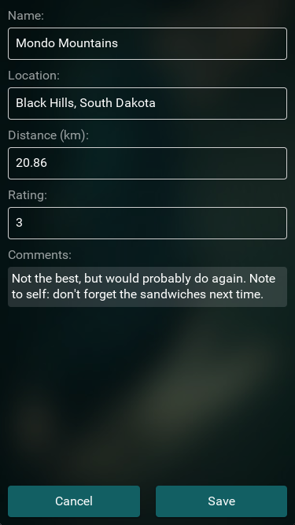

## Introduction

Welcome to our end-to-end app tutorial!

Picking up where our [quickstart](../basics/quickstart.md) left off, this tutorial takes us through the steps of creating a Fuse app from scratch. The app we'll put together is called "hikr", which is a basic hike tracking app where we can view a set of hikes we've been on and make changes to them by rating them, adding comments, etc.

The full source code for the app is available [here](https://github.com/fusetools/hikr)!

hikr is a simple app, and intentionally so. We want to learn the concepts of Fuse by building an app with multiple pieces and see how they'll fit together without getting too tied down by details. hikr is designed specifically for this, and by making the app, we'll learn many of the core aspects of building a real-world app in Fuse.

Additionally, we'll be adding various "tracks" that continue where the original tutorial leaves off, and will cover things like adding specific backends, improving certain editors, adding animations, and more. This way, we can focus on the core ideas first, and dig into more advanced/specific things later. So stay tuned for those!

### Core Concepts

Particularly, hikr covers these core concepts:

- Best practices for structuring an app in Fuse
- Making changes to data and communicating those changes with a backend
- How and when to build reusable components
- Combining components with routing and navigation

And as we build the app together, we'll gain real, hands-on experience with these core concepts, as well as many others.

### Chapters

The tutorial is split into the following chapters:

1. [Edit Hike view](edit-hike-view.md)
2. [Multiple hikes](multiple-hikes.md)
3. [Splitting up components](splitting-up-components.md)
4. [Navigation and routing](navigation-and-routing.md)
5. [Mocking our Backend](mock-backend.md)
6. [Tweaking the look/feel](look-and-feel.md)
7. [Splash screen](splash-screen.md)
8. [Final thoughts/what's next](final-thoughts.md)

Each chapter picks up where the previous leaves off, so it's highly recommended to go through it linearly without bouncing back and forth too much.

## hikr's Design

hikr's design is fairly straightforward. The app will start with a beautiful splash screen, complete with a video background and everything:

Pressing the "Get Started" button will take us to the Home page, which shows a list of our recent hikes:

Finally, we can tap any of these hikes to get to the Edit Hike view, which looks like this:

This page allows us to edit the specific hike, and we can either confirm these changes with the "Save" button, or revert them with the "Cancel" button. Both buttons will then take us back to the Home page.

The entire flow of the app can be represented like this:

And here's what the full app looks like in motion:

## What's Next

Now that we've got a basic idea of what we're going for, we'll start by creating the Edit Hike view, along with a basic view model. So [let's get started](edit-hike-view.md)!

The full source code for the app is available [here](https://github.com/fusetools/hikr).
