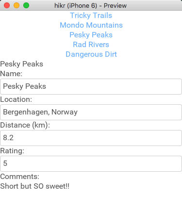

## Introduction

In the [last chapter](edit-hike-view.md), we blocked out the first view in our app, the Edit Hike view. This was a simple view that displays a single hike, as well as lets us edit that hike. This is a great start, but for our app, we need to be able to select one of many hikes and edit them individually.

In this chapter, that's exactly what we're going to do. To make sure things will be easy to manage, we'll still be keeping everything in our `MainView.ux` file. We'll add "selector" at the top of the view that allows us to select which hike we want to edit, and then our edit hike view from the last chapter will be populated with this data. Changes will not be persistent yet - we'll simply be loading data from our model into our view model, but not going the other way. We'll solve that in [a later chapter about mocking our backend](mock-backend.md).

The final code for this chapter is available [here](https://github.com/fusetools/hikr/tree/chapter-2).

## Creating our List of Hikes

In order for us to display a list of hikes to choose from, we first need a list of hikes. This is where we'll start building something that looks like a _model_ for our app. At first, we'll just use a simple array of hikes. Near the top of the JavaScript portion of our `MainView.ux` file, we'll place the following array:

```
var hikes = [
	{
		id: 0,
		name: "Tricky Trails",
		location: "Lakebed, Utah",
		distance: 10.4,
		rating: 4,
		comments: "This hike was nice and hike-like. Glad I didn't bring a bike."
	},
	{
		id: 1,
		name: "Mondo Mountains",
		location: "Black Hills, South Dakota",
		distance: 20.86,
		rating: 3,
		comments: "Not the best, but would probably do again. Note to self: don't forget the sandwiches next time."
	},
	{
		id: 2,
		name: "Pesky Peaks",
		location: "Bergenhagen, Norway",
		distance: 8.2,
		rating: 5,
		comments: "Short but SO sweet!!"
	},
	{
		id: 3,
		name: "Rad Rivers",
		location: "Moriyama, Japan",
		distance: 12.3,
		rating: 4,
		comments: "Took my time with this one. Great view!"
	},
	{
		id: 4,
		name: "Dangerous Dirt",
		location: "Cactus, Arizona",
		distance: 19.34,
		rating: 2,
		comments: "Too long, too hot. Also that snakebite wasn't very fun."
	}
];
```

You'll notice each item in this array has the same fields our edit hike view had, with the exception of an added `id` field, which is just a unique identifier for each of our items.

## Displaying our List of Hikes

Now that we've got our list of hikes, we'll make a simple view to display them.

The first thing we'll do is export our `hikes` variable to make it available from UX:

```
module.exports = {
	hikes: hikes,

	name: name,
	location: location,
	distance: distance,
	rating: rating,
	comments: comments
};
```

Since we want to be able to select one of the hikes we're displaying, we'll display each hike as a button that, when pressed, will select that specific hike and populate the edit hike view.

First, we'll just display our array of hikes as buttons. But how do we do that in UX? For these kinds of scenarios, UX provides a very helpful mechanism called @Each:

```
<ScrollView>
	<StackPanel>
		<Each Items="{hikes}">
		</Each>

		<Text Value="{name}" />
```

@Each is a very powerful UX feature. What @Each does is take the collection specified by its `Items` property and _project_ each item into a copy of the visual subtree inside the @Each tag. We can think of it kind of like copying and pasting the code inside @Each for each item in `Items`.

In our case, we'll use @Each to create a @Button for each of our hikes whose @Text will be set to that hike's `name`. That will look like this:

```
<Each Items="{hikes}">
	<Button Text="{name}" />
</Each>
```

If we save here, we can see that now @Each has created a @Button for each item in `hikes`, just like we expected. Cool! This works for pretty much all code we can put inside @Each, but in our case one @Button for each hike is all we need.

Notice how we also databound each @Button's @Text property to `name`, but we never exposed any variable called `name`. One of the awesome things about @Each is that for each of our `Items`, @Each will "narrow down" the data context that we're binding to to be the current item. So when we bind to `name`, we're not binding to a variable called `name` exported from JS; we're binding to the `name` property of the current item, which in this case is the current hike. It's that easy!

## Selecting Hikes

Now that we've got a button for each of the hikes in our model, we want to be able to select one by clicking one of these buttons.

Currently, our view model consists of many separate @Observable's for the various fields we can edit. Let's also add an @Observable whose `value` represents the hike we're currently editing. Initially, this will be empty, as we haven't yet selected a hike to edit:

```
var hike = Observable();
```

Now we need to get the data from `hike` to our other @Observable's, and this is where things get interesting. On one hand, we could imperatively populate all of our field @Observable's whenever `hike` is populated, but this would mean we'd have to subscribe to the @Observable and is frankly a bit too imperative for my taste. We'd much prefer doing something declarative instead!

Rather, what we'll do is _transform_, or _map_, the value of the `hike` @Observable into the value of its various properties. For example, this is what that might look like for `name`:

```
var name = hike.map(function(x) { return x.name; });
```

This might look a bit daunting at first if you're not yet used to functional reactive programming, but not to worry - it can be quite intuitive once you get a feel for it.

If we break down this code into parts, you'll notice a couple things. First of all, we're calling the `map` function on `hike`. `map` itself will return a new @Observable that acts just like any other @Observable, with the added benefit that each value that goes inside our `hike` @Observable will be _propagated_ to our new @Observable. In other words, all of the values in `name` will be _based on_, or _mapped from_, values in `hike`.

You'll also notice we're passing a function into `map`. This function is (unsurprisingly) called a _mapping function_. A mapping function is just like any other function - it takes an argument and returns a new value based on that argument. Sometimes, these functions have _side-effects_, which means they can affect the world around them. But typically, these functions are _pure functions_, which means they only return values based on their arguments, and nothing more.

But what does this mapping function _do_, exactly? Great question! Simply put, the mapping function will be called whenever there is a new value in `hike`. This new value is what gets passed to the function as its argument. The function will then return a new value based on this argument, which represents the value in the @Observable we're creating.

So, altogether, this means that we're taking `hike` and creating a new @Observable that represents the `name` property of each value that gets put into `hike`. Pretty cool, huh?

> Note: We can find out more information on Observables in our [Observable Crash Course](https://www.youtube.com/watch?v=bB9P4mTGtVU) video, as well as our @Observable docs.

Now, let's refactor the other @Observable's to also be based on `hike` like we did with `name`:

```
var name = hike.map(function(x) { return x.name; });
var location = hike.map(function(x) { return x.location; });
var distance = hike.map(function(x) { return x.distance; });
var rating = hike.map(function(x) { return x.rating; });
var comments = hike.map(function(x) { return x.comments; });
```

Finally, we need to hook up each of our buttons to a function that will populate our `hike` @Observable (which in turn will populate all of the @Observable's for individual fields). We'll start by creating an empty function in JavaScript, which we'll fill in in a moment:

```
function chooseHike() {
}
```

Next, let's add it to our exports so that UX can see it:

```
module.exports = {
	hikes: hikes,

	name: name,
	location: location,
	distance: distance,
	rating: rating,
	comments: comments,

	chooseHike: chooseHike
};
```

And we'll go ahead and hook up all of our buttons to it like this:

```
<Button Text="{name}" Clicked="{chooseHike}" />
```

Now it's time to fill in our function. The basic idea is that we'll fill in the value of our `hike` @Observable:

```
function chooseHike() {
	hike.value = ???
}
```

But what will we set it to, exactly? As it turns out, when we databind a function to `Clicked` on a @Button, that function can receive an argument. This argument contains a `data` field, which will represent the current data context for the @Button. And because of the way we've used @Each, that means that `data` will actually be the `hike` we're after. Cool! So, let's update our function to accept that argument and put its `data` property into our `hike` @Observable:

```
function chooseHike(arg) {
	hike.value = arg.data;
}
```

And now when we save this, we can see that our hike selectors work as we expect! When we click on one of them, the edit hike view gets populated properly and we can edit the individual fields. Cool!

## Our progress so far

So now we've started to get a basic model made up of many hikes, a view to select one of these hikes, and a view to edit the selected hike. Altogether, it looks like this:



The code hasn't grown too much, either. It looks like this:

```
<App>
	<ClientPanel>
		<JavaScript>
			var Observable = require("FuseJS/Observable");

			var hikes = [
				{
					id: 0,
					name: "Tricky Trails",
					location: "Lakebed, Utah",
					distance: 10.4,
					rating: 4,
					comments: "This hike was nice and hike-like. Glad I didn't bring a bike."
				},
				{
					id: 1,
					name: "Mondo Mountains",
					location: "Black Hills, South Dakota",
					distance: 20.86,
					rating: 3,
					comments: "Not the best, but would probably do again. Note to self: don't forget the sandwiches next time."
				},
				{
					id: 2,
					name: "Pesky Peaks",
					location: "Bergenhagen, Norway",
					distance: 8.2,
					rating: 5,
					comments: "Short but SO sweet!!"
				},
				{
					id: 3,
					name: "Rad Rivers",
					location: "Moriyama, Japan",
					distance: 12.3,
					rating: 4,
					comments: "Took my time with this one. Great view!"
				},
				{
					id: 4,
					name: "Dangerous Dirt",
					location: "Cactus, Arizona",
					distance: 19.34,
					rating: 2,
					comments: "Too long, too hot. Also that snakebite wasn't very fun."
				}
			];

			var hike = Observable();

			var name = hike.map(function(x) { return x.name; });
			var location = hike.map(function(x) { return x.location; });
			var distance = hike.map(function(x) { return x.distance; });
			var rating = hike.map(function(x) { return x.rating; });
			var comments = hike.map(function(x) { return x.comments; });

			function chooseHike(arg) {
				hike.value = arg.data;
			}

			module.exports = {
				hikes: hikes,

				name: name,
				location: location,
				distance: distance,
				rating: rating,
				comments: comments,

				chooseHike: chooseHike
			};
		</JavaScript>

		<ScrollView>
			<StackPanel>
				<Each Items="{hikes}">
					<Button Text="{name}" Clicked="{chooseHike}" />
				</Each>

				<Text Value="{name}" />

				<Text>Name:</Text>
				<TextBox Value="{name}" />

				<Text>Location:</Text>
				<TextBox Value="{location}" />

				<Text>Distance (km):</Text>
				<TextBox Value="{distance}" InputHint="Decimal" />

				<Text>Rating:</Text>
				<TextBox Value="{rating}" InputHint="Integer" />

				<Text>Comments:</Text>
				<TextView Value="{comments}" TextWrapping="Wrap" />
			</StackPanel>
		</ScrollView>
	</ClientPanel>
</App>
```

Now we should be getting a feel for how data might flow through our Fuse app and how different views will start to interact.

## What's Next

While being able to select from our list of hikes is really helpful, we'll ideally want to separate the parts of this view into separate views entirely. In [the next chapter](splitting-up-components.md), that's exactly what we'll do - we'll separate our views, view models, and model into organized, isolated components. Let's [dig in](splitting-up-components.md)!

The final code for this chapter is available [here](https://github.com/fusetools/hikr/tree/chapter-2).