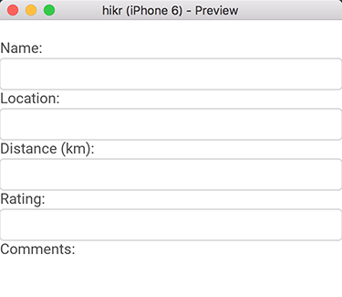

## Introduction

In the [last chapter](multiple-hikes.md), we extended our Edit Hike view by adding a second view to select which hike we're going to edit. This was a big step forward, but now it's about time we start splitting up our code into smaller, reusable _components_ so that our code will be easier to manage as our project grows. This will teach us how to utilize important tools that Fuse provides for managing the complexity of real-world app projects.

More specifically, what we'll do in this chapter is separate out our two views - the hike selector view, which will become our _home page_, and the edit hike view, which will become our _edit hike page_. This also means that our simple data model (our `hikes` array from the last chapter) should be split out as well, so that it's independent of the two views and can be used separately.

Now, because this is a lot of ground to cover, this part of the tutorial will only go over how to split our view into separate components, _not_ how we'll fit them back together and develop the flow of our app. This will mean that our view for editing a specific hike will no longer be populated with any data for a little bit, but that's ok. We want to take things one step at a time. Hooking our views back together and passing data between them will be covered in the next chapter, so don't worry!

The final code for this chapter is available [here](https://github.com/fusetools/hikr/tree/chapter-3).

## Separating the hikes collection

The first thing we'll do is separate out our `hikes` array into its own component, so that it will exist independently of either of our views. Since this is just some JavaScript data, we'll place it into its own _module_. A _module_ is basically a self-contained, reusable chunk of JavaScript. We've actually already been creating modules already - each time we inline code inside a `<JavaScript>` tag in UX, we're creating a module!

> Tip: Using the `<JavaScript>` tag in UX, we can also refer to another JavaScript file like this: `<JavaScript File="myScript.js" />`. This is the same thing as placing the JavaScript code inline inside the `<JavaScript>` tag, but can be cleaner, as we can separate the UX code from the logic of our components! We'll see more concrete examples of this later in this chapter.

However, in the case of our `hikes` array, we're not going to tie the module to a specific UX file. Instead, we'll just place the data into its own separate .js file, and tell Fuse to bundle this module with our app. Then, we'll _import_ this module into each of our views' modules.

To do this, we'll first create a new (empty) file in our project called `hikes.js`. We'll place this in the root of our project directory, so our directory should look something like this:

```sh
$ tree
.
|- MainView.ux
|- hikes.js
|- hikr.unoproj
```

Before we put any content in here, let's first make sure that Fuse will _bundle_ it with our app. Normally, if you write inline JavaScript code in UX by using the `JavaScript` tag, or refer to a specific file like `<JavaScript File="myFile.js" />`, Fuse will automatically make sure that JavaScript code is bundled with our app. However, when we have individual JavaScript modules in our project that aren't referred to by a `JavaScript` tag directly, we need to tell Fuse that this code is part of our project.

For that, we'll add some info to our _project file_ that tells Fuse that our `hikes.js` file should be bundled with our app. If we open up the `hikr.unoproj` file, we'll see something like this:

```json
{
  "Packages": [
    "Fuse",
    "FuseJS"
  ],
  "Includes": [
    "*"
  ]
}

```

As you can see, there's not much to it; basically just some simple info about our project. The section we're particularly interested in is the `"Includes"` section. Currently, it has one entry:

```json
  "Includes": [
    "*"
  ]
```

This basically means that the Fuse project should include a lot of the files commonly associated with Fuse projects. This covers .ux files, .uno files, and a few others. However, it does _not_ include JavaScript files, so we'll have to add our `hikes.js` file explicitly. To do this, we'll add another item to this list:

```json
{
  "Packages": [
    "Fuse",
    "FuseJS"
  ],
  "Includes": [
    "*",
    "hikes.js:Bundle"
  ]
}
```

All we've done here is placed a comma after the `"*"` entry, and added a `"hikes.js:Bundle"` entry after it. This is just saying "Hey, Fuse, you know that hikes.js file? Go ahead and bundle that with my app." Nice and simple! Now we can save this file, and we're all set.

At this point, we'll need to actually move our `hikes` array from inside `MainView.ux` into our `hikes.js` file. First, we'll copy it from our `MainView.ux` file, and then remove it:

```xml
		<JavaScript>
			var Observable = require("FuseJS/Observable");

			var hike = Observable();

			var name = hike.map(function(x) { return x.name; });
			var location = hike.map(function(x) { return x.location; });
			var distance = hike.map(function(x) { return x.distance; });
			var rating = hike.map(function(x) { return x.rating; });
			var comments = hike.map(function(x) { return x.comments; });

			function chooseHike(arg) {
				hike.value = arg.data;
			}

			module.exports = {
				hikes: hikes,

				name: name,
				location: location,
				distance: distance,
				rating: rating,
				comments: comments,

				chooseHike: chooseHike
			};
		</JavaScript>
```

Notice how we left the reference to `hikes` in `module.exports`. This will cause an error if we save the file, but don't worry - we'll fix this up in a minute.

But first, we'll place the array inside `hikes.js`:

```js
var hikes = [
	{
		id: 0,
		name: "Tricky Trails",
		location: "Lakebed, Utah",
		distance: 10.4,
		rating: 4,
		comments: "This hike was nice and hike-like. Glad I didn't bring a bike."
	},
	{
		id: 1,
		name: "Mondo Mountains",
		location: "Black Hills, South Dakota",
		distance: 20.86,
		rating: 3,
		comments: "Not the best, but would probably do again. Note to self: don't forget the sandwiches next time."
	},
	{
		id: 2,
		name: "Pesky Peaks",
		location: "Bergenhagen, Norway",
		distance: 8.2,
		rating: 5,
		comments: "Short but SO sweet!!"
	},
	{
		id: 3,
		name: "Rad Rivers",
		location: "Moriyama, Japan",
		distance: 12.3,
		rating: 4,
		comments: "Took my time with this one. Great view!"
	},
	{
		id: 4,
		name: "Dangerous Dirt",
		location: "Cactus, Arizona",
		distance: 19.34,
		rating: 2,
		comments: "Too long, too hot. Also that snakebite wasn't very fun."
	}
];
```

Once that's done, we'll need to _export_ this array from this new module so that we can see the data from our views again. This is done using `module.exports`, just like it was when exposing data from our inline JavaScript modules to the surrounding UX code. However, in this case, it gets a little bit simpler. Because we're just going to have this one piece of data in this file, we can simple write the following at the bottom:

```js
module.exports = hikes;
```

And that's it! Now we can save this file, and our new module is ready to go.

Now, back to our view code. Since we've moved our `hikes` array out of this file, we need to _import_ it from our new module. This is actually super easy to do. Remember the `var Observable = require("FuseJS/Observable");` line in `MainView.ux`? This tells Fuse to import FuseJS' @Observable module, and bind it to the name `Observable`. For our new `hikes` module, we'll do almost exactly the same thing:

```js
			var Observable = require("FuseJS/Observable");
			var hikes = require("hikes");
```

In this case, Fuse will import a module called `hikes`, which corresponds to our `hikes.js` file. It will also bind the module's `module.exports` object to the name `hikes`, which, in `hikes.js`, was our `hikes` array. Cool! That's actually all we need to do to use our newly-created, reusable JavaScript module. If we save `MainView.ux`, our live preview will reload. It may not look any different on the outside, but on the inside we're well on our way to a very clean and manageable project structure!

## Transforming the Edit Hike view into a component

Now that we've separated out our `hikes` array, the next thing we'll want to do is create a new component out of our view code. We'll do this in small steps as well. First, we'll want to create a new folder in our project called `Pages`:

```sh
$ tree
.
|- MainView.ux
|- hikes.js
|- hikr.unoproj
|- Pages
```

Inside this new folder, we'll create a new file called `EditHikePage.ux`. Inside there, we'll place the following code:

```xml
<Page ux:Class="EditHikePage"></Page>
```

Our directory tree should now look a bit like this:

```sh
$ tree
.
|- MainView.ux
|- hikes.js
|- hikr.unoproj
|- Pages
   |- EditHikePage.ux
```

Now before we move on, I need to explain a couple things. Let's take another look at our new `EditHikePage.ux` file's contents:

```xml
<Page ux:Class="EditHikePage"></Page>
```

At first glance, it looks like we're just creating a @Page with a funny `ux:Class` property and nothing in it. But what's a @Page exactly? And what's with this `ux:Class` stuff?

To answer the first question, a @Page is basically a special kind of UI element that will participate in navigation. We don't actually _have_ to use a @Page here; we could just as well use a `Panel`, a `Button`, or something else entirely. But it's generally considered best practice to use a @Page if you're going to use the component with navigation specifically, which we'll do a bit later in this chapter and the following one.

As for the second question, `ux:Class` means that instead of creating an _instance_ of a @Page, we're creating a _class_ that _extends_ the @Page class. If you've ever done some object-oriented programming before, this terminology will sound very familiar. If not, it may sound a little strange, but it's actually a pretty simple concept to grasp. Basically, we can think of a _class_ as a _kind_ of element, and an _instance_ is _an element of that kind_. For example, @Button is a class, and when we say `<Button />` in UX, we're making an instance of the @Button class. @Button describes how a button element should look and feel, and `<Button />` describes that an actual @Button element exists in our view.

But what does _extend_ mean in this context? It simply means that we're going to make our own class that is basically the same as a given class, but we'll add a few things of our own. In our case, we still want to end up with a @Page, but we want some extra stuff on it as well (the stuff that's specific to our view). So, we'll say `<Page ux:Class="EditHikePage" />`, which means we're going to create our own class called `EditHikePage` that extends the @Page class. Then, whenever we want to use this class (create an instance), instead of saying `<Page />` and putting all of our custom stuff inside it, we can simply say `<EditHikePage />`.

> Note: You can find out more about classes in our [Creating Components](https://fuse-open.github.io/docs/basics/creating-components) documentation.

Now that we've understood the basic contents of this file, it's time to migrate the code we want in our view over from `MainView.ux`. If we take a look at that file, we'll see something like this:

```xml
<App>
	<ClientPanel>
		<JavaScript>
			var Observable = require("FuseJS/Observable");
			var hikes = require("hikes");

			var hike = Observable();

			var name = hike.map(function(x) { return x.name; });
			var location = hike.map(function(x) { return x.location; });
			var distance = hike.map(function(x) { return x.distance; });
			var rating = hike.map(function(x) { return x.rating; });
			var comments = hike.map(function(x) { return x.comments; });

			function chooseHike(arg) {
				hike.value = arg.data;
			}

			module.exports = {
				hikes: hikes,

				name: name,
				location: location,
				distance: distance,
				rating: rating,
				comments: comments,

				chooseHike: chooseHike
			};
		</JavaScript>

		<ScrollView>
			<StackPanel>
				<Each Items="{hikes}">
					<Button Text="{name}" Clicked="{chooseHike}" />
				</Each>

				<Text Value="{name}" />

				<Text>Name:</Text>
				<TextBox Value="{name}" />

				<Text>Location:</Text>
				<TextBox Value="{location}" />

				<Text>Distance (km):</Text>
				<TextBox Value="{distance}" InputHint="Decimal" />

				<Text>Rating:</Text>
				<TextBox Value="{rating}" InputHint="Integer" />

				<Text>Comments:</Text>
				<TextView Value="{comments}" TextWrapping="Wrap" />
			</StackPanel>
		</ScrollView>
	</ClientPanel>
</App>
```

Looking at the top-level parts of this file, we first see our @App, and then a @ClientPanel. All of the other contents (in particular, the `JavaScript` and @ScrollView tags) are what make up our view specifically. So these are the parts we'll want to move over to our `EditHikePage.ux` file, inside the @Page. This will look something like this:

MainView.ux:

```xml
<App>
	<ClientPanel>
	</ClientPanel>
</App>
```

EditHikePage.ux:

```xml
<Page ux:Class="EditHikePage">
	<JavaScript>
		var Observable = require("FuseJS/Observable");
		var hikes = require("hikes");

		var hike = Observable();

		var name = hike.map(function(x) { return x.name; });
		var location = hike.map(function(x) { return x.location; });
		var distance = hike.map(function(x) { return x.distance; });
		var rating = hike.map(function(x) { return x.rating; });
		var comments = hike.map(function(x) { return x.comments; });

		function chooseHike(arg) {
			hike.value = arg.data;
		}

		module.exports = {
			hikes: hikes,

			name: name,
			location: location,
			distance: distance,
			rating: rating,
			comments: comments,

			chooseHike: chooseHike
		};
	</JavaScript>

	<ScrollView>
		<StackPanel>
			<Each Items="{hikes}">
				<Button Text="{name}" Clicked="{chooseHike}" />
			</Each>

			<Text Value="{name}" />

			<Text>Name:</Text>
			<TextBox Value="{name}" />

			<Text>Location:</Text>
			<TextBox Value="{location}" />

			<Text>Distance (km):</Text>
			<TextBox Value="{distance}" InputHint="Decimal" />

			<Text>Rating:</Text>
			<TextBox Value="{rating}" InputHint="Integer" />

			<Text>Comments:</Text>
			<TextView Value="{comments}" TextWrapping="Wrap" />
		</StackPanel>
	</ScrollView>
</Page>
```

If we save these files, our preview will update, but this time, our contents will vanish! The reason for this is simple - we've only created the `EditHikePage` class, but we haven't _used_ it anywhere! To fix this, we'll just add an _instance_ of the `EditHikePage` class inside the @ClientPanel in `MainView.ux`, like so:

```xml
<App>
	<ClientPanel>
		<EditHikePage />
	</ClientPanel>
</App>
```

Notice how this looks just like we had used any other class that comes standard in Fuse - but this time, it's a class we've created ourselves! If we save `MainView.ux`, we'll see that our view shows up again in preview. Awesome!

Now, before we move on, we'll want to do one more thing with our new component, and that's to split out its JavaScript code into its own file. This is very easy to do. First, we'll create a new file called `EditHikePage.js`, right next to our `EditHikePage.ux` file in the `Pages` folder of our project:

```sh
$ tree
.
|- MainView.ux
|- hikes.js
|- hikr.unoproj
|- Pages
   |- EditHikePage.js
   |- EditHikePage.ux
```

Then we'll take all of the code from our `JavaScript` tag in `EditHikePage.ux` and move it over to our `EditHikePage.js` file:

EditHikePage.ux:
```xml
<Page ux:Class="EditHikePage">
	<JavaScript>
	</JavaScript>

	<ScrollView>
		<StackPanel>
			<Each Items="{hikes}">
				<Button Text="{name}" Clicked="{chooseHike}" />
			</Each>

			<Text Value="{name}" />

			<Text>Name:</Text>
			<TextBox Value="{name}" />

			<Text>Location:</Text>
			<TextBox Value="{location}" />

			<Text>Distance (km):</Text>
			<TextBox Value="{distance}" InputHint="Decimal" />

			<Text>Rating:</Text>
			<TextBox Value="{rating}" InputHint="Integer" />

			<Text>Comments:</Text>
			<TextView Value="{comments}" TextWrapping="Wrap" />
		</StackPanel>
	</ScrollView>
</Page>
```

EditHikePage.js:
```js
var Observable = require("FuseJS/Observable");
var hikes = require("hikes");

var hike = Observable();

var name = hike.map(function(x) { return x.name; });
var location = hike.map(function(x) { return x.location; });
var distance = hike.map(function(x) { return x.distance; });
var rating = hike.map(function(x) { return x.rating; });
var comments = hike.map(function(x) { return x.comments; });

function chooseHike(arg) {
	hike.value = arg.data;
}

module.exports = {
	hikes: hikes,

	name: name,
	location: location,
	distance: distance,
	rating: rating,
	comments: comments,

	chooseHike: chooseHike
};
```

Go ahead and save this file. Finally, we'll change the `JavaScript` tags in our `EditHikePage.ux` file into a single tag that refers to our newly created JavaScript file:

```xml
<Page ux:Class="EditHikePage">
	<JavaScript File="EditHikePage.js" />

	<ScrollView>

	...
```

And that's it! If we save our `EditHikePage.ux` file, again preview will reload, and it will look the same as before. This means everything worked, and we're yet another step closer towards a fantastic Fuse project structure. Also, notice how we didn't have to explicitly include our `EditHikePage.js` file in our project file, simply because it was referenced from one of the `JavaScript` tags in our app. Cool!

## Separating our home page

At this point, our `EditHikePage` class is actually two components in one - a hike selector, and a hike editor. Generally, when making components, it's a good idea to make sure they're a simple as possible, and that they only represent one _thing_, like a single view. What we'll do next is to separate the selector view into its own class, which we'll call the `HomePage`.

Now that we've basically done this before, this second time should be a little easier. First, we'll create a blank page class that will become our home page, in a file called `HomePage.ux` in our `Pages` directory:

```xml
<Page ux:Class="HomePage"></Page>
```

Next, we'll migrate the home page-specific UX code from `EditHikePage.ux` into `HomePage.ux`. Specifically, we're after the @Each tag that displayed the `hikes` collection:

```xml
<Each Items="{hikes}">
	<Button Text="{name}" Clicked="{chooseHike}" />
</Each>
```

So let's go ahead and move that over:

```xml
<Page ux:Class="HomePage">
	<Each Items="{hikes}">
		<Button Text="{name}" Clicked="{chooseHike}" />
	</Each>
</Page>
```

Also, since we're going to be displaying a bunch of these hikes, we'll want to place them inside a @StackPanel. It's a good idea to also have that inside a @ScrollView, so we'll set that up too:

```xml
<Page ux:Class="HomePage">
	<ScrollView>
		<StackPanel>
			<Each Items="{hikes}">
				<Button Text="{name}" Clicked="{chooseHike}" />
			</Each>
		</StackPanel>
	</ScrollView>
</Page>
```

However, if we save all this, we'll notice a couple things. Particularly, our new `HomePage.ux` doesn't yet know about the `hikes` collection. We'll fix that by adding some JavaScript for this view.

Like before, we'll create our `HomePage.js` file, right next to our `HomePage.ux`, and we'll place the following code in there:

```js
var hikes = require("hikes");

function chooseHike(arg) {
	// TODO
}

module.exports = {
	hikes: hikes,

	chooseHike: chooseHike
};
```

This is basically the same code that's in `EditHikePage.js` currently, except we've commented out the contents of our `chooseHike` function. We'll get to that in the next chapter. But we no longer need this code in both places, since `EditHikePage` won't need to display all of the hikes. So, we'll go ahead and remove the `require`, `chooseHike` function, and their exports from `EditHikePage.js` while we're at it:

```js
var Observable = require("FuseJS/Observable");

var hike = Observable();

var name = hike.map(function(x) { return x.name; });
var location = hike.map(function(x) { return x.location; });
var distance = hike.map(function(x) { return x.distance; });
var rating = hike.map(function(x) { return x.rating; });
var comments = hike.map(function(x) { return x.comments; });

module.exports = {
	name: name,
	location: location,
	distance: distance,
	rating: rating,
	comments: comments
};
```

Now that our JavaScript is all ready to go, we'll go ahead and link to that file in `HomePage.ux`, like so:

```xml
<Page ux:Class="HomePage">
	<JavaScript File="HomePage.js" />
```

At this point, our page should be ready for display!

## Displaying our home page

By now, we've got multiple pages, and we'll need a way to display them and navigate between them. In Fuse, this is handled by the @Navigator and @Router components. These components will need a proper introduction, and we'll want to take our time learning how to use them properly to fully understand how powerful they are, so we'll take a look at those in detail in the next chapter.

For now, to keep things simple, we'll use a @PageControl instead. A @PageControl is great for cases where we want to have a few pages side-by-side that we'll to swipe between, which is just fine for initially displaying our two pages.

So, if we take a look at `MainView.ux`, it currently looks something like this:

```xml
<App>
	<ClientPanel>
		<EditHikePage />
	</ClientPanel>
</App>

```

Let's place the `EditHikePage` instance inside a @PageControl, like so:

```xml
<App>
	<ClientPanel>
		<PageControl>
			<EditHikePage />
		</PageControl>
	</ClientPanel>
</App>
```

Now, all we have to do is add a `HomePage` instance inside our @PageControl as well. Because it's the home page, let's place it above our existing `EditHikePage` instance:

```xml
<App>
	<ClientPanel>
		<PageControl>
			<HomePage />
			<EditHikePage />
		</PageControl>
	</ClientPanel>
</App>
```

And now, when we save all of this, our new `HomePage` will be displayed, and we can swipe right to reveal the `EditHikePage` as well. Cool!

## Our progress so far

Phew, we've covered a lot of ground here! At this point, we've got our two views separated into components and displayed side-by-side in a @PageControl. This is how they look:

`HomePage.ux`:


`EditHikePage.ux`:



And here's what the code for all of our various files looks like. It's a few more files now, but they're much simpler now in isolation:

`hikr.unoproj`:
```json
{
  "Packages": [
    "Fuse",
    "FuseJS"
  ],
  "Includes": [
    "*",
    "hikes.js:Bundle"
  ]
}
```

`MainView.ux`:
```xml
<App>
	<ClientPanel>
		<PageControl>
			<HomePage />
			<EditHikePage />
		</PageControl>
	</ClientPanel>
</App>
```

`hikes.js`:
```js
var hikes = [
	{
		id: 0,
		name: "Tricky Trails",
		location: "Lakebed, Utah",
		distance: 10.4,
		rating: 4,
		comments: "This hike was nice and hike-like. Glad I didn't bring a bike."
	},
	{
		id: 1,
		name: "Mondo Mountains",
		location: "Black Hills, South Dakota",
		distance: 20.86,
		rating: 3,
		comments: "Not the best, but would probably do again. Note to self: don't forget the sandwiches next time."
	},
	{
		id: 2,
		name: "Pesky Peaks",
		location: "Bergenhagen, Norway",
		distance: 8.2,
		rating: 5,
		comments: "Short but SO sweet!!"
	},
	{
		id: 3,
		name: "Rad Rivers",
		location: "Moriyama, Japan",
		distance: 12.3,
		rating: 4,
		comments: "Took my time with this one. Great view!"
	},
	{
		id: 4,
		name: "Dangerous Dirt",
		location: "Cactus, Arizona",
		distance: 19.34,
		rating: 2,
		comments: "Too long, too hot. Also that snakebite wasn't very fun."
	}
];

module.exports = hikes;
```

`Pages/EditHikePage.ux`:
```xml
<Page ux:Class="EditHikePage">
	<JavaScript File="EditHikePage.js" />

	<ScrollView>
		<StackPanel>
			<Text Value="{name}" />

			<Text>Name:</Text>
			<TextBox Value="{name}" />

			<Text>Location:</Text>
			<TextBox Value="{location}" />

			<Text>Distance (km):</Text>
			<TextBox Value="{distance}" InputHint="Decimal" />

			<Text>Rating:</Text>
			<TextBox Value="{rating}" InputHint="Integer" />

			<Text>Comments:</Text>
			<TextView Value="{comments}" TextWrapping="Wrap" />
		</StackPanel>
	</ScrollView>
</Page>
```

`Pages/EditHikePage.js`:
```js
var Observable = require("FuseJS/Observable");

var hike = Observable();

var name = hike.map(function(x) { return x.name; });
var location = hike.map(function(x) { return x.location; });
var distance = hike.map(function(x) { return x.distance; });
var rating = hike.map(function(x) { return x.rating; });
var comments = hike.map(function(x) { return x.comments; });

module.exports = {
	name: name,
	location: location,
	distance: distance,
	rating: rating,
	comments: comments
};
```

`Pages/HomePage.ux`:
```xml
<Page ux:Class="HomePage">
	<JavaScript File="HomePage.js" />

	<ScrollView>
		<StackPanel>
			<Each Items="{hikes}">
				<Button Text="{name}" Clicked="{chooseHike}" />
			</Each>
		</StackPanel>
	</ScrollView>
</Page>
```

`Pages/HomePage.js`
```js
var hikes = require("hikes");

function chooseHike(arg) {
	// TODO
}

module.exports = {
	hikes: hikes,

	chooseHike: chooseHike
};
```

## What's next

Now that we've got our two views separated into different components, the next step on our journey will be to hook them back together so that our selector in `HomePage` will populate the editor `EditHikePage` and navigate to it as well. That's where we'll start developing the _flow_ of our app using Fuse's @Navigator and @Router components. This is what we'll cover in the [next chapter](navigation-and-routing.md), so when you're ready, let's [move on](navigation-and-routing.md)!

The final code for this chapter is available [here](https://github.com/fusetools/hikr/tree/chapter-3).