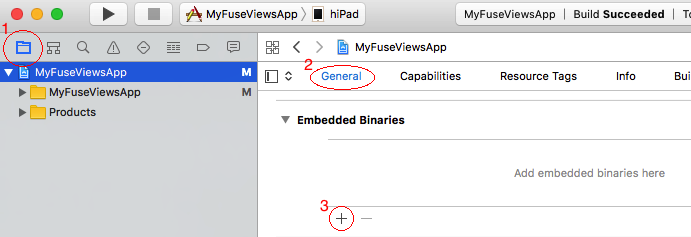
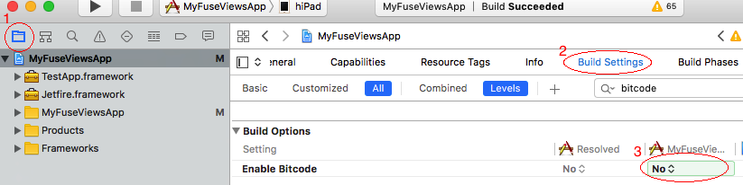

# Xcode and Android Studio Integration

The `Fuse.Views` package allows you to take any UX UI component and export them as a native Library for iOS and Android. In this tutorial we will step by step look at how this is done.

## Step 0: Setting up dependencies

In your `.unoproj`, add a package reference to `Fuse.Views`.
It should look something like the following.

```json
{
	"Packages": [
		"Fuse",
		"FuseJS",
		"Fuse.Views"
	],
	"Includes": [
		"*"
	]
}
```

## Step 1: Exporting Views

In Fuse Views you must explicitly specify which views you want to be able to instantiate from Swift, Objective-C and Java. You can export any UX component, except for non-UI elements (like Triggers and Animations) and [UX Classes](articles:ux-markup/classes) that have [dependencies](articles:ux-markup/dependencies).

Let's say that, for example, you have defined the following components somewhere in your Fuse project:

```xml
<Panel ux:Class="VideoView">
    <!-- ... -->
</Panel>

<Panel ux:Class="StatsView">
    <!-- ... -->
</Panel>
```

We can then export these components by providing them as [UX Templates](articles:ux-markup/templates) to a special `ExportedViews` tag.

```xml
<App>
    <ExportedViews>
        <VideoView ux:Template="VideoView" />
        <StatsView ux:Template="StatsView" />
    </ExportedViews>
</App>
```


Export an [Xcode Framework](https://developer.apple.com/library/content/documentation/MacOSX/Conceptual/BPFrameworks/Concepts/WhatAreFrameworks.html) or an [Android aar](https://developer.android.com/studio/projects/android-library.html) by compiling with `-DLIBRARY` set.

```sh
uno build ios -DLIBRARY
uno build android -DLIBRARY
```

Now you will find the Xcode framework and the Android aar under the following paths:

- Xcode framework – `build/iOS/Debug/build/Release-iphoneos/ProjectName.framework`
- Android aar – `build/Android/Debug/app/build/outputs/aar/app-debug.aar`

## Step 2: Setting up the native Library

Now that we have built our library, we need to add it to our Xcode or Gradle project.

#### iOS

Add the framework you just built as an embedded binary in Xcode




	
And finally, disable Bitcode.




#### Android

In `YourAndroidApp/app/build.gradle`, just under this line:

```js
apply plugin: 'com.android.application'
```

Add the following:

```js
allprojects {
    repositories {
        jcenter()
        flatDir {
            dirs 'libs'
        }
    }
}
```

and in the dependency section, add:

```js
compile(name:'app-debug', ext:'aar')
```

In `AndroidManifest.xml` add the following attributes to the main `activity` declaration:

```js
android:launchMode="singleTask"
android:taskAffinity=""
android:configChanges="orientation|keyboardHidden|screenSize|smallestScreenSize"
```

And finally, copy `build/Android/Debug/app/build/outputs/aar/app-debug.aar` to `YourAndroidApp/app/libs/app-debug.aar`

#### Updating the framework or aar after fuse rebuild

After a rebuild you need to manually update the framework or aar in your native project. Do this by overwriting the old library with the one you just produced. This is easily automated by scripting the copy-overwrite procedure.

Notes when updating the framework/aar:
- By default Xcode imports frameworks to the project root directory. This is where you want to overwrite.
- If you are using Android Studio you must do a rebuild after updating the aar for code completion and code errors to work properly.

Notes when updating Fuse:
- To ensure that your project is running the last FuseViews package, cut `compile(name:'app-debug', ext:'aar')` line from your gradle file, Sync and add the dependency again. 

## Step 3: Bootstrapping Fuse Views

Before you can instantiate your exported views, fuse needs to be initialized.

#### Objective-C

Add the following in your `AppDelegate`

```objectivec
#import <FuseProjectName/Context.h>
```

```objectivec
- (BOOL)application:(UIApplication *)application willFinishLaunchingWithOptions:(NSDictionary *)launchOptions
{
    [uContext initSharedContextWithWindow:^UIWindow* () { return [self window]; }];
    [[uContext sharedContext] application:application willFinishLaunchingWithOptions:launchOptions];
    return YES;
}
```

#### Swift

Add a Swift-Objective-C bridging header and add this import:

```swift
#import <FuseProjectName/Context.h>
```

Then add the following to your `AppDelegate`.

```swift
func application(_ application: UIApplication, willFinishLaunchingWithOptions launchOptions: [UIApplicationLaunchOptionsKey : Any]? = nil) -> Bool {
    uContext.initSharedContext(window: { return self.window })
    uContext.shared().application(application, willFinishLaunchingWithOptions: launchOptions)
    return true
}
```

#### Java

In your main `Activity`, inherit from `com.fuse.views.FuseViewsActivity`.

```java
public class MainActivity extends com.fuse.views.FuseViewsActivity {
```

##### Fragment support
To use your View as `Fragment`, inherit from `com.fuse.views.FuseViewsFragment` 
```java
public class FuseFragment extends com.fuse.views.FuseViewsFragment {
```

In your `Activity` init FuseViewsFragment on your `onCreate()` method just before the `setContentView()`
```java
@Override
protected void onCreate(Bundle savedInstanceState) {
	super.onCreate(savedInstanceState);
	FuseViewsFragment.init(this, savedInstanceState);
	setContentView(R.layout.activity_main);
	...
}
```
## Step 4: Instantiating a View

You are now ready to instantiate your exported views.
To interop with your views you will get a handle object with some methods that act as the interface for interop.
Through the handle you can get a native View that will display your exported view.


#### Objective-C

Make sure to have these headers imported:
```objectivec
#import <ProjectName/ExportedViews.h>
#import <ProjectName/ViewHandle.h>
```

Instantiating the view handle and getting the native view:

```objectivec
ViewHandle* videoView = [ExportedViews instantiate:@"VideoView"];
UIView* nativeView = [videoView view];
```

#### Swift

Make sure to have these headers imported in your Swift-Objective-C bridging header:

```swift
#import <ProjectName/ExportedViews.h>
#import <ProjectName/ViewHandle.h>
```

Instantiating the view handle and getting the native view:

```swift
let videoView: ViewHandle? = ExportedViews.instantiate("VideoView");
let view: UIView = videoView?.view
```

#### Java

Make sure you have these imports in your java file:

```java
import com.fuse.views.ExportedViews;
import com.fuse.views.ViewHandle;
```

Instantiating the view handle and getting the native view:

```java
ViewHandle videoView = ExportedViews.instantiate("VideoView");
android.view.View nativeView = videoView.getView();
```

## Step 5: Use the fuse view in a native layout

A Fuse View will interop with the native layout, for size it relies on the native layout doing a measure pass on its views. On iOS this might not be the case depending on what kind of layout you have used. So you might have to manage the size by yourself. Using the super view's `bounds` should be sufficient in most cases.

#### Objective-C

```objectivec
UIView* parent = ...;

ViewHandle* videoView = [ExportedViews instantiate:@"VideoView"];
UIView* nativeView = [videoView view];

[parent addSubview:nativeView];

// Make the Fuse View fill its parent
[nativeView setFrame:parent.bounds];
```

#### Swift

```swift
let parent: UIView = ...;

let videoView: ViewHandle? = ExportedViews.instantiate("VideoView");
let view: UIView = videoView?.view

parent.addSubview(view!)

let width = parent.frame.width
let height = parent.frame.height

view?.frame = CGRect(x: 0, y: 0, width: width, height: height)
```

#### Java

```java
android.widget.RelativeLayout parent = ...;

ViewHandle videoView = ExportedViews.instantiate("VideoView");
android.view.View nativeView = videoView.getView();

nativeView.setLayoutParam(new android.widget.RelativeLayout.LayoutParams(MATCH_PARENT, MATCH_PARENT));
parent.addView(nativeView);
```

## Step 6: Interop between native and fuse

As mentioned the `ViewHandle` object acts as your interface with fuse. You can set a data context for your view in the form of JSON, a key-value pair and add callbacks.

Lets take a look at the API:

#### Objective-C

```objectivec
@interface ViewHandle : NSObject

@property (readonly) UIView* view;

-(void) setDataJson:(NSString*)json;
-(void) setDataString:(NSString*)value forKey:(NSString*)key;
-(void) setCallback:(Callback)callback forKey:(NSString*)key;

@end
```

The signature of `Callback` is as follows:

```objectivec
typedef void(^Callback)(Arguments*);
```


#### Java

```java
public class ViewHandle {
    public android.view.View getView();
    public void setDataJson(String json);
    public void setDataString(String key, String value);
    public void setCallback(String key, com.fuse.views.ICallback callback);
}
```

The interface of `ICallback` is as follows:

```java
public interface ICallback {
    void invoke(IArguments args);
}
```

If you are familiar with [`JavaScript`](https://fuse-open.github.io/docs/fuse/reactive/javascript) and [`DataBinding`](https://fuse-open.github.io/docs/fuse/reactive/databinding) in fuse this will be quite easy to understand. `setDataJson` is the equivalent of having a `module.exports` in JavaScript and `setCallback` is the equivalent of adding a function to the `exports`. The function arguments passed to the native callback in Fuse views will contain the same data you would get in `JavaScript`, but you get the through the methods available on the `Arguments`. Since the function arguments needs to be serialized to strings and JSON, accessing the `Arguments` will lazily serialize what you request. In the common case you are more interested in getting the callback than accessing the whole data context. Please have a look at [`Binding functions`](https://fuse-open.github.io/docs/scripting/scripting#binding-functions) for an overview of what arguments will be passed.

```objectivec
@interface Arguments : NSObject

@property (readonly) NSDictionary<NSString*,NSString*>* args;
@property (readonly) NSString* dataJson;

@end
```

```objectivec
public interface IArguments {
    HashMap<String,String> getArgs();
    String getDataJson();
}
```

Let's look at an example with UX and see how that component can be populated with data from JavaScript and from a native language with fuse views:

```xml
<DockPanel>
    <Text Value="{title}" Dock="Top" Margin="8" TextAlignment="Center" />
    <StackPanel ux:Class="UsersListView" Dock="Fill">
        <Each Items="{users}">
            <Panel Clicked="{user_clicked}">
                ...
            </Panel>
        </Each>
    </StackPanel>
</DockPanel>
```

For the above UX code we can populate it with JavaScript:

```js
module.exports = {
    title: "Meetup attendees",
    users: [...],
    user_clicked: function(args) { ... }
}
```

The equivalent in fuse views will look like this:

#### Objective-C

```objectivec
ViewHandle* usersListView = [ExportedViews instantiate:@"UsersListView"];
[usersListView setDataString:@"Meetup attendees" forKey:@"title"];
[usersListView setDataJson:@"{ \"users\" : [...] }"];
[usersListView setCallback:^void(NSDictionary<NSString*,NSString*>* args) { ... } forKey:@"user_clicked"];
```

#### Swift

```swift
let usersListView: ViewHandle? = ExportedViews.instantiate("UsersListView")
usersListView?.setDataString("Meetup attendees" as String!, "title" as String!)
usersListView?.setDataJson("{ \"users\" : [...] }" as String!)
usersListView?.setCallback({ (args) -> Void in { ... } }, forKey: "user_clicked")
```

#### Java

```java
ViewHandle usersListView = ExportedViews.instantiate("UsersListView");
usersListView.setDataString("title", "Meetup attendees");
usersListView.setDataJson("{ \"users\" : [...] }");
usersListView.setCallback("user_clicked", new ICallback() {
    @Override
    public void invoke(HashMap<String, String> args) { ... }
});
```

##### Fragment support
The full workaround when using `Fragment`
```csharp

    @Override
    public View onCreateView(LayoutInflater inflater, ViewGroup container, Bundle savedInstanceState) {
        RelativeLayout relativeLayout = new RelativeLayout(getContext());
        ViewHandle videoView = ExportedViews.instantiate("VideoView");
        android.view.View nativeView = videoView.getView();

	videoView.setDataJson("{ \"users\" : [...] }");
        videoView.setCallback("user_clicked", new ICallback() {
            @Override
            public void invoke(IArguments iArguments) { ... }
        });

        nativeView.setLayoutParams(new android.widget.RelativeLayout.LayoutParams(MATCH_PARENT, MATCH_PARENT));
        relativeLayout.addView(nativeView);

        return relativeLayout;
    }
```
